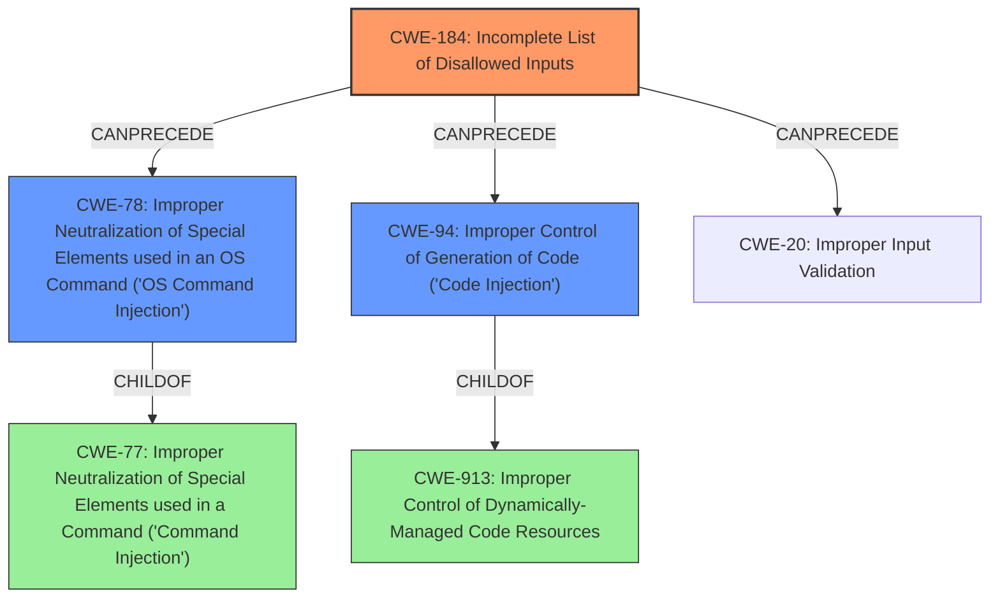

# Enhanced Analysis for CVE-2024-33896

# Summary
| CWE ID | CWE Name | Confidence | CWE Abstraction Level | CWE Vulnerability Mapping Label | CWE-Vulnerability Mapping Notes |
|---|---|---|---|---|---|
| CWE-184 | Incomplete List of Disallowed Inputs | 0.9 | Base | Primary CWE | Allowed |
| CWE-78 | Improper Neutralization of Special Elements used in an OS Command ('OS Command Injection') | 0.7 | Base | Secondary Candidate | Allowed |
| CWE-94 | Improper Control of Generation of Code ('Code Injection') | 0.6 | Base | Secondary Candidate | Allowed-with-Review |

## Evidence and Confidence

*   **Confidence Score:** 0.8
*   **Evidence Strength:** HIGH

## Relationship Analysis
The primary CWE is CWE-184, which describes an incomplete list of disallowed inputs. This is directly supported by the vulnerability description stating "**improper parameter blacklisting**". CWE-78 and CWE-94 are related to injection vulnerabilities, but are less specific than CWE-184 in describing the root cause.



## Vulnerability Chain
The vulnerability chain starts with an **improper parameter blacklisting** (CWE-184), which leads to the possibility of **code injection** (CWE-94) or **OS command injection** (CWE-78). The initial flaw is the incomplete blacklist, which allows malicious input to pass through and be interpreted as code or commands. The lack of complete input validation (which CWE-20 represents) allows the injection vulnerability to be realized.

## Summary of Analysis
The vulnerability description indicates that the root cause is **improper parameter blacklisting**. This maps directly to CWE-184 (Incomplete List of Disallowed Inputs). The CVE Reference Links Content Summary provides more details: "While the vendor implemented filters, these filters could be bypassed by prefixing the parameters with two dashes (e.g., `--up`)." This confirms that the implemented blacklist was incomplete. The result of this incomplete blacklist is that OS commands could be injected leading to root-level code execution.

CWE-78 (Improper Neutralization of Special Elements used in an OS Command ('OS Command Injection')) and CWE-94 (Improper Control of Generation of Code ('Code Injection')) are potential consequences of the incomplete blacklist, but CWE-184 is the more accurate root cause. CWE-20 (Improper Input Validation) is a more general case of input validation issues, but CWE-184 more precisely describes the issue.

The selected CWEs are at the optimal level of specificity, with CWE-184 being the base level CWE that accurately describes the root cause, and CWE-78 and CWE-94 being potential consequences of the vulnerability.

Relevant CWE Information:

*   **CWE-184 (Incomplete List of Disallowed Inputs):** The product implements a protection mechanism that relies on a list of inputs that are not allowed by policy, but the list is incomplete. This accurately describes the **improper parameter blacklisting**.
*   **CWE-78 (Improper Neutralization of Special Elements used in an OS Command ('OS Command Injection'))**: The product constructs all or part of an OS command using externally-influenced input, but it does not neutralize special elements. The bypass of the filter to allow the injection of OS commands.
*   **CWE-94 (Improper Control of Generation of Code ('Code Injection')):** The product constructs all or part of a code segment using externally-influenced input, but it does not neutralize special elements that could modify the syntax or behavior of the intended code segment. The injection of the `--up` parameter allows for the execution of arbitrary commands.


## CWE Relationship Analysis

Current CWEs represent these abstraction levels: .


### Vulnerability Chain Analysis

**Chain starting from CWE-94:**
- 94 (Improper Control of Generation of Code ('Code Injection')) - ROOT


**Chain starting from CWE-77:**
- 77 (Improper Neutralization of Special Elements used in a Command ('Command Injection')) - ROOT


### CWE Relationship Diagram

```mermaid
graph TD
    classDef primary fill:#f96,stroke:#333,stroke-width:2px
    classDef secondary fill:#69f,stroke:#333
    classDef tertiary fill:#9e9,stroke:#333
```