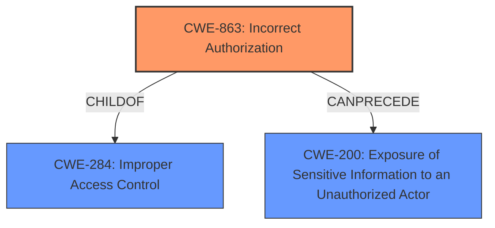

# Analysis Report for CVE-2024-3404

# Vulnerability Analysis Report: CVE-2024-3404

## Description

In gaizhenbiao/chuanhuchatgpt, specifically the version tagged as 20240121, there exists a vulnerability due to **improper access control mechanisms**. This flaw allows an authenticated attacker to bypass intended access restrictions and read the `history` files of other users, potentially leading to unauthorized access to sensitive information. The vulnerability is present in the applications handling of access control for the `history` path, where no adequate mechanism is in place to prevent an authenticated user from accessing another users chat history files. This issue poses a significant risk as it could allow attackers to obtain sensitive information from the chat history of other users.

## Vulnerability Description Key Phrases

- **Rootcause:** improper access control mechanisms
- **Impact:** ['bypass intended access restrictions', 'obtain sensitive information', 'read the `history` files of other users']
- **Attacker:** authenticated attacker
- **Product:** gaizhenbiao/chuanhuchatgpt
- **Version:** 20240121

## Analysis (with Relationship Data)

# Summary
| CWE ID | CWE Name | Confidence | CWE Abstraction Level | CWE Vulnerability Mapping Label | CWE-Vulnerability Mapping Notes |
|---|---|---|---|---|---|
| CWE-863 | Incorrect Authorization | 0.85 | Class | Allowed-with-Review | Primary CWE: The application checks authorization, but does it incorrectly. |
| CWE-200 | Exposure of Sensitive Information to an Unauthorized Actor | 0.75 | Class | Discouraged | Secondary Candidate: Due to the sensitive information being exposed. |

## Evidence and Confidence

*   **Confidence Score:** 0.80
*   **Evidence Strength:** MEDIUM

## Relationship Analysis
The primary relationship influencing the decision is that CWE-863 is a more specific Class-level CWE than the Pillar CWE-284 (Improper Access Control) and more accurately describes the vulnerability where the access control mechanism is present but implemented incorrectly. The relationship CANPRECEDE from CWE-863 to CWE-200 is also relevant, as an incorrect authorization can lead to the exposure of sensitive information. The analysis considered parent-child relationships to identify the most specific and accurate CWE.



## Vulnerability Chain
The vulnerability chain starts with **improper access control mechanisms** (likely leading to incorrect authorization), which allows an authenticated attacker to bypass intended access restrictions and read the `history` files of other users, ultimately leading to unauthorized access to sensitive information. The chain can be represented as:

Incorrect Authorization (CWE-863) -> Exposure of Sensitive Information to an Unauthorized Actor (CWE-200)

## Summary of Analysis
The initial assessment considered several CWEs, including CWE-284 (Improper Access Control), CWE-862 (Missing Authorization), and CWE-863 (Incorrect Authorization). However, based on the vulnerability description, the **improper access control mechanisms** lead to an authorization check that exists but incorrectly grants access, making CWE-863 the most appropriate primary CWE. The phrase "bypass intended access restrictions" suggests that some form of access control was in place but was flawed, which aligns with CWE-863.

The evidence from the vulnerability description includes: "improper access control mechanisms" and "bypass intended access restrictions". This supports the choice of CWE-863 as the primary CWE.

The graph relationships influenced the final selection by highlighting the connection between incorrect authorization and the potential exposure of sensitive information.

The selected CWEs are at the optimal level of specificity because CWE-863 accurately captures the nature of the authorization flaw, while CWE-200 reflects the resulting impact of sensitive information exposure.

Relevant CWE Information:

# Enhanced Context (25 CWEs)
The following CWEs were identified as potentially relevant to this vulnerability:

## CWE-668: Exposure of Resource to Wrong Sphere
**Abstraction Level**: Class
**Similarity Score**: 0.76
**Source**: dense

**Description**:
The product exposes a resource to the wrong control sphere, providing unintended actors with inappropriate access to the resource.

**Mapping Guidance**:
- Usage: Discouraged
- Rationale: CWE-668 is high-level and is often misused as a catch-all when lower-level CWE IDs might be applicable. It is sometimes used for low-information vulnerability reports [REF-1287]. It is a level-1 Class (i.e., a child of a Pillar). It is not useful for trend analysis.


## CWE-212: Improper Removal of Sensitive Information Before Storage or Transfer
**Abstraction Level**: Base
**Similarity Score**: 0.76
**Source**: dense

**Description**:
The product stores, transfers, or shares a resource that contains sensitive information, but it does not properly remove that information before the product makes the resource available to unauthorized actors.

**Mapping Guidance**:
- Usage: Allowed
- Rationale: This CWE entry is at the Base level of abstraction, which is a preferred level of abstraction for mapping to the root causes of vulnerabilities.


## CWE-497: Exposure of Sensitive System Information to an Unauthorized Control Sphere
**Abstraction Level**: Base
**Similarity Score**: 0.76
**Source**: dense

**Description**:
The product does not properly prevent sensitive system-level information from being accessed by unauthorized actors who do not have the same level of access to the underlying system as the product does.

**Mapping Guidance**:
- Usage: Allowed
- Rationale: This CWE entry is at the Base level of abstraction, which is a preferred level of abstraction for mapping to the root causes of vulnerabilities.


## CWE-267: Privilege Defined With Unsafe Actions
**Abstraction Level**: Base
**Similarity Score**: 0.75
**Source**: dense

**Description**:
A particular privilege, role, capability, or right can be used to perform unsafe actions that were not intended, even when it is assigned to the correct entity.

**Mapping Guidance**:
- Usage: Allowed
- Rationale: This CWE entry is at the Base level of abstraction, which is a preferred level of abstraction for mapping to the root causes of vulnerabilities.


## CWE-538: Insertion of Sensitive Information into Externally-Accessible File or Directory
**Abstraction Level**: Base
**Similarity Score**: 0.75
**Source**: dense

**Description**:
The product places sensitive information into files or directories that are accessible to actors who are allowed to have access to the files, but not to the sensitive information.

**Mapping Guidance**:
- Usage: Allowed
- Rationale: This CWE entry is at the Base level of abstraction, which is a preferred level of abstraction for mapping to the root causes of vulnerabilities.


## CWE-639: Authorization Bypass Through User-Controlled Key
**Abstraction Level**: Base
**Similarity Score**: 0.75
**Source**: dense

**Description**:
The system's authorization functionality does not prevent one user from gaining access to another user's data or record by modifying the key value identifying the data.

**Mapping Guidance**:
- Usage: Allowed
- Rationale: This CWE entry is at the Base level of abstraction, which is a preferred level of abstraction for mapping to the root causes of vulnerabilities.


## CWE-807: Reliance on Untrusted Inputs in a Security Decision
**Abstraction Level**: Base
**Similarity Score**: 0.75
**Source**: dense

**Description**:
The product uses a protection mechanism that relies on the existence or values of an input, but the input can be modified by an untrusted actor in a way that bypasses the protection mechanism.

**Mapping Guidance**:
- Usage: Allowed
- Rationale: This CWE entry is at the Base level of abstraction, which is a preferred level of abstraction for mapping to the root causes of vulnerabilities.


## CWE-41: Improper Resolution of Path Equivalence
**Abstraction Level**: Base
**Similarity Score**: 0.74
**Source**: dense

**Description**:
The product is vulnerable to file system contents disclosure through path equivalence. Path equivalence involves the use of special characters in file and directory names. The associated manipulations are intended to generate multiple names for the same object.

**Mapping Guidance**:
- Usage: Allowed
- Rationale: This CWE entry is at the Base level of abstraction, which is a preferred level of abstraction for mapping to the root causes of vulnerabilities.


## CWE-610: Externally Controlled Reference to a Resource in Another Sphere
**Abstraction Level**: Class
**Similarity Score**: 0.74
**Source**: dense

**Description**:
The product uses an externally controlled name or reference that resolves to a resource that is outside of the intended control sphere.

**Mapping Guidance**:
- Usage: Discouraged
- Rationale: This CWE entry is a level-1 Class (i.e., a child of a Pillar). It might have lower-level children that would be more appropriate


## CWE-472: External Control of Assumed-Immutable Web Parameter
**Abstraction Level**: Base
**Similarity Score**: 0.74
**Source**: dense

**Description**:
The web application does not sufficiently verify inputs that are assumed to be immutable but are actually externally controllable, such as hidden form fields.

**Mapping Guidance**:
- Usage: Allowed
- Rationale: This CWE entry is at the Base level of abstraction, which is a preferred level of abstraction for mapping to the root causes of vulnerabilities.


## CWE-639: Authorization Bypass Through User-Controlled Key
**Abstraction Level**: Base
**Similarity Score**: 1352.79
**Source**: sparse

**Description**:
The system's authorization functionality does not prevent one user from gaining access to another user's


## CWE Relationship Analysis

Current CWEs represent these abstraction levels: .


### Vulnerability Chain Analysis

**Chain starting from CWE-863:**
- 863 (Incorrect Authorization) - ROOT


**Chain starting from CWE-610:**
- 610 (Externally Controlled Reference to a Resource in Another Sphere) - ROOT


### CWE Relationship Diagram

```mermaid
graph TD
    classDef primary fill:#f96,stroke:#333,stroke-width:2px
    classDef secondary fill:#69f,stroke:#333
    classDef tertiary fill:#9e9,stroke:#333
```


*Report generated on 2025-07-13 08:02:40*
