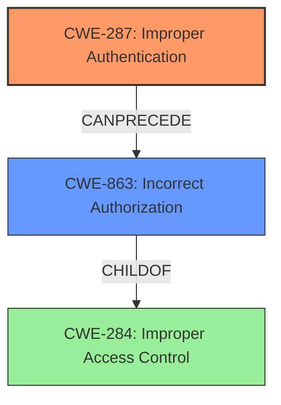

# Raw Analyzer Response for CVE-2024-34103

# Summary
| CWE ID  | CWE Name                         | Confidence | CWE Abstraction Level | CWE Vulnerability Mapping Label | CWE-Vulnerability Mapping Notes |
| ------- | -------------------------------- | ---------- | --------------------- | ------------------------------- | ------------------------------- |
| CWE-287 | Improper Authentication          | 0.9        | Class                 | Primary                         | Allowed-with-Review            |
| CWE-863 | Incorrect Authorization          | 0.7        | Class                 | Secondary                       | Allowed-with-Review            |

## Evidence and Confidence

*   **Confidence Score:** 0.8
*   **Evidence Strength:** HIGH

## Relationship Analysis
The primary weakness is **Improper Authentication (CWE-287)**, a class-level CWE. While more specific base-level CWEs exist under CWE-287, the provided description doesn't provide enough information to pinpoint the exact authentication failure mechanism. **Incorrect Authorization (CWE-863)** is considered a secondary weakness because **Improper Authentication** often precedes authorization bypass. The relationship between these two is that successful exploitation of **Improper Authentication** can lead to unauthorized access, which is a form of **Incorrect Authorization**.

## Vulnerability Chain
The vulnerability chain starts with **Improper Authentication (CWE-287)**, which allows an attacker to bypass identity verification. This leads to a state where the attacker can then perform actions they are not authorized to do, resulting in **Incorrect Authorization (CWE-863)** and ultimately privilege escalation.

CWE-287 (Improper Authentication) -> CWE-863 (Incorrect Authorization) -> Privilege Escalation

## Summary of Analysis
The primary assessment is based on the vulnerability description stating "**Improper Authentication vulnerability** that could result in privilege escalation." The CVE Reference Links Content Summary confirms this with "**Root Cause: Improper Authentication (CWE-287)**" and "**Vulnerability: Improper Authentication leading to Privilege Escalation**."

CWE-287 is chosen as the primary CWE due to the explicit mention of "**Improper Authentication**" as the root cause.
CWE-863 is chosen as a secondary CWE because **Improper Authentication** typically precedes an **authorization bypass**.

The selection of CWE-287 and CWE-863 is at the Class level of abstraction due to the limited details in the vulnerability description. More specific, base-level CWEs might be applicable if more information about the exact authentication and authorization failures were available.

Other CWEs Considered but Not Used:

*   CWE-285 (Improper Authorization): While privilege escalation is a form of authorization issue, the root cause is specifically identified as **Improper Authentication**, making CWE-287 a more accurate primary classification.
*   CWE-306 (Missing Authentication for Critical Function): This is too specific because it implies a complete absence of authentication, whereas "**Improper Authentication**" suggests a flawed authentication process.
*   CWE-269 (Improper Privilege Management): This is too high-level and doesn't directly address the authentication failure.
*   CWE-862 (Missing Authorization): Similar to CWE-306, this is too specific because it implies a complete absence of authorization checks, whereas the vulnerability description indicates a potential bypass due to flawed authentication.