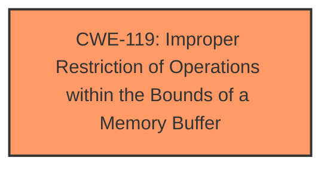

# Enhanced Analysis for CVE-2024-34170

# Summary

| CWE ID  | CWE Name                                                                            | Confidence | CWE Abstraction Level | CWE Vulnerability Mapping Label | CWE-Vulnerability Mapping Notes |
| :-------- | :---------------------------------------------------------------------------------- | :----------- | :---------------------- | :------------------------------ | :-------------------------------- |
| CWE-119 | Improper Restriction of Operations within the Bounds of a Memory Buffer | 0.75       | Class                     | Primary                         | Discouraged                       |

## Evidence and Confidence

*   **Confidence Score:** 0.75
*   **Evidence Strength:** MEDIUM

## Relationship Analysis

The primary relationship influencing the decision is the parent-child relationship between CWE-119 and more specific buffer overflow/out-of-bounds write CWEs. Although the description mentions **"Improper buffer restrictions"**, it does not provide enough detail to pinpoint the exact nature of the restriction failure. Therefore, the higher-level CWE-119 is chosen.



## Vulnerability Chain

The vulnerability chain starts with **improper buffer restrictions** (CWE-119) leading to a potential denial of service.

## Summary of Analysis

The analysis is based primarily on the vulnerability description, which mentions **"Improper buffer restrictions"** as the root cause. The CVE Reference Links Content Summary confirms this. Retriever results also suggest CWE-119. The choice of CWE-119 is at a higher level (Class) because the description lacks the specific details needed to assign a more precise Base or Variant CWE related to buffer overflows. While CWE-119 is discouraged, the lack of specific information about the buffer restriction failure makes it the most appropriate choice.

Relevant CWE Information:

# Enhanced Context (25 CWEs)

## CWE-131: Incorrect Calculation of Buffer Size

**Abstraction Level**: Base
**Similarity Score**: 0.77
**Source**: dense

**Description**:
The product does not correctly calculate the size to be used when allocating a buffer, which could lead to a buffer overflow.

**Mapping Guidance**:
- Usage: Allowed
- Rationale: This CWE entry is at the Base level of abstraction, which is a preferred level of abstraction for mapping to the root causes of vulnerabilities.

*Rationale for not using*: While potentially related, the description only mentions **"improper buffer restrictions"** and does not specify incorrect calculation of buffer size.

## CWE-119: Improper Restriction of Operations within the Bounds of a Memory Buffer

**Abstraction Level**: Class
**Similarity Score**: 0.77
**Source**: dense

**Description**:
The product performs operations on a memory buffer, but it reads from or writes to a memory location outside the buffer's intended boundary. This may result in read or write operations on unexpected memory locations that could be linked to other variables, data structures, or internal program data.

**Mapping Guidance**:
- Usage: Discouraged
- Rationale: CWE-119 is commonly misused in low-information vulnerability reports when lower-level CWEs could be used instead, or when more details about the vulnerability are available.

*Rationale for using*: The description indicates **"improper buffer restrictions"**. While discouraged, it serves as a suitable high-level classification due to limited information.

## CWE-1285: Improper Validation of Specified Index, Position, or Offset in Input

**Abstraction Level**: Base
**Similarity Score**: 0.76
**Source**: dense

**Description**:
The product receives input that is expected to specify an index, position, or offset into an indexable resource such as a buffer or file, but it does not validate or incorrectly validates that the specified index/position/offset has the required properties.

**Mapping Guidance**:
- Usage: Allowed
- Rationale: This CWE entry is at the Base level of abstraction, which is a preferred level of abstraction for mapping to the root causes of vulnerabilities.

*Rationale for not using*: There's no mention of input validation or index/offset issues in the description.

## CWE-805: Buffer Access with Incorrect Length Value

**Abstraction Level**: Base
**Similarity Score**: 0.76
**Source**: dense

**Description**:
The product uses a sequential operation to read or write a buffer, but it uses an incorrect length value that causes it to access memory that is outside of the bounds of the buffer.

**Mapping Guidance**:
- Usage: Allowed
- Rationale: This CWE entry is at the Base level of abstraction, which is a preferred level of abstraction for mapping to the root causes of vulnerabilities.

*Rationale for not using*: The description only states **"improper buffer restrictions"** and doesn't provide specifics about incorrect length values.

## CWE-755: Improper Handling of Exceptional Conditions

**Abstraction Level**: Class
**Similarity Score**: 0.76
**Source**: dense

**Description**:
The product does not handle or incorrectly handles an exceptional condition.

**Mapping Guidance**:
- Usage: Discouraged
- Rationale: This CWE entry is a level-1 Class (i.e., a child of a Pillar). It might have lower-level children that would be more appropriate

*Rationale for not using*: This CWE is too generic and doesn't relate directly to buffer restrictions.

## CWE-824: Access of Uninitialized Pointer

**Abstraction Level**: Base
**Similarity Score**: 0.75
**Source**: dense

**Description**:
The product accesses or uses a pointer that has not been initialized.

**Mapping Guidance**:
- Usage: Allowed
- Rationale: This CWE entry is at the Base level of abstraction, which is a preferred level of abstraction for mapping to the root causes of vulnerabilities.

*Rationale for not using*: There's no evidence to suggest uninitialized pointers are involved.

## CWE-843: Access of Resource Using Incompatible Type ('Type Confusion')

**Abstraction Level**: Base
**Similarity Score**: 0.75
**Source**: dense

**Description**:
The product allocates or initializes a resource such as a pointer, object, or variable using one type, but it later accesses that resource using a type that is incompatible with the original type.

**Mapping Guidance**:
- Usage: Allowed
- Rationale: This CWE entry is at the Base level of abstraction, which is a preferred level of abstraction for mapping to the root causes of vulnerabilities.

*Rationale for not using*: There's no evidence of type confusion.

## CWE-193: Off-by-one Error

**Abstraction Level**: Base
**Similarity Score**: 0.75
**Source**: dense

**Description**:
A product calculates or uses an incorrect maximum or minimum value that is 1 more, or 1 less, than the correct value.

**Mapping Guidance**:
- Usage: Allowed
- Rationale: This CWE entry is at the Base level of abstraction, which is a preferred level of abstraction for mapping to the root causes of vulnerabilities.

*Rationale for not using*: There's no indication of an off-by-one error.

## CWE-280: Improper Handling of Insufficient Permissions or Privileges

**Abstraction Level**: Base
**Similarity Score**: 0.75
**Source**: dense

**Description**:
The product does not handle or incorrectly handles when it has insufficient privileges to access resources or functionality as specified by their permissions. This may cause it to follow unexpected code paths that may leave the product in an invalid state.

**Mapping Guidance**:
- Usage: Allowed
- Rationale: This CWE entry is at the Base level of abstraction, which is a preferred level of abstraction for mapping to the root causes of vulnerabilities.

*Rationale for not using*: The description mentions an authenticated user, but the root cause is related to buffer restrictions, not permission handling.

## CWE-252: Unchecked Return Value

**Abstraction Level**: Base
**Similarity Score**: 0.75
**Source**: dense

**Description**:
The product does not check the return value from a method or function, which can prevent it from detecting unexpected states and conditions.

**Mapping Guidance**:
- Usage: Allowed
- Rationale: This CWE entry is at the Base level of abstraction, which is a preferred level of abstraction for mapping to the root causes of vulnerabilities.

*Rationale for not using*: There's no evidence of unchecked return values contributing to the vulnerability.

## CWE-119: Improper Restriction of Operations within the Bounds of a Memory Buffer

**Abstraction Level**: Class
**Similarity Score**: 392.97
**Source**: sparse

**Description**:
The product performs operations on a memory buffer, but it reads from or writes to a memory location outside the buffer's intended boundary. This may result in read or write operations on unexpected memory locations that could be linked to other variables, data structures, or internal program data.

**Mapping Guidance**:
- Usage: Discouraged
- Rationale: CWE-119 is commonly misused in low-information vulnerability reports when lower-level CWEs could be used instead, or when more details about the vulnerability are available.

*Rationale for using*: As explained above, the description mentions **"improper buffer restrictions"**, making this the most fitting high-level classification.

## CWE-1


## CWE Relationship Analysis

Current CWEs represent these abstraction levels: .


### Vulnerability Chain Analysis

**Chain starting from CWE-280:**
- 280 (Improper Handling of Insufficient Permissions or Privileges ) - ROOT


**Chain starting from CWE-805:**
- 805 (Buffer Access with Incorrect Length Value) - ROOT


### CWE Relationship Diagram

```mermaid
graph TD
    classDef primary fill:#f96,stroke:#333,stroke-width:2px
    classDef secondary fill:#69f,stroke:#333
    classDef tertiary fill:#9e9,stroke:#333
```