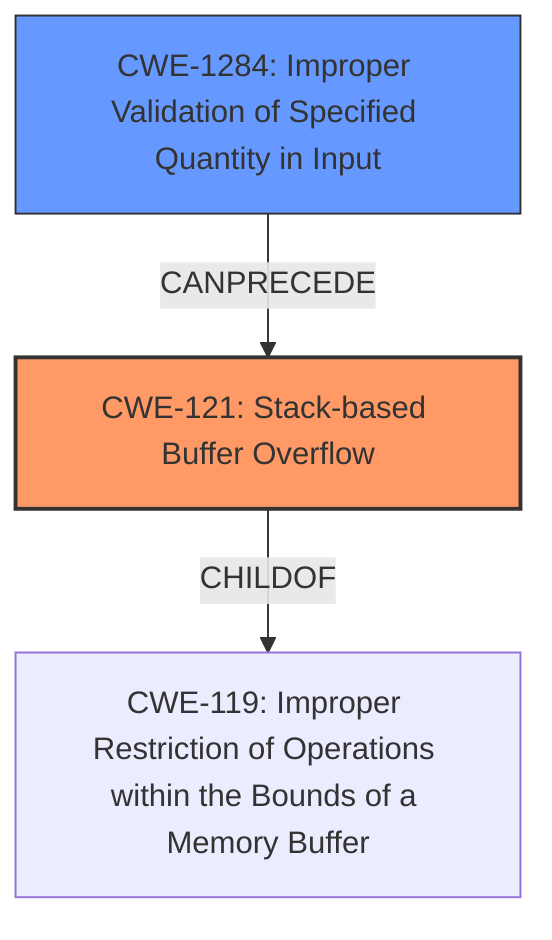

# Analysis Report for CVE-2024-34198

# Vulnerability Analysis Report: CVE-2024-34198

## Description

TOTOLINK AC1200 Wireless Router A3002RU V2.1.1-B20230720.1011 is vulnerable to **Buffer Overflow**. The formWlEncrypt CGI handler in the boa program **fails to limit the length of the wlan_ssid field from user input**. This allows attackers to craft malicious HTTP requests by supplying an excessively long value for the wlan_ssid field, leading to a **stack overflow**. This can be further exploited to execute arbitrary commands or launch denial-of-service attacks.

## Vulnerability Description Key Phrases

- **Rootcause:** fails to limit the length of the wlan_ssid field from user input
- **Weakness:** ['Buffer Overflow', 'stack overflow']
- **Impact:** ["['execute arbitrary commands'", "'denial-of-service attacks']"]
- **Vector:** malicious HTTP requests
- **Product:** TOTOLINK AC1200 Wireless Router A3002RU
- **Version:** V2.1.1-B20230720.1011
- **Component:** formWlEncrypt CGI handler

## Analysis (with Relationship Data)

# Summary
| CWE ID   | CWE Name                                                                             | Confidence | CWE Abstraction Level | CWE Vulnerability Mapping Label | CWE-Vulnerability Mapping Notes |
| -------- | ------------------------------------------------------------------------------------ | ---------- | --------------------- | ------------------------------- | --------------------------------- |
| CWE-121  | Stack-based Buffer Overflow                                                          | 1          | Base                  | Primary                         | Allowed                             |
| CWE-1284 | Improper Validation of Specified Quantity in Input                                 | 0.9        | Base                  | Secondary                       | Allowed                             |

## Evidence and Confidence

*   **Confidence Score:** 0.95
*   **Evidence Strength:** HIGH

## Relationship Analysis
The primary weakness is a stack-based buffer overflow (CWE-121). This occurs because there is **improper validation of the length** of the *wlan_ssid* field. Thus, CWE-1284 can be considered a contributing factor as it describes the root cause of the buffer overflow, where the input's quantity (length) is not properly validated. CWE-121 is a child of CWE-119 (Improper Restriction of Operations within the Bounds of a Memory Buffer) and can be preceded by CWE-129 (Improper Validation of Array Index) or CWE-190 (Integer Overflow or Wraparound). In this case, the most relevant preceding weakness is CWE-1284.



## Vulnerability Chain
The vulnerability chain starts with **improper input validation** (CWE-1284), where the length of the *wlan_ssid* field is not validated. This leads to a **stack-based buffer overflow** (CWE-121) when an excessively long value is provided, potentially resulting in arbitrary command execution or denial-of-service.

## Summary of Analysis
The vulnerability is primarily a stack-based buffer overflow (CWE-121) due to the **failure to limit the length** of the *wlan_ssid* field. The description explicitly mentions a "**stack overflow**" as the vulnerability, which aligns perfectly with CWE-121. The root cause is the **lack of input validation** on the length of the input, making CWE-1284 a relevant contributing factor.

The choice of CWE-121 is at the Base level, which is the preferred level of abstraction. Other CWEs considered, such as CWE-20 (Improper Input Validation), were deemed too generic, as CWE-1284 provides a more specific description of the **improper validation** issue.

Relevant CWE Information:

# Enhanced Context (25 CWEs)

## CWE-134: Use of Externally-Controlled Format String
**Abstraction Level**: Base
**Similarity Score**: 0.74

## CWE-755: Improper Handling of Exceptional Conditions
**Abstraction Level**: Class
**Similarity Score**: 0.74

## CWE-345: Insufficient Verification of Data Authenticity
**Abstraction Level**: Class
**Similarity Score**: 0.74

## CWE-696: Incorrect Behavior Order
**Abstraction Level**: Class
**Similarity Score**: 0.74

## CWE-703: Improper Check or Handling of Exceptional Conditions
**Abstraction Level**: Pillar
**Similarity Score**: 0.74

## CWE-74: Improper Neutralization of Special Elements in Output Used by a Downstream Component ('Injection')
**Abstraction Level**: Class
**Similarity Score**: 0.74

## CWE-1391: Use of Weak Credentials
**Abstraction Level**: Class
**Similarity Score**: 0.74

## CWE-668: Exposure of Resource to Wrong Sphere
**Abstraction Level**: Class
**Similarity Score**: 0.74

## CWE-330: Use of Insufficiently Random Values
**Abstraction Level**: Class
**Similarity Score**: 0.74

## CWE-41: Improper Resolution of Path Equivalence
**Abstraction Level**: Base
**Similarity Score**: 0.73

## CWE-1284: Improper Validation of Specified Quantity in Input
**Abstraction Level**: Base
**Similarity Score**: 4273.45

## CWE-789: Memory Allocation with Excessive Size Value
**Abstraction Level**: Variant
**Similarity Score**: 4116.24

## CWE-130: Improper Handling of Length Parameter Inconsistency
**Abstraction Level**: Base
**Similarity Score**: 4017.53

## CWE-190: Integer Overflow or Wraparound
**Abstraction Level**: Base
**Similarity Score**: 3940.76

## CWE-770: Allocation of Resources Without Limits or Throttling
**Abstraction Level**: Base
**Similarity Score**: 3871.70

## CWE-1284: Improper Validation of Specified Quantity in Input
**Abstraction Level**: base
**Similarity Score**: 4.33

## CWE-770: Allocation of Resources Without Limits or Throttling
**Abstraction Level**: base
**Similarity Score**: 4.33

## CWE-190: Integer Overflow or Wraparound
**Abstraction Level**: base
**Similarity Score**: 3.80

## CWE-193: Off-by-one Error
**Abstraction Level**: base
**Similarity Score**: 3.57

## CWE-125: Out-of-bounds Read
**Abstraction Level**: base
**Similarity Score**: 3.49

## CWE-20: Improper Input Validation
**Abstraction Level**: class
**Similarity Score**: 2.98

## CWE-1325: Improperly Controlled Sequential Memory Allocation
**Abstraction Level**: base
**Similarity Score**: 2.93

## CWE-170: Improper Null Termination
**Abstraction Level**: base
**Similarity Score**: 2.87

## CWE-476: NULL Pointer Dereference
**Abstraction Level**: base
**Similarity Score**: 2.73

## CWE-129: Improper Validation of Array Index
**Abstraction Level**: variant
**Similarity Score**: 2.68


## CWE Relationship Analysis

Current CWEs represent these abstraction levels: .


### Vulnerability Chain Analysis

**Chain starting from CWE-130:**
- 130 (Improper Handling of Length Parameter Inconsistency) - ROOT


**Chain starting from CWE-476:**
- 476 (NULL Pointer Dereference) - ROOT


### CWE Relationship Diagram

```mermaid
graph TD
    classDef primary fill:#f96,stroke:#333,stroke-width:2px
    classDef secondary fill:#69f,stroke:#333
    classDef tertiary fill:#9e9,stroke:#333
```


*Report generated on 2025-07-13 08:07:07*
