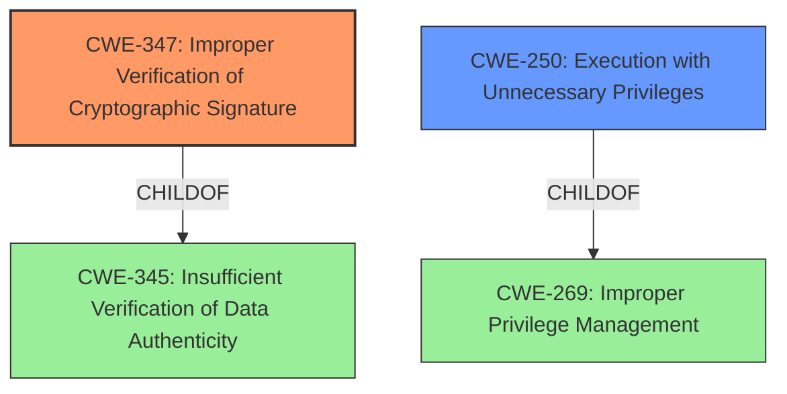

# Raw Analyzer Response for CVE-2024-34331

# Summary

| CWE ID   | CWE Name                                                        | Confidence | CWE Abstraction Level | CWE Vulnerability Mapping Label | CWE-Vulnerability Mapping Notes |
| -------- | --------------------------------------------------------------- | ---------- | --------------------- | ------------------------------- | ------------------------------- |
| CWE-347  | Improper Verification of Cryptographic Signature                | 0.9        | Base                  | Primary                         | Allowed                        |
| CWE-250  | Execution with Unnecessary Privileges                          | 0.7        | Base                  | Secondary                       | Allowed                        |

## Evidence and Confidence

*   **Confidence Score:** 0.8
*   **Evidence Strength:** HIGH

## Relationship Analysis

The primary relationship identified is that **CWE-347 (Improper Verification of Cryptographic Signature)** is the root cause, as the **lack of code signature verification** directly led to the vulnerability. **CWE-250 (Execution with Unnecessary Privileges)** is related because the `Parallels Service` was running with elevated privileges (`setuid root`), which amplified the impact of the signature verification failure. While CWE-347 is a child of CWE-345 (Insufficient Verification of Data Authenticity), CWE-347 is more specific, relating to cryptographic signatures. CWE-250 is a child of CWE-269 (Improper Privilege Management), but CWE-250 is more specific as it addresses the case where code is executed with higher privileges than necessary.

## Vulnerability Chain

The vulnerability chain starts with the **lack of code signature verification (CWE-347)**. Because the `Parallels Service` was running with **unnecessary root privileges (CWE-250)**, the failure to verify the signature of `createinstallmedia` led to the execution of malicious code with root privileges, resulting in privilege escalation.

## Summary of Analysis

The analysis is strongly based on the provided evidence, specifically the "Vulnerability Description Key Phrases" and "CVE Reference Links Content Summary" which clearly identify the **lack of code signature verification** as the root cause. The summary highlights that the `repack_osx_install_app.sh` script did not verify the code signature of `createinstallmedia` before execution. The retriever results also suggest **CWE-347 (Improper Verification of Cryptographic Signature)** as a potential match. The guidance on privileges vs. permissions further supports the choice of CWE-250, as the `Parallels Service` was running with higher privileges than necessary.

The selected CWEs are at the optimal level of specificity because they directly address the root cause (**lack of code signature verification**) and a contributing factor (**unnecessary privileges**). While higher-level CWEs like CWE-345 and CWE-269 could apply, they are less specific and do not capture the full nature of the vulnerability.

Relevant CWE Information:

*   **CWE-347: Improper Verification of Cryptographic Signature**
    *   This is the primary weakness, as the **lack of code signature verification** on `createinstallmedia` allowed the execution of malicious code. The vulnerability description explicitly mentions this **lack of verification**. The "CVE Reference Links Content Summary" confirms that the `repack_osx_install_app.sh` script was not verifying the code signature of `createinstallmedia` before execution.
    *   Security implication: Allows attackers to execute arbitrary code.
    *   CWE-347 is a base level CWE and a child of CWE-345 (Insufficient Verification of Data Authenticity), but it is more specific to cryptographic signatures.
    *   Confidence: 0.9
*   **CWE-250: Execution with Unnecessary Privileges**
    *   The `Parallels Service` was running with `setuid root`, which means it had root privileges. This amplified the impact of the signature verification failure, as the malicious code was executed with root privileges.
    *   Security implication: Increases the impact of other vulnerabilities.
    *   CWE-250 is a base level CWE and a child of CWE-269 (Improper Privilege Management), but it is more specific as it addresses the case where code is executed with higher privileges than necessary.
    *   Confidence: 0.7

Other CWEs considered but not used:

*   CWE-269: Improper Privilege Management - This is a class-level CWE, and CWE-250 is a more specific child.
*   CWE-345: Insufficient Verification of Data Authenticity - This is a class-level CWE, and CWE-347 is a more specific child.
*   CWE-732: Incorrect Permission Assignment for Critical Resource - This CWE is more about incorrect permissions being assigned to resources, whereas this vulnerability is about code signature verification.
*   CWE-367: Time-of-check Time-of-use (TOCTOU) Race Condition - There is no evidence of a TOCTOU race condition in the vulnerability description.
*   CWE-427: Uncontrolled Search Path Element - There is no evidence of an uncontrolled search path element in the vulnerability description.