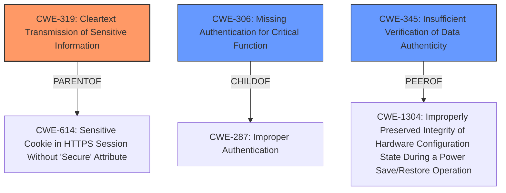

# Analysis Report for CVE-2024-34463

# Vulnerability Analysis Report: CVE-2024-34463

## Description

BPL Personal Weighing Scale PWS-01BT IND/09/18/599 devices **send sensitive information in unencrypted BLE packets**. (The packet data also lacks authentication and integrity protection.)

## Vulnerability Description Key Phrases

- **Weakness:** send sensitive information in unencrypted BLE packets
- **Impact:** integrity
- **Product:** BPL Personal Weighing Scale PWS-01BT IND/09/18/599

## Analysis (with Relationship Data)

# Summary

| CWE ID  | CWE Name                                                    | Confidence | CWE Abstraction Level | CWE Vulnerability Mapping Label | CWE-Vulnerability Mapping Notes |
| :-------- | :---------------------------------------------------------- | :--------- | :-------------------- | :------------------------------ | :------------------------------ |
| CWE-319   | Cleartext Transmission of Sensitive Information           | 1.0        | Base                  | Primary                         | Allowed                       |
| CWE-306   | Missing Authentication for Critical Function              | 0.7        | Base                  | Secondary                       | Allowed                       |
| CWE-345   | Insufficient Verification of Data Authenticity            | 0.6        | Class                 | Secondary                       | Discouraged                    |

## Evidence and Confidence

*   **Confidence Score:** 0.8
*   **Evidence Strength:** HIGH

## Relationship Analysis

The primary CWE is CWE-319, which describes the core issue of transmitting sensitive information in cleartext. CWE-306 (Missing Authentication for Critical Function) is a related weakness as the lack of authentication exacerbates the risk of cleartext transmission. CWE-345 (Insufficient Verification of Data Authenticity) is related because the packets lack authentication and integrity protection. CWE-319 is a base-level CWE, offering a good balance between specificity and generality. CWE-306 and CWE-345 are Class level CWEs and are less specific than CWE-319.



## Vulnerability Chain

The vulnerability chain starts with the **transmission of sensitive information in unencrypted BLE packets** (CWE-319). The **lack of authentication and integrity protection** (CWE-306 and CWE-345) allows attackers to easily intercept and interpret the data, potentially leading to privacy violations and misuse of personal information.

## Summary of Analysis

The analysis strongly supports the selection of CWE-319 as the primary CWE, given the explicit statement that the device "**send sensitive information in unencrypted BLE packets**". This aligns perfectly with the description of CWE-319. The CVE Reference Links Content Summary also confirms the root cause as "**Insecure Bluetooth Communication:** The scale uses a publicly broadcasted Bluetooth beacon to transmit weight data without any encryption or authentication." The other CWEs considered, such as CWE-306 and CWE-345, are related but represent contributing factors rather than the primary weakness.

The evidence is very strong, providing high confidence in the mapping. The graph relationships helped clarify the connections between different weaknesses, but the decision was primarily driven by the direct evidence of cleartext transmission. The selected CWEs are at the optimal level of specificity, with CWE-319 being a base-level CWE that accurately reflects the nature of the vulnerability.

Relevant CWE Information:

*   **CWE-319: Cleartext Transmission of Sensitive Information**
    *   The vulnerability description explicitly states the device "sends sensitive information in unencrypted BLE packets."
    *   This directly matches the CWE description: "The product transmits sensitive or security-critical data in cleartext in a communication channel that can be sniffed by unauthorized actors."
    *   Security Impact: Allows attackers to intercept and read sensitive data.
    *   Relationship: Base level CWE, providing a good level of specificity.
    *   Mapping Guidance: Allowed.
*   **CWE-306: Missing Authentication for Critical Function**
    *   The vulnerability description also states that "The packet data also lacks authentication and integrity protection." The "CVE Reference Links Content Summary" confirms that there is "**Lack of Pairing/Authentication:**".
    *   This aligns with the CWE description: "The product does not perform any authentication for functionality that requires a provable user identity or consumes a significant amount of resources."
    *   Security Impact: Allows unauthorized access to sensitive functionality.
    *   Relationship: ChildOf CWE-287 (Improper Authentication).
    *   Mapping Guidance: Allowed.
*   **CWE-345: Insufficient Verification of Data Authenticity**
    *   The vulnerability description also states that "The packet data also lacks authentication and integrity protection." The "CVE Reference Links Content Summary" confirms that there is a "**Lack of Pairing/Authentication:**".
    *   This aligns with the CWE description: "The product does not sufficiently verify the origin or authenticity of data, in a way that causes it to accept invalid data."
    *   Security Impact: Allows attackers to inject false information.
    *   Relationship: PeerOf CWE-1304 (Improperly Preserved Integrity of Hardware Configuration State During a Power Save/Restore Operation)
    *   Mapping Guidance: Discouraged.
*   **CWE-614: Sensitive Cookie in HTTPS Session Without 'Secure' Attribute**
    *   This CWE was considered because it relates to sensitive information and secure attributes, but it is specific to cookies in HTTPS sessions, which is not relevant to this vulnerability.
*   **CWE-522: Insufficiently Protected Credentials**
    *   This CWE was considered because the BLE packets lacked authentication, but the vulnerability does not explicitly involve credentials.
*   **CWE-256: Plaintext Storage of a Password**
    *   This CWE was not selected because the vulnerability is related to transmission of data and not storage.
*   **CWE-312: Cleartext Storage of Sensitive Information**
    *   This CWE was not selected because the vulnerability is related to transmission of data and not storage.


## CWE Relationship Analysis

Current CWEs represent these abstraction levels: .


### Vulnerability Chain Analysis

**Chain starting from CWE-345:**
- 345 (Insufficient Verification of Data Authenticity) - ROOT


**Chain starting from CWE-319:**
- 319 (Cleartext Transmission of Sensitive Information) - ROOT


### CWE Relationship Diagram

```mermaid
graph TD
    classDef primary fill:#f96,stroke:#333,stroke-width:2px
    classDef secondary fill:#69f,stroke:#333
    classDef tertiary fill:#9e9,stroke:#333
```


*Report generated on 2025-07-13 08:09:17*
