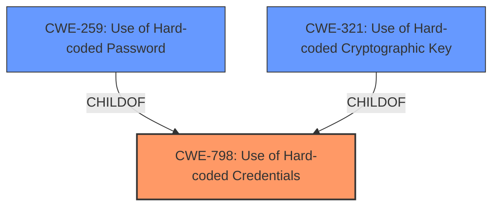

# Analysis Report for CVE-2024-34539

# Vulnerability Analysis Report: CVE-2024-34539

## Description

Hardcoded credentials in TerraMaster TOS firmware through 5.1 allow a remote attacker to successfully login to the mail or webmail server. These credentials can also be used to login to the administration panel and to perform privileged actions.

## Vulnerability Description Key Phrases

- **Rootcause:** hardcoded credentials
- **Impact:** login to mail/webmail server, administration panel, perform privileged actions
- **Attacker:** remote attacker
- **Product:** TerraMaster TOS firmware
- **Version:** through 5.1

## Analysis (with Relationship Data)

# Summary
| CWE ID | CWE Name | Confidence | CWE Abstraction Level | CWE Vulnerability Mapping Label | CWE-Vulnerability Mapping Notes |
|---|---|---|---|---|---|
| CWE-798 | Use of Hard-coded Credentials | 1.0 | Base | Primary | Allowed |
| CWE-259 | Use of Hard-coded Password | 0.7 | Variant | Secondary | Allowed |
| CWE-321 | Use of Hard-coded Cryptographic Key | 0.6 | Variant | Secondary | Allowed |

## Evidence and Confidence

*   **Confidence Score:** 0.9
*   **Evidence Strength:** HIGH

## Relationship Analysis
The primary CWE is CWE-798 (Use of Hard-coded Credentials), which is a Base level CWE. CWE-259 (Use of Hard-coded Password) and CWE-321 (Use of Hard-coded Cryptographic Key) are both variants of CWE-798. Since the vulnerability description specifically mentions hardcoded credentials being used to log in, CWE-798 is the most appropriate primary CWE. If the hardcoded credential was specifically a password, CWE-259 could be considered but CWE-798 is still a better fit. If the hardcoded credential was specifically a cryptographic key, CWE-321 would be a suitable variant, but not mentioned in the description.



## Vulnerability Chain
The vulnerability chain starts with the **hardcoded credentials** (CWE-798). This leads to the impact of a remote attacker being able to log in to the mail/webmail server and the administration panel, allowing them to perform privileged actions.

## Summary of Analysis
The vulnerability description clearly states the presence of **hardcoded credentials**, which is the root cause of the issue. This aligns perfectly with CWE-798 (Use of Hard-coded Credentials). The "CVE Reference Links Content Summary" also reinforces this by explicitly mentioning the use of hardcoded administrative credentials. The retriever results also list CWE-798 as the top candidate.

The selection of CWE-798 is based on the direct evidence of **hardcoded credentials** being the root cause, as stated in the vulnerability description and the CVE reference. The relationships to CWE-259 and CWE-321 were considered, but not selected as the primary CWE because the credentials were not explicitly identified as a password or a cryptographic key.

Other CWEs Considered:
*   CWE-259: Use of Hard-coded Password - Considered since passwords are a type of credential, but the description does not specify that the **hardcoded credential** is specifically a password.
*   CWE-321: Use of Hard-coded Cryptographic Key - Considered because cryptographic keys are a type of credential, but the description does not specify that the **hardcoded credential** is specifically a key.
*   CWE-1392: Use of Default Credentials - Not selected because the credentials are **hardcoded**, not default credentials.
*   CWE-912: Hidden Functionality - Not relevant as this is not about hidden or undocumented functionality.
*   CWE-89: Improper Neutralization of Special Elements used in an SQL Command ('SQL Injection') - Not relevant as there is no mention of SQL injection.
*   CWE-522: Insufficiently Protected Credentials - Not relevant as the core issue is the **hardcoded** nature of the credentials, not how they are stored or transmitted.
*   CWE-287: Improper Authentication - Not relevant as this is a consequence rather than the root cause.
*   CWE-456: Missing Initialization of a Variable - Not relevant.


## CWE Relationship Analysis

Current CWEs represent these abstraction levels: .


### Vulnerability Chain Analysis

**Chain starting from CWE-321:**
- 321 (Use of Hard-coded Cryptographic Key) - ROOT


**Chain starting from CWE-89:**
- 89 (Improper Neutralization of Special Elements used in an SQL Command ('SQL Injection')) - ROOT


### CWE Relationship Diagram

```mermaid
graph TD
    classDef primary fill:#f96,stroke:#333,stroke-width:2px
    classDef secondary fill:#69f,stroke:#333
    classDef tertiary fill:#9e9,stroke:#333
```


*Report generated on 2025-07-13 08:09:32*
