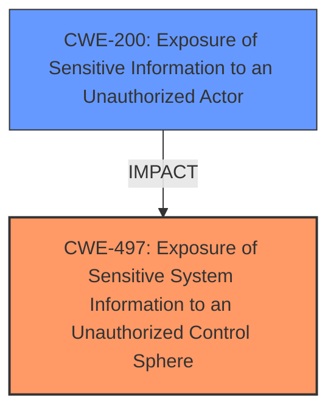

# Enhanced Analysis for CVE-2024-34594

# Summary
| CWE ID | CWE Name | Confidence | CWE Abstraction Level | CWE Vulnerability Mapping Label | CWE-Vulnerability Mapping Notes |
|---|---|---|---|---|---|
| CWE-497 | Exposure of Sensitive System Information to an Unauthorized Control Sphere | 0.8 | Base | Allowed | Primary CWE. This captures the root cause of the exposure of sensitive kernel memory addresses due to an unnecessary proc_entry. |
| CWE-200 | Exposure of Sensitive Information to an Unauthorized Actor | 0.6 | Class | Discouraged | Secondary CWE. This reflects the impact of the vulnerability, where sensitive information is exposed to unauthorized actors. |

## Evidence and Confidence

*   **Confidence Score:** 0.7
*   **Evidence Strength:** MEDIUM

## Relationship Analysis
The primary relationship is between CWE-497 [CWE-497: Exposure of Sensitive System Information to an Unauthorized Control Sphere] and CWE-200 [CWE-200: Exposure of Sensitive Information to an Unauthorized Actor]. CWE-497 represents the root cause, which leads to the impact described by CWE-200. While CWE-200 is a more general class, CWE-497 is a Base level CWE that specifically identifies the exposure of sensitive system information which aligns well with the vulnerability description.



## Vulnerability Chain
The vulnerability chain starts with an unnecessary proc_entry in the proc file system (CWE-497 [CWE-497: Exposure of Sensitive System Information to an Unauthorized Control Sphere]). This leads to the exposure of kernel memory addresses to local attackers (CWE-200 [CWE-200: Exposure of Sensitive Information to an Unauthorized Actor]).

## Summary of Analysis
The initial analysis focused on identifying the root cause of the vulnerability. The "CVE Reference Links Content Summary" clearly states that the vulnerability is caused by an "unnecessary proc_entry in the proc file system," leading to the exposure of sensitive information.

CWE-497 [CWE-497: Exposure of Sensitive System Information to an Unauthorized Control Sphere] was chosen as the primary CWE because it specifically addresses the exposure of sensitive system-level information due to improper access control within the system, which is the root cause. The description of CWE-497 aligns with the root cause description "unnecessary proc_entry in the proc file system".

CWE-200 [CWE-200: Exposure of Sensitive Information to an Unauthorized Actor] was considered to represent the impact of the vulnerability. The vulnerability description explicitly mentions the "Exposure of sensitive information and read kernel memory address".

The graph relationships helped clarify the relationship between the root cause and the impact, with CWE-497 [CWE-497: Exposure of Sensitive System Information to an Unauthorized Control Sphere] leading to CWE-200 [CWE-200: Exposure of Sensitive Information to an Unauthorized Actor].

The selected CWEs are at the optimal level of specificity, with CWE-497 [CWE-497: Exposure of Sensitive System Information to an Unauthorized Control Sphere] providing a base-level description of the root cause and CWE-200 [CWE-200: Exposure of Sensitive Information to an Unauthorized Actor] describing the resulting impact.

Other CWEs Considered but Not Used:

*   CWE-213 [CWE-213: Exposure of Sensitive Information Due to Incompatible Policies]: While this CWE also deals with the exposure of sensitive information, it focuses on incompatible policies, which is not the primary issue in this case. The issue is more about an unnecessary entry in the proc file system allowing access to sensitive information.
*   CWE-668 [CWE-668: Exposure of Resource to Wrong Sphere]: This is a high-level class that describes exposing a resource to the wrong control sphere. While applicable, it is less specific than CWE-497 [CWE-497: Exposure of Sensitive System Information to an Unauthorized Control Sphere], which directly addresses the system-level information exposure.
*   CWE-285 [CWE-285: Improper Authorization] and CWE-284 [CWE-284: Improper Access Control]: These CWEs are related to authorization and access control issues. While the vulnerability involves unauthorized access to kernel memory addresses, the root cause is not directly related to a missing or incorrect authorization check but rather to the unnecessary presence of an entry in the proc file system.


## CWE Relationship Analysis

Current CWEs represent these abstraction levels: .


### Vulnerability Chain Analysis

**Chain starting from CWE-213:**
- 213 (Exposure of Sensitive Information Due to Incompatible Policies) - ROOT


**Chain starting from CWE-285:**
- 285 (Improper Authorization) - ROOT


### CWE Relationship Diagram

```mermaid
graph TD
    classDef primary fill:#f96,stroke:#333,stroke-width:2px
    classDef secondary fill:#69f,stroke:#333
    classDef tertiary fill:#9e9,stroke:#333
```