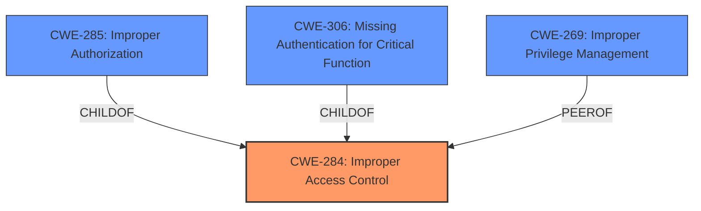

# Analysis Report for CVE-2024-34595

# Vulnerability Analysis Report: CVE-2024-34595

## Description

**Improper access control** in clickAdapterItem of SystemUI prior to SMR Jul-2024 Release 1 allows local attackers to launch privileged activities.

## Vulnerability Description Key Phrases

- **Rootcause:** Improper access control
- **Impact:** launch privileged activities
- **Attacker:** local attackers
- **Product:** SystemUI
- **Version:** prior to SMR Jul-2024 Release 1
- **Component:** clickAdapterItem

## Analysis (with Relationship Data)

# Summary
| CWE ID | CWE Name | Confidence | CWE Abstraction Level | CWE Vulnerability Mapping Label | CWE-Vulnerability Mapping Notes |
|---|---|---|---|---|---|
| CWE-284 | Improper Access Control | 0.8 | Pillar | Allowed | Primary CWE |
| CWE-269 | Improper Privilege Management | 0.6 | Class | Discouraged | Secondary Candidate |

## Evidence and Confidence

*   **Confidence Score:** 0.8
*   **Evidence Strength:** HIGH

## Relationship Analysis
The primary CWE selected is CWE-284, which is a high-level category. The vulnerability description indicates **improper access control**, which aligns with CWE-284's description. Given the lack of specific details in the vulnerability description to pinpoint the exact mechanism of the access control failure (authentication vs. authorization), CWE-284 serves as a suitable starting point.

The relationship analysis considered child CWEs of CWE-284, such as CWE-285 (Improper Authorization) and CWE-306 (Missing Authentication for Critical Function). However, the vulnerability description does not provide enough information to determine whether the access control issue stems from a lack of authorization or authentication. Therefore, the higher-level CWE-284 is chosen because it better reflects the general nature of the vulnerability as described.



## Vulnerability Chain
The vulnerability chain starts with the **improper access control** in the `clickAdapterItem` function (CWE-284), which allows a local attacker to launch privileged activities.

Vulnerability Chain:
1.  **Improper Access Control** (CWE-284): The root cause is the lack of proper access control in the `clickAdapterItem` function.
2.  **Launch Privileged Activities:** The impact of the vulnerability is that a local attacker can launch privileged activities.

## Summary of Analysis
The initial assessment identified **improper access control** as the primary weakness. The provided vulnerability description states, "**Improper access control** in clickAdapterItem of SystemUI prior to SMR Jul-2024 Release 1 allows local attackers to launch privileged activities." The "CVE Reference Links Content Summary" section further supports this by stating: "The vulnerability stems from a lack of proper access control in the `clickAdapterItem` function within SystemUI."

Given the limited information, choosing a more specific CWE would be speculative. Therefore, CWE-284 is the most appropriate and specific choice based on the available evidence.

CWE-269 (Improper Privilege Management) was considered since launching privileged activities could be related to privilege management. However, since the root cause is **improper access control**, CWE-284 is the more direct and appropriate classification.

Relevant CWE Information:

# Enhanced Context (25 CWEs)
The following CWEs were identified as potentially relevant to this vulnerability:

## CWE-451: User Interface (UI) Misrepresentation of Critical Information
**Abstraction Level**: Class
**Similarity Score**: 0.78

## CWE-203: Observable Discrepancy
**Abstraction Level**: Base
**Similarity Score**: 0.77

## CWE-345: Insufficient Verification of Data Authenticity
**Abstraction Level**: Class
**Similarity Score**: 0.77

## CWE-267: Privilege Defined With Unsafe Actions
**Abstraction Level**: Base
**Similarity Score**: 0.77

## CWE-497: Exposure of Sensitive System Information to an Unauthorized Control Sphere
**Abstraction Level**: Base
**Similarity Score**: 0.77

## CWE-754: Improper Check for Unusual or Exceptional Conditions
**Abstraction Level**: Class
**Similarity Score**: 0.76

## CWE-668: Exposure of Resource to Wrong Sphere
**Abstraction Level**: Class
**Similarity Score**: 0.75

## CWE-1021: Improper Restriction of Rendered UI Layers or Frames
**Abstraction Level**: Base
**Similarity Score**: 0.75

## CWE-280: Improper Handling of Insufficient Permissions or Privileges 
**Abstraction Level**: Base
**Similarity Score**: 0.75

## CWE-266: Incorrect Privilege Assignment
**Abstraction Level**: Base
**Similarity Score**: 0.75

## CWE-285: Improper Authorization
**Abstraction Level**: Class
**Similarity Score**: 1451.50

## CWE-863: Incorrect Authorization
**Abstraction Level**: Class
**Similarity Score**: 1426.85

## CWE-639: Authorization Bypass Through User-Controlled Key
**Abstraction Level**: Base
**Similarity Score**: 1383.99

## CWE-287: Improper Authentication
**Abstraction Level**: Class
**Similarity Score**: 1359.04

## CWE-306: Missing Authentication for Critical Function
**Abstraction Level**: Base
**Similarity Score**: 1335.67

## CWE-306: Missing Authentication for Critical Function
**Abstraction Level**: base
**Similarity Score**: 2.47

## CWE-250: Execution with Unnecessary Privileges
**Abstraction Level**: base
**Similarity Score**: 2.47

## CWE-613: Insufficient Session Expiration
**Abstraction Level**: base
**Similarity Score**: 2.21

## CWE-1304: Improperly Preserved Integrity of Hardware Configuration State During a Power Save/Restore Operation
**Abstraction Level**: base
**Similarity Score**: 2.18

## CWE-927: Use of Implicit Intent for Sensitive Communication
**Abstraction Level**: variant
**Similarity Score**: 2.16

## CWE-926: Improper Export of Android Application Components
**Abstraction Level**: variant
**Similarity Score**: 2.16

## CWE-213: Exposure of Sensitive Information Due to Incompatible Policies
**Abstraction Level**: base
**Similarity Score**: 2.12

## CWE-708: Incorrect Ownership Assignment
**Abstraction Level**: base
**Similarity Score**: 2.05

## CWE-280: Improper Handling of Insufficient Permissions or Privileges 
**Abstraction Level**: Base
**Similarity Score**: 1.97

## CWE-290: Authentication Bypass by Spoofing
**Abstraction Level**: base
**Similarity Score**: 1.80


## CWE Relationship Analysis

Current CWEs represent these abstraction levels: .


### Vulnerability Chain Analysis

**Chain starting from CWE-345:**
- 345 (Insufficient Verification of Data Authenticity) - ROOT


**Chain starting from CWE-639:**
- 639 (Authorization Bypass Through User-Controlled Key) - ROOT


### CWE Relationship Diagram

```mermaid
graph TD
    classDef primary fill:#f96,stroke:#333,stroke-width:2px
    classDef secondary fill:#69f,stroke:#333
    classDef tertiary fill:#9e9,stroke:#333
```


*Report generated on 2025-07-13 08:12:32*
