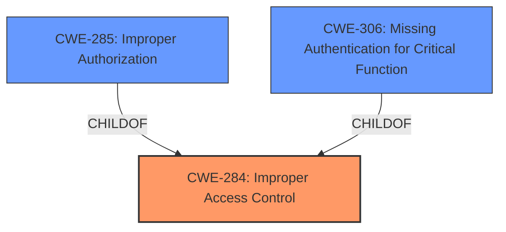

# Raw Analyzer Response for CVE-2024-34603

# Summary
| CWE ID | CWE Name | Confidence | CWE Abstraction Level | CWE Vulnerability Mapping Label | CWE-Vulnerability Mapping Notes |
|---|---|---|---|---|---|
| CWE-284 | Improper Access Control | 0.8 | Pillar | Primary | Discouraged |
| CWE-285 | Improper Authorization | 0.6 | Class | Secondary Candidate | Discouraged |
| CWE-306 | Missing Authentication for Critical Function | 0.4 | Base | Secondary Candidate | Allowed |

## Evidence and Confidence

*   **Confidence Score:** 0.8
*   **Evidence Strength:** MEDIUM

## Relationship Analysis
The primary relationship influencing my decision is the hierarchical structure between CWE-284 (Improper Access Control) and its children, particularly CWE-285 (Improper Authorization) and CWE-306 (Missing Authentication for Critical Function). While the description indicates **improper access control**, the exact nature (authorization vs. authentication) is not explicitly stated. Therefore, I've chosen the higher-level CWE-284 as the primary mapping, but also included CWE-285 and CWE-306 as secondary candidates that might be more appropriate with additional information. The abstraction levels influenced the decision, prioritizing the broader Pillar level (CWE-284) due to lack of specificity.

## Vulnerability Chain
The vulnerability chain starts with **Improper access control** which leads to a local attacker being able to access location data.

Improper Access Control --> Access Location Data

- CWE-284 is a root cause.
- There is insufficient information to define a more detailed chain.

## Summary of Analysis
The initial analysis focused on identifying the root cause and impact of the vulnerability. The key phrase "**Improper access control**" directly points to a weakness in how the application manages access to resources. The impact, "access location data," highlights the sensitive nature of the data being exposed.

The retriever results suggested several CWEs related to access control and authorization. However, the vulnerability description lacks specific details about whether the **improper access control** stems from a missing authorization check (CWE-862), an incorrect authorization check (CWE-863), or a complete lack of authentication (CWE-306).

Given the ambiguity, I chose CWE-284 (Improper Access Control) as the primary mapping. This CWE serves as a high-level umbrella for access control issues when the specific root cause is unclear.

The classification guidance reinforced this decision, suggesting that CWE-284 is appropriate when the root cause is not clearly authentication or authorization. If more information becomes available, a more specific CWE like CWE-285 or CWE-306 might be more suitable.

The evidence from the "Vulnerability Description Key Phrases" and "CVE Reference Links Content Summary" sections confirms the **improper access control** as the root cause.

My confidence in the mapping is relatively high (0.8), given the direct evidence of **improper access control**. However, the lack of specificity in the description prevents a more precise mapping.

*   **CWE-284:** Improper Access Control
    *   **Technical Explanation:** The vulnerability description explicitly states "**Improper access control**." This CWE is a high-level category that applies when access control mechanisms are flawed, but the specific nature of the flaw (e.g., missing authorization, incorrect permission checks) is not clear.
    *   **Security Implications:** Allows unauthorized access to sensitive resources or functionality.
    *   **Relationship Analysis:** This is a Pillar-level CWE with more specific child CWEs like CWE-285 (Improper Authorization) and CWE-306 (Missing Authentication for Critical Function).
    *   **Mapping Guidance Influence:** The classification guidance suggests using CWE-284 when the root cause isn't clearly authentication or authorization.
    *   **Confidence:** 0.8

*   **CWE-285:** Improper Authorization
    *   **Technical Explanation:** This CWE applies if the access control issue stems from an incorrect or missing authorization check. While the description mentions "**Improper access control**," it's possible that the underlying cause is a failure to properly authorize access based on user roles or permissions.
    *   **Security Implications:** Allows users to perform actions or access resources they are not authorized to.
    *   **Relationship Analysis:** Child of CWE-284.
    *   **Mapping Guidance Influence:** Discouraged as a primary mapping if a more specific CWE is available, but considered here as a potential secondary mapping.
    *   **Confidence:** 0.6

*   **CWE-306:** Missing Authentication for Critical Function
    *   **Technical Explanation:** This CWE applies if the vulnerability stems from a complete lack of authentication for a critical function. It's possible that the "**Improper access control**" involves a sensitive function that lacks any authentication mechanism.
    *   **Security Implications:** Allows anyone to access sensitive functionality without proving their identity.
    *   **Relationship Analysis:** Child of CWE-287 (Improper Authentication), which is a parent of CWE-306 and also a child of CWE-284.
    *   **Mapping Guidance Influence:** Used when no identity validation is enforced for sensitive functionality.
    *   **Confidence:** 0.4

CWEs considered but not used:

*   CWE-862 (Missing Authorization): This CWE was considered but not selected as the primary mapping because the vulnerability description doesn't explicitly state that authorization checks are missing. If further investigation reveals that the **improper access control** is due to a lack of authorization checks, this CWE would be more appropriate.
*   CWE-863 (Incorrect Authorization): Similar to CWE-862, this CWE was considered but not selected because the description doesn't provide enough information to determine whether the authorization checks are present but flawed.
*   CWE-287 (Improper Authentication): This CWE was considered, but the description doesn't explicitly indicate that the authentication process itself is flawed. CWE-306 is more specific to the scenario of missing authentication, which is a possibility.