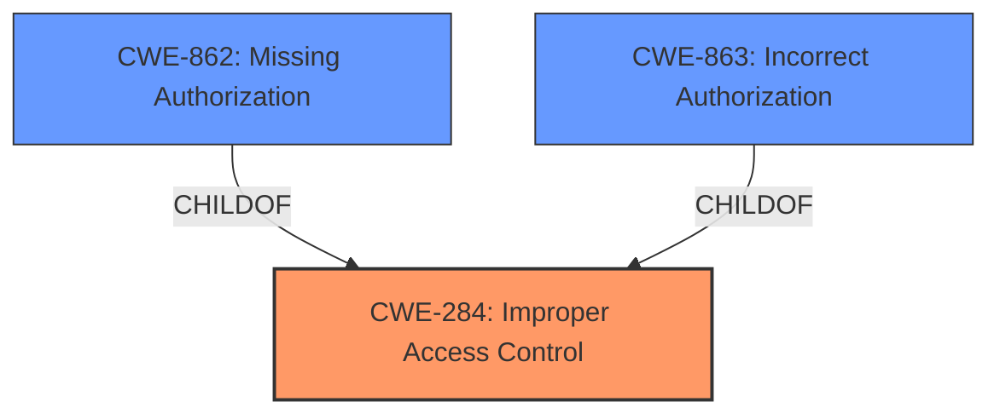

# Analysis Report for CVE-2024-34604

# Vulnerability Analysis Report: CVE-2024-34604

## Description

**Improper access control** in LedCoverService prior to SMR Aug-2024 Release 1 allows local attackers to bypass restrictions on starting services from the background.

## Vulnerability Description Key Phrases

- **Rootcause:** Improper access control
- **Impact:** bypass restrictions on starting services from the background
- **Attacker:** local attackers
- **Product:** LedCoverService
- **Version:** prior to SMR Aug-2024 Release 1

## Analysis (with Relationship Data)

# Summary
| CWE ID | CWE Name | Confidence | CWE Abstraction Level | CWE Vulnerability Mapping Label | CWE-Vulnerability Mapping Notes |
|---|---|---|---|---|---|
| CWE-284 | Improper Access Control | 0.9 | Pillar | Primary CWE | Discouraged |
| CWE-862 | Missing Authorization | 0.7 | Class | Secondary Candidate | Allowed-with-Review |
| CWE-863 | Incorrect Authorization | 0.6 | Class | Secondary Candidate | Allowed-with-Review |

## Evidence and Confidence

*   **Confidence Score:** 0.9
*   **Evidence Strength:** MEDIUM

## Relationship Analysis
The primary relationship influencing the selection was the parent-child relationship between CWE-284 (Improper Access Control) and its children, such as CWE-862 (Missing Authorization) and CWE-863 (Incorrect Authorization). While the description points towards an authorization issue, the lack of specific details about whether authorization checks are missing or incorrect makes CWE-284 the most appropriate high-level choice.



## Vulnerability Chain
The vulnerability chain starts with the **improper access control**, which allows local attackers to bypass restrictions.

## Summary of Analysis
The initial assessment identified **improper access control** as the root cause, aligning with the provided vulnerability description and CVE details. The retriever results and CWE guidance further supported this direction.

The selection of CWE-284 is based on the **root cause** phrase "**improper access control**" and the impact of bypassing restrictions. The CWE guidance suggests using more specific children of CWE-284 if the root cause is more clear. However, the description does not explicitly state whether authorization checks are missing (CWE-862) or incorrectly implemented (CWE-863). Therefore, I am using CWE-284.

Relevant CWE Information:

# Enhanced Context (25 CWEs)
The following CWEs were identified as potentially relevant to this vulnerability:

## CWE-284: Improper Access Control
**Abstraction Level**: Pillar
**Similarity Score**: 0.172
**Source**: sparse

**Description**:
The software does not restrict access to resources (data, files, actions, etc.) to only the intended privileged actors or incorrectly restricts access.

**Mapping Guidance**:
- Usage: Discouraged
- Rationale: This is a very general category. It is better to select a more specific child.

## CWE-862: Missing Authorization
**Abstraction Level**: Class
**Similarity Score**: 0.564
**Source**: dense

**Description**:
The application does not perform an authorization check before an actor attempts to access a resource or perform an action.

**Mapping Guidance**:
- Usage: Allowed-with-Review
- Rationale: This CWE entry is a Class and might have Base-level children that would be more appropriate

## CWE-863: Incorrect Authorization
**Abstraction Level**: Class
**Similarity Score**: 0.149
**Source**: sparse

**Description**:
The product performs an authorization check when an actor attempts to access a resource or perform an action, but it does not correctly perform the check.

**Mapping Guidance**:
- Usage: Allowed-with-Review
- Rationale: This CWE entry is a Class and might have Base-level children that would be more appropriate

## CWE-285: Improper Authorization
**Abstraction Level**: Class
**Similarity Score**: 0.168
**Source**: sparse

**Description**:
The product does not perform or incorrectly performs an authorization check when an actor attempts to access a resource or perform an action.

**Mapping Guidance**:
- Usage: Discouraged
- Rationale: CWE-285 is high-level and lower-level CWEs can frequently be used instead. It is a level-1 Class (i.e., a child of a Pillar).

## CWE-306: Missing Authentication for Critical Function
**Abstraction Level**: Base
**Similarity Score**: 1287.48
**Source**: sparse

**Description**:
The product does not perform any authentication for functionality that requires a provable user identity or consumes a significant amount of resources.

**Mapping Guidance**:
- Usage: Allowed
- Rationale: This CWE entry is at the Base level of abstraction, which is a preferred level of abstraction for mapping to the root causes of vulnerabilities.

**CWE-284: Improper Access Control**
*   **Technical Explanation:** The vulnerability lies in the **improper access control** within the LedCoverService, leading to a bypass of restrictions on starting services from the background. This means the service does not adequately restrict access to its functionalities, allowing unauthorized local attackers to exploit it.
*   **Security Implications:** This can lead to privilege escalation or unauthorized execution of code within the context of the LedCoverService.
*   **Relationship Analysis:** CWE-284 is a high-level category. More specific CWEs like CWE-862 (Missing Authorization) or CWE-863 (Incorrect Authorization) could be considered if more details were available.
*   **Mapping Guidance:** The MITRE mapping guidance discourages using CWE-284 if a more specific child CWE is applicable. However, the provided information doesn't allow for a more precise classification, so CWE-284 is chosen as the most appropriate.

**CWE-862: Missing Authorization**
*   **Technical Explanation:** If the **improper access control** is due to a complete lack of authorization checks, CWE-862 would be applicable. This would mean the LedCoverService does not verify whether the attacker is authorized to start services from the background.
*   **Security Implications:** Similar to CWE-284, this can lead to privilege escalation or unauthorized code execution.
*   **Relationship Analysis:** CWE-862 is a child of CWE-284, representing a more specific type of access control issue.
*   **Mapping Guidance:** The MITRE mapping guidance allows for the use of CWE-862, especially if authorization checks are completely absent.

**CWE-863: Incorrect Authorization**
*   **Technical Explanation:** If the **improper access control** is due to incorrectly implemented authorization checks, CWE-863 would be applicable. This means the LedCoverService attempts to verify authorization but does so in a flawed manner, allowing unauthorized access.
*   **Security Implications:** Similar to CWE-284 and CWE-862, this can lead to privilege escalation or unauthorized code execution.
*   **Relationship Analysis:** CWE-863 is a child of CWE-284, representing another specific type of access control issue.
*   **Mapping Guidance:** The MITRE mapping guidance allows for the use of CWE-863 if the authorization checks are present but flawed.

**CWEs Considered but Not Used:**

*   CWE-285 (Improper Authorization): While closely related, CWE-285 is also a high-level category.
*   CWE-306 (Missing Authentication for Critical Function): The issue is about bypassing restrictions on starting services from the background, which are related to authorization, not authentication. Authentication determines *who* the actor is, while authorization determines *what* the actor is allowed to do.

The final decision is based on the available evidence, relationship analysis, and mapping guidance, resulting in the selection of CWE-284 as the primary CWE, with consideration for CWE-862 and CWE-863 if more details emerge about the specific nature of the authorization flaw.


## CWE Relationship Analysis

Current CWEs represent these abstraction levels: .


### Vulnerability Chain Analysis

**Chain starting from CWE-863:**
- 863 (Incorrect Authorization) - ROOT


**Chain starting from CWE-862:**
- 862 (Missing Authorization) - ROOT


### CWE Relationship Diagram

```mermaid
graph TD
    classDef primary fill:#f96,stroke:#333,stroke-width:2px
    classDef secondary fill:#69f,stroke:#333
    classDef tertiary fill:#9e9,stroke:#333
```


*Report generated on 2025-07-13 08:14:10*
