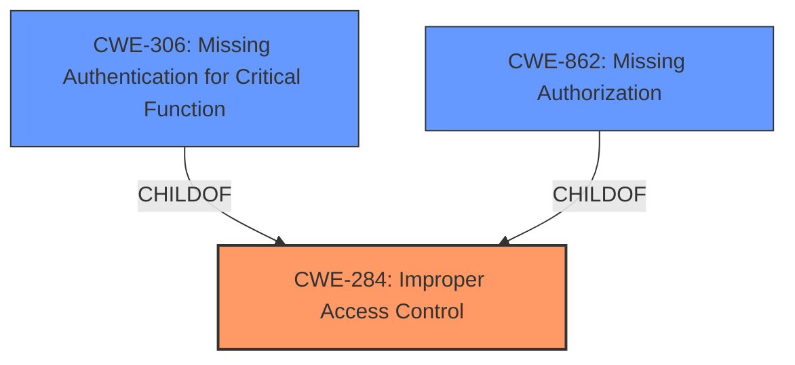

# Analysis Report for CVE-2024-34606

# Vulnerability Analysis Report: CVE-2024-34606

## Description

**Improper access control** in SmartThingsService prior to SMR Aug-2024 Release 1 allows local attackers to bypass restrictions on starting services from the background.

## Vulnerability Description Key Phrases

- **Rootcause:** Improper access control
- **Impact:** bypass restrictions on starting services from the background
- **Attacker:** local attackers
- **Product:** SmartThingsService
- **Version:** prior to SMR Aug-2024 Release 1

## Analysis (with Relationship Data)

# Summary
| CWE ID  | CWE Name                      | Confidence | CWE Abstraction Level | CWE Vulnerability Mapping Label | CWE-Vulnerability Mapping Notes |
| :------- | :----------------------------- | :--------- | :-------------------- | :------------------------------ | :----------------------------- |
| CWE-284 | Improper Access Control       | 0.85       | Pillar                | Primary CWE                     | Discouraged                  |
| CWE-306 | Missing Authentication for Critical Function | 0.65   | Base              | Secondary Candidate               | Allowed                   |
| CWE-862 | Missing Authorization | 0.65   | Base              | Secondary Candidate               | Allowed                   |

## Evidence and Confidence

*   **Confidence Score:** 0.80
*   **Evidence Strength:** MEDIUM

## Relationship Analysis

The primary relationship influencing the CWE selection is the hierarchical structure related to access control. CWE-284 is a high-level category, while CWE-306 and CWE-862 are more specific. The vulnerability description mentions "**Improper access control**", making CWE-284 a reasonable initial choice. However, it lacks detail to definitively pinpoint whether the access control issue stems from missing authentication (CWE-306) or missing authorization (CWE-862). Since it is unclear whether identity was checked (authentication) or authorization was missing/incorrect, the higher level CWE-284 is preferred. If more information were available, a more specific CWE could be selected.



## Vulnerability Chain

The vulnerability chain starts with "**Improper access control**" (CWE-284), which allows local attackers to bypass restrictions on starting services from the background. The chain is:

1.  **Root Cause:** CWE-284 (**Improper access control**)
2.  **Impact:** Bypass restrictions on starting services from the background.

The description does not provide sufficient detail to determine whether the **improper access control** is due to missing authentication or missing authorization.

## Summary of Analysis

The initial assessment, based on the "**Improper access control**" key phrase, pointed towards CWE-284. The retriever results also highlighted CWE-285 (**Improper Authorization**), CWE-863 (**Incorrect Authorization**), and CWE-306 (**Missing Authentication for Critical Function**) as potential candidates.

The guidance on Authentication vs Authorization vs Access Control helped refine the selection. The guidance emphasizes that if the root cause is unclear, using CWE-284 is acceptable, but if it can be determined whether identity was checked or not, then CWE-306 or CWE-862, respectively, should be used.

The available evidence does not provide enough information to definitively choose between authentication and authorization issues. Therefore, CWE-284 (**Improper Access Control**) remains the primary CWE due to its broad applicability to access control failures. However, due to the commonality of Authentication and Authorization issues, CWE-306 and CWE-862 are listed as secondary candidates.

Relevant CWE Information:

# Enhanced Context (10 CWEs)
The following CWEs were identified as potentially relevant to this vulnerability:

## CWE-284: Improper Access Control
**Abstraction Level**: Pillar
**Description**: The software does not restrict access to resources (data, files, actions, etc.) to only the intended privileged actors (users, processes, etc.).
**Mapping Guidance**:
- Usage: Discouraged
- Rationale: CWE-284 is high-level and lower-level CWEs can frequently be used instead. It is a level-1 Class (i.e., a child of a Pillar).
**Relationships**:
- PARENTOF -> CWE-602
- PARENTOF -> CWE-538
- PARENTOF -> CWE-732
- PARENTOF -> CWE-264
- PARENTOF -> CWE-266
- PARENTOF -> CWE-269
- PARENTOF -> CWE-285
- PARENTOF -> CWE-287
- PARENTOF -> CWE-425
- PARENTOF -> CWE-664
- PARENTOF -> CWE-924
- PARENTOF -> CWE-1004
- PARENTOF -> CWE-1304
- CANFOLLOW -> CWE-41
- CANFOLLOW -> CWE-22
- CANFOLLOW -> CWE-73
- CANFOLLOW -> CWE-99
- CANFOLLOW -> CWE-269

## CWE-285: Improper Authorization
**Abstraction Level**: Class
**Description**: The product does not perform or incorrectly performs an authorization check when an actor attempts to access a resource or perform an action.
**Mapping Guidance**:
- Usage: Discouraged
- Rationale: CWE-285 is high-level and lower-level CWEs can frequently be used instead. It is a level-1 Class (i.e., a child of a Pillar).

## CWE-863: Incorrect Authorization
**Abstraction Level**: Class
**Description**: The product performs an authorization check when an actor attempts to access a resource or perform an action, but it does not correctly perform the check.
**Mapping Guidance**:
- Usage: Allowed-with-Review
- Rationale: This CWE entry is a Class and might have Base-level children that would be more appropriate

## CWE-269: Improper Privilege Management
**Abstraction Level**: Class
**Description**: The software does not properly manage privileges, possibly including privilege assignment, privilege checking, or elevation of privileges.
**Mapping Guidance**:
- Usage: Discouraged
- Rationale: This CWE entry is a Class and might have Base-level children that would be more appropriate

## CWE-927: Use of Implicit Intent for Sensitive Communication
**Abstraction Level**: Variant
**Description**: The application uses an implicit intent to send sensitive information to a component, but this may result in the unintended exposure of the information if the target component is not properly secured.
**Mapping Guidance**:
- Usage: Allowed
- Rationale: This CWE entry is at the Variant level of abstraction, which is a preferred level of abstraction for mapping to the root causes of vulnerabilities.

## CWE-287: Improper Authentication
**Abstraction Level**: Class
**Description**: When an actor claims to have a given identity, the product does not prove or insufficiently proves that the claim is correct.
**Mapping Guidance**:
- Usage: Discouraged
- Rationale: This CWE entry might be misused when lower-level CWE entries are likely to be applicable. It is a level-1 Class (i.e., a child of a Pillar).

## CWE-1285: Improper Validation of Specified Index, Position, or Offset in Input
**Abstraction Level**: Base
**Description**: The software receives an index, position, or offset as input, but it does not validate or incorrectly validates that the value is within the expected bounds, which could lead to read or write operations in unintended memory locations.
**Mapping Guidance**:
- Usage: Allowed
- Rationale: This CWE entry is at the Base level of abstraction, which is a preferred level of abstraction for mapping to the root causes of vulnerabilities.

## CWE-923: Improper Restriction of Communication Channel to Intended Endpoints
**Abstraction Level**: Class
**Description**: The software does not properly restrict the communication channel to only the intended endpoints, which could allow unintended parties to eavesdrop on or interfere with communications.
**Mapping Guidance**:
- Usage: Allowed-with-Review
- Rationale: This CWE entry is a Class and might have Base-level children that would be more appropriate

## CWE-306: Missing Authentication for Critical Function
**Abstraction Level**: Base
**Description**: The product does not perform any authentication for functionality that requires a provable user identity or consumes a significant amount of resources.
**Mapping Guidance**:
- Usage: Allowed
- Rationale: This CWE entry is at the Base level of abstraction, which is a preferred level of abstraction for mapping to the root causes of vulnerabilities.

## CWE-613: Insufficient Session Expiration
**Abstraction Level**: Base
**Description**: The application does not sufficiently expire or invalidate a user session after a certain period of inactivity or after a logout, which could allow an attacker to reuse the session and gain unauthorized access to the application.
**Mapping Guidance**:
- Usage: Allowed
- Rationale: This CWE entry is at the Base level of abstraction, which is a preferred level of abstraction for mapping to the root causes of vulnerabilities.


## CWE Relationship Analysis

Current CWEs represent these abstraction levels: .


### Vulnerability Chain Analysis

**Chain starting from CWE-862:**
- 862 (Missing Authorization) - ROOT


**Chain starting from CWE-269:**
- 269 (Improper Privilege Management) - ROOT


### CWE Relationship Diagram

```mermaid
graph TD
    classDef primary fill:#f96,stroke:#333,stroke-width:2px
    classDef secondary fill:#69f,stroke:#333
    classDef tertiary fill:#9e9,stroke:#333
```


*Report generated on 2025-07-13 08:14:46*
