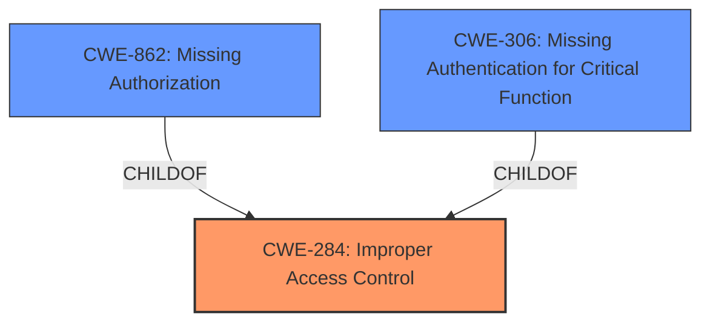

# Enhanced Analysis for CVE-2024-34610

# Summary
| CWE ID | CWE Name | Confidence | CWE Abstraction Level | CWE Vulnerability Mapping Label | CWE-Vulnerability Mapping Notes |
|---|---|---|---|---|---|
| CWE-284 | Improper Access Control | 0.9 | Pillar | Primary | Discouraged |
| CWE-862 | Missing Authorization | 0.7 | Base | Secondary Candidate | Allowed |
| CWE-306 | Missing Authentication for Critical Function | 0.6 | Base | Secondary Candidate | Allowed |

## Evidence and Confidence

*   **Confidence Score:** 0.9
*   **Evidence Strength:** HIGH

## Relationship Analysis
The primary CWE selected is CWE-284, which is a high-level category. While it is discouraged, the provided information does not give enough details to determine whether the issue lies specifically in authentication (CWE-306) or authorization (CWE-862). Therefore, CWE-284 serves as the best initial mapping.

CWE-862 and CWE-306 are both children of CWE-284. If more details were available (e.g., no authentication required for a critical function or a missing authorization check after authentication), then one of those would be more appropriate.



## Vulnerability Chain
The vulnerability chain starts with **improper access control** which leads to local attackers being able to access protected data.
  - Root Cause: **Improper access control**
  - Impact: Access to protected data

## Summary of Analysis
The initial analysis identified the **improper access control** as the root cause, which led to the selection of CWE-284. The guidance clearly states that if the root cause can be pinpointed to authentication or authorization, then a more specific CWE should be chosen, but given the lack of detail, CWE-284 is the most appropriate. Further investigation is needed to understand whether the **improper access control** is due to a lack of authentication (CWE-306) or a lack of authorization (CWE-862), or both.
The selection of CWE-284 is at the optimal level of specificity based on the available evidence. The evidence includes the "Vulnerability Description Key Phrases" section which indicated "**Improper access control**" as the rootcause.

Relevant CWE Information:

# Enhanced Context (25 CWEs)
The following CWEs were identified as potentially relevant to this vulnerability:

## CWE-345: Insufficient Verification of Data Authenticity
**Abstraction Level**: Class
**Similarity Score**: 0.76
**Source**: dense
**Description**:
The product does not sufficiently verify the origin or authenticity of data, in a way that causes it to accept invalid data.
**Mapping Guidance**:
- Usage: Discouraged

## CWE-754: Improper Check for Unusual or Exceptional Conditions
**Abstraction Level**: Class
**Similarity Score**: 0.76
**Source**: dense
**Description**:
The product does not check or incorrectly checks for unusual or exceptional conditions that are not expected to occur frequently during day to day operation of the product.
**Mapping Guidance**:
- Usage: Allowed-with-Review

## CWE-497: Exposure of Sensitive System Information to an Unauthorized Control Sphere
**Abstraction Level**: Base
**Similarity Score**: 0.76
**Source**: dense
**Description**:
The product does not properly prevent sensitive system-level information from being accessed by unauthorized actors who do not have the same level of access to the underlying system as the product does.
**Mapping Guidance**:
- Usage: Allowed

## CWE-203: Observable Discrepancy
**Abstraction Level**: Base
**Similarity Score**: 0.76
**Source**: dense
**Description**:
The product behaves differently or sends different responses under different circumstances in a way that is observable to an unauthorized actor, which exposes security-relevant information about the state of the product, such as whether a particular operation was successful or not.
**Mapping Guidance**:
- Usage: Allowed

## CWE-668: Exposure of Resource to Wrong Sphere
**Abstraction Level**: Class
**Similarity Score**: 0.76
**Source**: dense
**Description**:
The product exposes a resource to the wrong control sphere, providing unintended actors with inappropriate access to the resource.
**Mapping Guidance**:
- Usage: Discouraged

## CWE-703: Improper Check or Handling of Exceptional Conditions
**Abstraction Level**: Pillar
**Similarity Score**: 0.75
**Source**: dense
**Description**:
The product does not properly anticipate or handle exceptional conditions that rarely occur during normal operation of the product.
**Mapping Guidance**:
- Usage: Discouraged

## CWE-280: Improper Handling of Insufficient Permissions or Privileges 
**Abstraction Level**: Base
**Similarity Score**: 0.75
**Source**: dense
**Description**:
The product does not handle or incorrectly handles when it has insufficient privileges to access resources or functionality as specified by their permissions. This may cause it to follow unexpected code paths that may leave the product in an invalid state.
**Mapping Guidance**:
- Usage: Allowed

## CWE-451: User Interface (UI) Misrepresentation of Critical Information
**Abstraction Level**: Class
**Similarity Score**: 0.75
**Source**: dense
**Description**:
The user interface (UI) does not properly represent critical information to the user, allowing the information - or its source - to be obscured or spoofed. This is often a component in phishing attacks.
**Mapping Guidance**:
- Usage: Allowed-with-Review

## CWE-267: Privilege Defined With Unsafe Actions
**Abstraction Level**: Base
**Similarity Score**: 0.75
**Source**: dense
**Description**:
A particular privilege, role, capability, or right can be used to perform unsafe actions that were not intended, even when it is assigned to the correct entity.
**Mapping Guidance**:
- Usage: Allowed

## CWE-212: Improper Removal of Sensitive Information Before Storage or Transfer
**Abstraction Level**: Base
**Similarity Score**: 0.74
**Source**: dense
**Description**:
The product stores, transfers, or shares a resource that contains sensitive information, but it does not properly remove that information before the product makes the resource available to unauthorized actors.
**Mapping Guidance**:
- Usage: Allowed

## CWE-285: Improper Authorization
**Abstraction Level**: Class
**Similarity Score**: 1411.59
**Source**: sparse
**Description**:
The product does not perform or incorrectly performs an authorization check when an actor attempts to access a resource or perform an action.
**Mapping Guidance**:
- Usage: Discouraged

## CWE-863: Incorrect Authorization
**Abstraction Level**: Class
**Similarity Score**: 1390.30
**Source**: sparse
**Description**:
The product performs an authorization check when an actor attempts to access a resource or perform an action, but it does not correctly perform the check.
**Mapping Guidance**:
- Usage: Allowed-with-Review

## CWE-639: Authorization Bypass Through User-Controlled Key
**Abstraction Level**: Base
**Similarity Score**: 1352.14
**Source**: sparse
**Description**:
The system's authorization functionality does not prevent one user from gaining access to another user's data or record by modifying the key value identifying the data.
**Mapping Guidance**:
- Usage: Allowed

## CWE-287: Improper Authentication
**Abstraction Level**: Class
**Similarity Score**: 1318.94
**Source**: sparse
**Description**:
When an actor claims to have a given identity, the product does not prove or insufficiently proves that the claim is correct.
**Mapping Guidance**:
- Usage: Discouraged

## CWE-306: Missing Authentication for Critical Function
**Abstraction Level**: Base
**Similarity Score**: 1282.91
**Source**: sparse
**Description**:
The product does not perform any authentication for functionality that requires a provable user identity or consumes a significant amount of resources.
**Mapping Guidance**:
- Usage: Allowed

## CWE-942: Permissive Cross-domain Policy with Untrusted Domains
**Abstraction Level**: variant
**Similarity Score**: 2.68
**Source**: graph
**Description**:
CWE-942: Permissive Cross-domain Policy with Untrusted Domains
**Mapping Guidance**:
- Usage: Allowed

## CWE-280: Improper Handling of Insufficient Permissions or Privileges 
**Abstraction Level**: Base
**Similarity Score


## CWE Relationship Analysis

Current CWEs represent these abstraction levels: .


### Vulnerability Chain Analysis

**Chain starting from CWE-863:**
- 863 (Incorrect Authorization) - ROOT


**Chain starting from CWE-280:**
- 280 (Improper Handling of Insufficient Permissions or Privileges ) - ROOT


### CWE Relationship Diagram

```mermaid
graph TD
    classDef primary fill:#f96,stroke:#333,stroke-width:2px
    classDef secondary fill:#69f,stroke:#333
    classDef tertiary fill:#9e9,stroke:#333
```