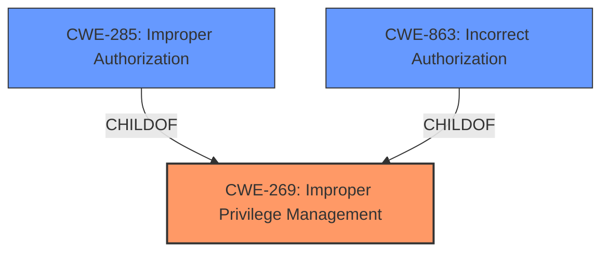

# Enhanced Analysis for CVE-2024-34620

# Summary
| CWE ID  | CWE Name                        | Confidence | CWE Abstraction Level | CWE Vulnerability Mapping Label | CWE-Vulnerability Mapping Notes |
|---------|---------------------------------|------------|-----------------------|---------------------------------|---------------------------------|
| CWE-269 | Improper Privilege Management   | 0.8        | Class                 | Primary CWE                    | Discouraged                   |

## Evidence and Confidence

*   **Confidence Score:** 0.8
*   **Evidence Strength:** MEDIUM

## Relationship Analysis
The primary relationship to consider is that CWE-269 [Improper Privilege Management] is a Class-level CWE. While it directly relates to the vulnerability description's root cause (**Improper privilege management**), it's a broad category. Several of its children offer more specific classifications, but without more detail about how privilege management is **improper**, CWE-269 is the most appropriate fit based on available evidence. CWE-285 [Improper Authorization], and CWE-863 [Incorrect Authorization] are more specific, but require more details on how the **improper privilege management** manifested as flawed permission checking.



## Vulnerability Chain
The vulnerability chain begins with **Improper privilege management**, leading to the ability for local attackers to start privileged services.

Improper Privilege Management -> Start Privileged Service

## Summary of Analysis
The vulnerability description explicitly states "**Improper privilege management** in SumeNNService prior to SMR Aug-2024 Release 1 allows local attackers to start privileged service." The CVE Reference Links Content Summary reinforces this by stating, "Improper privilege management in SumeNNService" as the root cause, leading to the impact "Local attackers can start a privileged service."

The most direct mapping based on the provided information is CWE-269 [Improper Privilege Management]. While CWE-269 is discouraged for being too general, the provided evidence doesn't allow for a more specific classification. The key phrase "**Improper privilege management**" aligns directly with the CWE name and description. Without further details about how the privilege management is improper (e.g., incorrect assignment, missing checks), a more specific CWE cannot be confidently selected.

Other CWEs Considered:

*   CWE-266 [Incorrect Privilege Assignment]: Considered, but there's no specific evidence of incorrect privilege assignment (e.g., assigning admin privileges to a guest account).
*   CWE-285 [Improper Authorization]: Considered, but there's no specific evidence of improper authorization checks.
*   CWE-250 [Execution with Unnecessary Privileges]: Considered, but the description does not indicate code running with higher privileges than necessary.
*   CWE-863 [Incorrect Authorization]: Considered, but requires more details on how the **improper privilege management** manifested as flawed permission checking.

Therefore, CWE-269 remains the most appropriate, albeit general, classification based on the available evidence.


## CWE Relationship Analysis

Current CWEs represent these abstraction levels: .


### Vulnerability Chain Analysis

**Chain starting from CWE-863:**
- 863 (Incorrect Authorization) - ROOT


**Chain starting from CWE-269:**
- 269 (Improper Privilege Management) - ROOT


### CWE Relationship Diagram

```mermaid
graph TD
    classDef primary fill:#f96,stroke:#333,stroke-width:2px
    classDef secondary fill:#69f,stroke:#333
    classDef tertiary fill:#9e9,stroke:#333
```