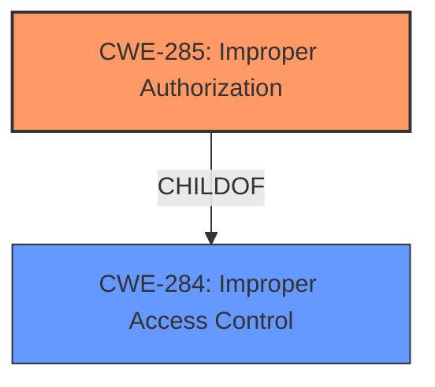

# Analysis Report for CVE-2024-34642

# Vulnerability Analysis Report: CVE-2024-34642

## Description

**Improper authorization** in One UI Home prior to SMR Sep-2024 Release 1 allows physical attackers to temporarily access sensitive information.

## Vulnerability Description Key Phrases

- **Rootcause:** Improper authorization
- **Impact:** access sensitive information
- **Attacker:** physical attackers
- **Product:** One UI Home
- **Version:** prior to SMR Sep-2024 Release 1

## Analysis (with Relationship Data)

# Summary
| CWE ID | CWE Name | Confidence | CWE Abstraction Level | CWE Vulnerability Mapping Label | CWE-Vulnerability Mapping Notes |
|---|---|---|---|---|---|
| CWE-285 | Improper Authorization | 0.9 | Class | Primary CWE | Discouraged |
| CWE-284 | Improper Access Control | 0.6 | Pillar | Secondary Candidate | Discouraged |

## Evidence and Confidence

*   **Confidence Score:** 0.9
*   **Evidence Strength:** HIGH

## Relationship Analysis
The primary relationship to consider is the parent-child relationship between CWE-284 (Improper Access Control) and CWE-285 (Improper Authorization). While CWE-284 is a broader category, the vulnerability description explicitly states "**Improper authorization**," making CWE-285 the more specific and appropriate choice. The "Authentication vs Authorization vs Access Control Guidance" confirms that CWE-285 is suited for authorization flaws. CWE-285 is a Class level of abstraction, while several Base level children exist, none of them are specific enough.



## Vulnerability Chain
The vulnerability chain starts with **improper authorization**, leading to temporary access of sensitive information by physical attackers.

Improper Authorization (Root Cause) -> Access to Sensitive Information (Impact)

## Summary of Analysis
The initial assessment strongly points to CWE-285 (Improper Authorization) as the primary weakness. The vulnerability description explicitly uses the term "**Improper authorization**," and the CVE reference links confirm this as the **root cause**. The impact is temporary access to sensitive information.

Although CWE-285 is a Class and typically lower-level CWEs are preferred, none of the children of CWE-285 fit. The retriever results also list CWE-285 as a possibility.

CWE-284 (Improper Access Control) was considered but is too broad. The evidence clearly indicates the problem is with authorization, not general access control.

The decision is primarily based on the explicit mention of "**Improper authorization**" in the vulnerability description and CVE summary. The "Authentication vs Authorization vs Access Control Guidance" further supports this choice.

Relevant CWE Information:

**CWE-285: Improper Authorization**: The product does not perform or incorrectly performs an authorization check when an actor attempts to access a resource or perform an action. This aligns perfectly with the vulnerability description.

# Enhanced Context (25 CWEs)
The following CWEs were identified as potentially relevant to this vulnerability:

## CWE-285: Improper Authorization
**Abstraction Level**: Class
**Similarity Score**: 1281.73
**Source**: sparse

**Description**:
The product does not perform or incorrectly performs an authorization check when an actor attempts to access a resource or perform an action.


## CWE Relationship Analysis

Current CWEs represent these abstraction levels: .


### Vulnerability Chain Analysis

**Chain starting from CWE-284:**
- 284 (Improper Access Control) - ROOT


**Chain starting from CWE-285:**
- 285 (Improper Authorization) - ROOT


### CWE Relationship Diagram

```mermaid
graph TD
    classDef primary fill:#f96,stroke:#333,stroke-width:2px
    classDef secondary fill:#69f,stroke:#333
    classDef tertiary fill:#9e9,stroke:#333
```


*Report generated on 2025-07-13 08:17:46*
