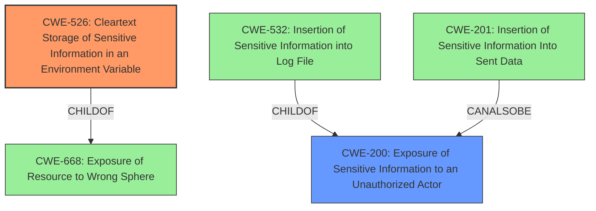

# Enhanced Analysis for CVE-2024-34696

# Summary
| CWE ID  | CWE Name                                                                    | Confidence | CWE Abstraction Level | CWE Vulnerability Mapping Label | CWE-Vulnerability Mapping Notes |
| :-------- | :-------------------------------------------------------------------------- | :--------- | :---------------------- | :------------------------------ | :-------------------------------- |
| CWE-526   | Cleartext Storage of Sensitive Information in an Environment Variable         | 0.9        | Variant                 | Primary                         | Allowed                           |
| CWE-200   | Exposure of Sensitive Information to an Unauthorized Actor                 | 0.7        | Class                   | Secondary                       | Discouraged                      |

## Evidence and Confidence

*   **Confidence Score:** 0.8
*   **Evidence Strength:** MEDIUM

## Relationship Analysis
The primary CWE, CWE-526, is a Variant of CWE-256 (Plaintext Storage of Passwords) and CWE-668 (Exposure of Resource to Wrong Sphere). CWE-200 is a Class-level CWE that represents the general case of sensitive information exposure. The relationship between CWE-526 and CWE-200 shows a hierarchical relationship where the specific case of environment variables is a type of information exposure.



## Vulnerability Chain
The vulnerability chain starts with the storage of sensitive information in environment variables (CWE-526), which leads to the exposure of this information to unauthorized actors (CWE-200).

## Summary of Analysis
The primary weakness is the storage of sensitive information in environment variables. The vulnerability description states: "GeoServers Server Status page and REST API lists all environment variables and Java properties to any GeoServer user with administrative rights...These variables/properties can also contain sensitive information, such as database passwords or API keys/tokens." This directly maps to CWE-526 (Cleartext Storage of Sensitive Information in an Environment Variable). This is then exposed via the status page to administrators, hence CWE-200 (Exposure of Sensitive Information to an Unauthorized Actor).

CWE-200 is a class-level CWE and discouraged as a primary mapping. However, in this case, it accurately describes the impact. I am selecting CWE-526 as primary because it's a more specific variant that details the root cause **weakness**, while CWE-200 describes the resulting **information disclosure**.

Other CWEs considered but not used:

*   CWE-532 (Insertion of Sensitive Information into Log File): While the description mentions sensitive information being exposed, it is not explicitly in log files, but rather via the Server Status page and REST API.
*   CWE-201 (Insertion of Sensitive Information Into Sent Data): Similar to CWE-532, this is not the primary method of exposure. The information is not necessarily being "sent" but rather displayed.
*   CWE-668 (Exposure of Resource to Wrong Sphere): This is too high-level and CWE-526 is more specific to the root cause.
*   CWE-306 (Missing Authentication for Critical Function): Authentication *is* required (admin rights), so this doesn't apply.
* CWE-863 (Incorrect Authorization): Authorization is not the root cause.
* CWE-917 (Improper Neutralization of Special Elements used in an Expression Language Statement ('Expression Language Injection')): Does not apply to this case.

Relevant CWE Information:

# Enhanced Context (25 CWEs)
The following CWEs were identified as potentially relevant to this vulnerability:

## CWE-497: Exposure of Sensitive System Information to an Unauthorized Control Sphere
**Abstraction Level**: Base
**Similarity Score**: 0.76
**Source**: dense

**Description**:
The product does not properly prevent sensitive system-level information from being accessed by unauthorized actors who do not have the same level of access to the underlying system as the product does.

**Mapping Guidance**:
- Usage: Allowed
- Rationale: This CWE entry is at the Base level of abstraction, which is a preferred level of abstraction for mapping to the root causes of vulnerabilities.


## CWE-212: Improper Removal of Sensitive Information Before Storage or Transfer
**Abstraction Level**: Base
**Similarity Score**: 0.74
**Source**: dense

**Description**:
The product stores, transfers, or shares a resource that contains sensitive information, but it does not properly remove that information before the product makes the resource available to unauthorized actors.

**Mapping Guidance**:
- Usage: Allowed
- Rationale: This CWE entry is at the Base level of abstraction, which is a preferred level of abstraction for mapping to the root causes of vulnerabilities.


## CWE-200: Exposure of Sensitive Information to an Unauthorized Actor
**Abstraction Level**: Class
**Similarity Score**: 0.74
**Source**: dense

**Description**:
The product exposes sensitive information to an actor that is not explicitly authorized to have access to that information.

**Mapping Guidance**:
- Usage: Discouraged
- Rationale: CWE-200 is commonly misused to represent the loss of confidentiality in a vulnerability, but confidentiality loss is a technical impact - not a root cause error. As of CWE 4.9, over 400 CWE entries can lead to a loss of confidentiality. Other options are often available. [REF-1287].


## CWE-918: Server-Side Request Forgery (SSRF)
**Abstraction Level**: Base
**Similarity Score**: 0.73
**Source**: dense

**Description**:
The web server receives a URL or similar request from an upstream component and retrieves the contents of this URL, but it does not sufficiently ensure that the request is being sent to the expected destination.

**Mapping Guidance**:
- Usage: Allowed
- Rationale: This CWE entry is at the Base level of abstraction, which is a preferred level of abstraction for mapping to the root causes of vulnerabilities.


## CWE-201: Insertion of Sensitive Information Into Sent Data
**Abstraction Level**: Base
**Similarity Score**: 0.73
**Source**: dense

**Description**:
The code transmits data to another actor, but a portion of the data includes sensitive information that should not be accessible to that actor.

**Mapping Guidance**:
- Usage: Allowed
- Rationale: This CWE entry is at the Base level of abstraction, which is a preferred level of abstraction for mapping to the root causes of vulnerabilities.


## CWE-917: Improper Neutralization of Special Elements used in an Expression Language Statement ('Expression Language Injection')
**Abstraction Level**: Base
**Similarity Score**: 0.73
**Source**: dense

**Description**:
The product constructs all or part of an expression language (EL) statement in a framework such as a Java Server Page (JSP) using externally-influenced input from an upstream component, but it does not neutralize or incorrectly neutralizes special elements that could modify the intended EL statement before it is executed.

**Mapping Guidance**:
- Usage: Allowed
- Rationale: This CWE entry is at the Base level of abstraction, which is a preferred level of abstraction for mapping to the root causes of vulnerabilities.


## CWE-668: Exposure of Resource to Wrong Sphere
**Abstraction Level**: Class
**Similarity Score**: 0.73
**Source**: dense

**Description**:
The product exposes a resource to the wrong control sphere, providing unintended actors with inappropriate access to the resource.

**Mapping Guidance**:
- Usage: Discouraged
- Rationale: CWE-668 is high-level and is often misused as a catch-all when lower-level CWE IDs might be applicable. It is sometimes used for low-information vulnerability reports [REF-1287]. It is a level-1 Class (i.e., a child of a Pillar). It is not useful for trend analysis.


## CWE-209: Generation of Error Message Containing Sensitive Information
**Abstraction Level**: Base
**Similarity Score**: 0.73
**Source**: dense

**Description**:
The product generates an error message that includes sensitive information about its environment, users, or associated data.

**Mapping Guidance**:
- Usage: Allowed
- Rationale: This CWE entry is at the Base level of abstraction, which is a preferred level of abstraction for mapping to the root causes of vulnerabilities.


## CWE-


## CWE Relationship Analysis

Current CWEs represent these abstraction levels: .


### Vulnerability Chain Analysis

**Chain starting from CWE-863:**
- 863 (Incorrect Authorization) - ROOT


**Chain starting from CWE-526:**
- 526 (Cleartext Storage of Sensitive Information in an Environment Variable) - ROOT


### CWE Relationship Diagram

```mermaid
graph TD
    classDef primary fill:#f96,stroke:#333,stroke-width:2px
    classDef secondary fill:#69f,stroke:#333
    classDef tertiary fill:#9e9,stroke:#333
```