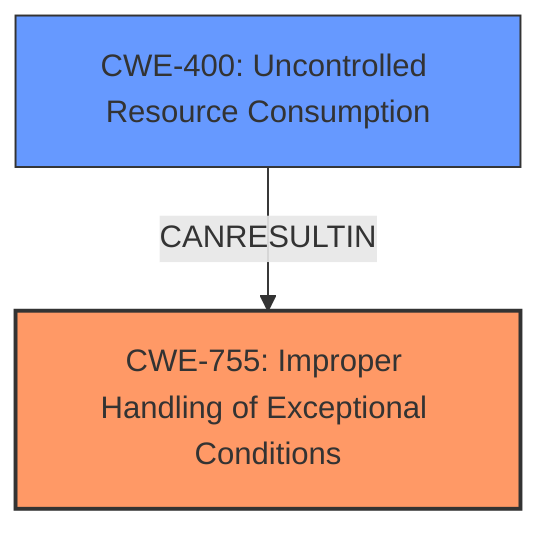

# Analysis for CVE-2024-34750

# Summary
| CWE ID | CWE Name | Confidence | CWE Abstraction Level | CWE Vulnerability Mapping Label | CWE-Vulnerability Mapping Notes |
|---|---|---|---|---|---|
| CWE-755 | Improper Handling of Exceptional Conditions | 0.8 | Class | Primary | Allowed-with-Review |
| CWE-400 | Uncontrolled Resource Consumption | 0.7 | Class | Secondary | Discouraged |

## Evidence and Confidence

*   **Confidence Score:** 0.75
*   **Evidence Strength:** MEDIUM

## Relationship Analysis
The primary relationship influencing the decision is that CWE-755 is a class-level CWE, and it can lead to resource consumption issues. While other more specific CWEs could be considered if more details were available. The final decision also considered that while CWE-400 is also a class and discouraged, it accurately reflects the impact of the **Improper Handling of Exceptional Conditions**.

## Vulnerability Chain
The vulnerability chain starts with the **Improper Handling of Exceptional Conditions** (CWE-755), which leads to a miscounting of active HTTP/2 streams. This, in turn, results in an incorrect infinite timeout, allowing connections to remain open when they should be closed, eventually leading to **Uncontrolled Resource Consumption** (CWE-400) and a denial of service.

## Summary of Analysis
The initial analysis identified CWE-755 as the primary root cause due to the explicit mention of "**Improper Handling of Exceptional Conditions**" in the vulnerability description and key phrases. The subsequent resource consumption and denial of service are consequences of this improper handling. While CWE-400 is listed as a root cause in the key phrases, it is more accurately reflecting the impact of the vulnerability.

The evidence provided explicitly states: "When processing an HTTP/2 stream, Tomcat did not handle some cases of excessive HTTP headers correctly. This led to a miscounting of active HTTP/2 streams which in turn led to the use of an incorrect infinite timeout which allowed connections to remain open which should have been closed."

The graph relationships influenced the final selection by highlighting the potential chain of events, with CWE-755 as the starting point and CWE-400 as the result.

The selected CWEs are at the optimal level of specificity given the available information. While more specific CWEs related to resource management might exist, the description doesn't provide enough detail to warrant their selection.

Relevant CWE Information:

# Enhanced Context (25 CWEs)
The following CWEs were identified as potentially relevant to this vulnerability:

## CWE-400: Uncontrolled Resource Consumption
**Abstraction Level**: Class
**Similarity Score**: 0.74
**Source**: dense

**Description**:
The product does not properly control the allocation and maintenance of a limited resource, thereby enabling an actor to influence the amount of resources consumed, eventually leading to the exhaustion of available resources.

**Mapping Guidance**:
- Usage: Discouraged
- Rationale: CWE-400 is intended for incorrect behaviors in which the product is expected to track and restrict how many resources it consumes, but CWE-400 is often misused because it is conflated with the "technical impact" of vulnerabilities in which resource consumption occurs. It is sometimes used for low-information vulnerability reports. It is a level-1 Class (i.e., a child of a Pillar).

**Technical Explanation for CWE-755:**

*   **How the vulnerability's details match the CWE's characteristics:** The vulnerability description explicitly mentions "**Improper Handling of Exceptional Conditions**". This aligns directly with CWE-755, which describes scenarios where a product fails to handle exceptional conditions correctly.
*   **The security implications and potential impact:** The improper handling leads to a miscounting of HTTP/2 streams and an incorrect timeout, ultimately causing connections to remain open unnecessarily.
*   **Any parent-child relationships or chain patterns that influenced your mapping:** CWE-755 is a class-level CWE, and it can lead to resource management issues, as seen in this case where it leads to uncontrolled resource consumption.
*   **Whether the weakness is primary or secondary in the vulnerability:** This is the primary weakness as it is the root cause of the subsequent resource consumption.
*   **How the official MITRE mapping guidance influenced your decision:** While CWE-755 is a Class, the description aligns directly with the vulnerability, making it the most appropriate choice despite the discouraged usage.

**Technical Explanation for CWE-400:**

*   **How the vulnerability's details match the CWE's characteristics:** The vulnerability ultimately leads to connections remaining open and consuming resources unnecessarily, aligning with CWE-400's description of uncontrolled resource consumption.
*   **The security implications and potential impact:** The uncontrolled resource consumption can lead to a denial of service, making the system unavailable to legitimate users.
*   **Any parent-child relationships or chain patterns that influenced your mapping:** CWE-400 is the resulting impact of the initial **Improper Handling of Exceptional Conditions** (CWE-755).
*   **Whether the weakness is primary or secondary in the vulnerability:** This is a secondary weakness, representing the impact of the primary weakness.
*   **How the official MITRE mapping guidance influenced your decision:** Although CWE-400 is discouraged, it is included because it accurately captures the resulting impact of the vulnerability, specifically the uncontrolled consumption of resources leading to a denial of service.

**CWEs Considered but Not Used:**

*   **CWE-770: Allocation of Resources Without Limits or Throttling:** While resource allocation is involved, the core issue is not the lack of limits on allocation but the improper handling of exceptional conditions that leads to resource consumption.
*   **CWE-789: Memory Allocation with Excessive Size Value:** This CWE is related to memory allocation, but the vulnerability doesn't explicitly mention memory allocation issues.
*   **CWE-1333: Inefficient Regular Expression Complexity:** This CWE is not relevant as the vulnerability description does not mention regular expressions.
*   **CWE-404: Improper Resource Shutdown or Release:** This could be considered but the connections were never closed due to miscounting of active streams.
*   **CWE-410: Insufficient Resource Pool:** The issue isn't about the size of the resource pool but the incorrect handling of HTTP/2 streams leading to resource exhaustion.
*   **CWE-20: Improper Input Validation:** While input validation might be indirectly related, the primary issue is with the handling of exceptional conditions.