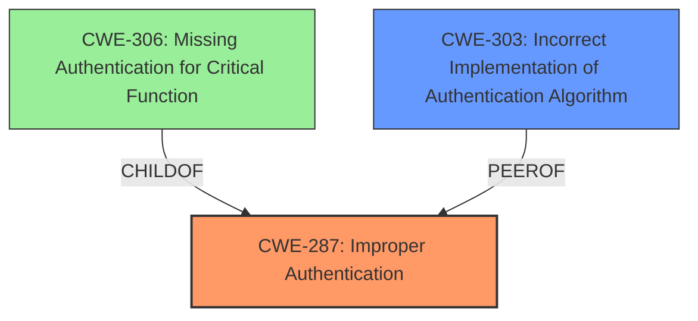

# Raw Analyzer Response for CVE-2024-34788

# Summary
| CWE ID | CWE Name | Confidence | CWE Abstraction Level | CWE Vulnerability Mapping Label | CWE-Vulnerability Mapping Notes |
|---|---|---|---|---|---|
| CWE-287 | Improper Authentication | 0.9 | Class | Primary | Allowed |
| CWE-303 | Incorrect Implementation of Authentication Algorithm | 0.6 | Base | Secondary | Allowed |

## Evidence and Confidence

*   **Confidence Score:** 0.9
*   **Evidence Strength:** HIGH

## Relationship Analysis
The primary CWE is CWE-287, "Improper Authentication," which is a Class-level CWE. CWE-306, "Missing Authentication for Critical Function," is a child of CWE-287, but the description indicates **improper authentication** rather than missing authentication, making CWE-287 more appropriate. CWE-303, "Incorrect Implementation of Authentication Algorithm", is considered as a secondary CWE because the description doesn't provide specific details about how the authentication was implemented incorrectly.

## Vulnerability Chain
The vulnerability chain starts with the **improper authentication vulnerability** (CWE-287). This leads to a remote malicious user gaining access to potentially sensitive information. The root cause is the **improper authentication**, and the impact is unauthorized access to sensitive information.

## Summary of Analysis
The primary weakness is **improper authentication** which directly aligns with CWE-287. The vulnerability description explicitly states "An **improper authentication vulnerability**," supporting the selection of CWE-287. The Retriever Results also list CWE-287 as the top candidate. CWE-303 could be considered if more details of the authentication algorithm were available.

The selection of CWE-287 is at the optimal level of specificity because it accurately reflects the nature of the vulnerability as described in the vulnerability description.
# Relevant CWE Information: