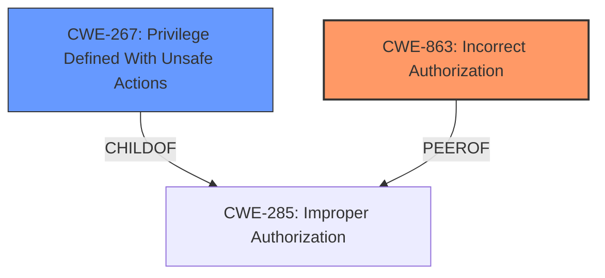

# Analysis for CVE-2024-3504

# Summary
| CWE ID | CWE Name | Confidence | CWE Abstraction Level | CWE Vulnerability Mapping Label | CWE-Vulnerability Mapping Notes |
|---|---|---|---|---|---|
| CWE-863 | Incorrect Authorization | 0.9 | Class | Primary | Allowed-with-Review |
| CWE-267 | Privilege Defined With Unsafe Actions | 0.7 | Base | Secondary | Allowed |

## Evidence and Confidence

*   **Confidence Score:** 0.8
*   **Evidence Strength:** HIGH

## Relationship Analysis
The primary relationship impacting the decision is the hierarchical structure with CWE-863 as a Class and potentially having more specific Base-level children. CWE-267 is considered a Base-level alternative, which relates to privilege management.

## Vulnerability Chain
The vulnerability chain starts with **improper access control** leading to privilege escalation and ultimately the ability to delete projects.

## Summary of Analysis
The analysis is based heavily on the provided evidence, particularly the "Vulnerability Description Key Phrases" and "CVE Reference Links Content Summary". The key phrase "**improper access control**" suggests a problem with authorization. The code diffs confirm the **lack of proper authorization checks**.

CWE-863 (Incorrect Authorization) is selected as the primary CWE because the application performs an authorization check, but it does so incorrectly, allowing an admin to elevate a user to organization owner.
CWE-267 (Privilege Defined With Unsafe Actions) is considered as a secondary CWE because the elevated privilege allows the user to delete projects, representing an unsafe action.

The retriever results also support this choice, with CWE-863 and CWE-267 among the top candidates. The guidance on Authentication vs. Authorization vs. Access Control reinforces that the issue is primarily related to authorization.

Relevant CWE Information:

# Enhanced Context (25 CWEs)
The following CWEs were identified as potentially relevant to this vulnerability:

## CWE-267: Privilege Defined With Unsafe Actions
**Abstraction Level**: Base
**Similarity Score**: 0.76
**Source**: dense

**Description**:
A particular privilege, role, capability, or right can be used to perform unsafe actions that were not intended, even when it is assigned to the correct entity.

**Mapping Guidance**:
- Usage: Allowed
- Rationale: This CWE entry is at the Base level of abstraction, which is a preferred level of abstraction for mapping to the root causes of vulnerabilities.

## CWE-863: Incorrect Authorization
**Abstraction Level**: Class
**Similarity Score**: 2096.15
**Source**: sparse

**Description**:
The product performs an authorization check when an actor attempts to access a resource or perform an action, but it does not correctly perform the check.

**Mapping Guidance**:
- Usage: Allowed-with-Review
- Rationale: This CWE entry is a Class and might have Base-level children that would be more appropriate

# Complete CWE Specifications

CWE-285: Improper Authorization
The product does not perform or incorrectly performs an authorization check when an actor attempts to access a resource or perform an action.

CWE-610: Externally Controlled Reference to a Resource in Another Sphere
The software uses an external source to determine the identity of a resource, service, or data sink that should be used, but the software does not ensure that the external source is within the expected control sphere.

CWE-639: Authorization Bypass Through User-Controlled Key
The system's authorization functionality does not prevent one user from gaining access to another user's data or record by modifying the key value identifying the data.

CWE-863: Incorrect Authorization
The product performs an authorization check when an actor attempts to access a resource or perform an action, but it does not correctly perform the check.

CWE-267: Privilege Defined With Unsafe Actions
A particular privilege, role, capability, or right can be used to perform unsafe actions that were not intended, even when it is assigned to the correct entity.

CWE-269: Improper Privilege Management
The application does not adequately ensure that an actor has the required privileges to perform an action.

CWE-347: Improper Verification of Cryptographic Signature
The product receives data that is expected to have a cryptographic signature, but it does not properly verify the signature.

CWE-284: Improper Access Control
The software does not adequately control access to a resource or data, allowing an attacker to perform unauthorized actions or gain access to sensitive information.

CWE-708: Incorrect Ownership Assignment
The software assigns ownership of a resource to the wrong entity, which can lead to unintended access or modification of the resource.

CWE-842: Placement of User into Incorrect Group
The software places a user account into the wrong group or role, which grants the user unintended privileges or access.

Other CWEs considered but not used:

*   CWE-285: Improper Authorization: This is a more general category than CWE-863. Since the authorization check is present but flawed, CWE-863 is more appropriate.
*   CWE-284: Improper Access Control: This is a high-level category, and more specific CWEs are available.
*   CWE-306: Missing Authentication for Critical Function: The issue is not a lack of authentication, but a flaw in the authorization process after authentication.
*   CWE-639: Authorization Bypass Through User-Controlled Key: While user role manipulation is involved, the core issue is the incorrect authorization logic that allows the bypass, making CWE-863 more fitting.
*   CWE-269: Improper Privilege Management: This is similar to CWE-267, but CWE-267 more directly relates to the unsafe actions that can be performed with the incorrectly assigned privilege.