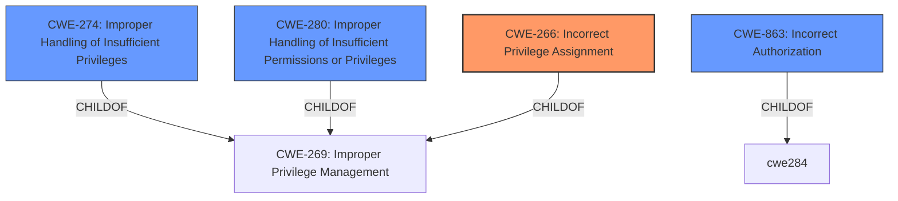

# Raw Analyzer Response for CVE-2024-35122

# Summary
| CWE ID | CWE Name | Confidence | CWE Abstraction Level | CWE Vulnerability Mapping Label | CWE-Vulnerability Mapping Notes |
|---|---|---|---|---|---|
| CWE-266 | Incorrect Privilege Assignment | 0.9 | Base | Primary CWE | Allowed |
| CWE-274 | Improper Handling of Insufficient Privileges | 0.7 | Base | Secondary Candidate | Discouraged |
| CWE-280 | Improper Handling of Insufficient Permissions or Privileges  | 0.7 | Base | Secondary Candidate | Allowed |
| CWE-863 | Incorrect Authorization | 0.6 | Class | Secondary Candidate | Allowed-with-Review |

## Evidence and Confidence

*   **Confidence Score:** 0.9
*   **Evidence Strength:** HIGH

## Relationship Analysis
The primary CWE is CWE-266, which is a base-level CWE, fitting for a root cause. CWE-274 and CWE-280 are related to handling insufficient privileges or permissions and are children of CWE-269 (Improper Privilege Management), offering related perspectives. CWE-863 is also related, as it describes the scenario where an authorization check is performed incorrectly. These relationships helped narrow down the selection to a specific privilege assignment issue.

## Vulnerability Chain
The vulnerability chain starts with an **insufficient authority requirement** (CWE-266), which allows a local, non-privileged user to configure a referential constraint using the privileges of another user. This leads to a file-level local denial of service.

## Summary of Analysis
The analysis is heavily based on the provided evidence, specifically the "Vulnerability Description Key Phrases" and "CVE Reference Links Content Summary". The key phrase "**insufficient authority requirement**" strongly suggests an issue with privilege assignment, aligning with CWE-266. The CVE Reference further details the root cause as being an insufficient authority requirement, causing a denial of service.

The graph relationships influenced the decision by highlighting the connections between privilege management and authorization. However, the core issue is not a failure to check permissions (authorization) but rather the initial incorrect assignment of privileges that allows the unauthorized action to occur.

CWE-266 is selected because it directly addresses the root cause of **incorrect privilege assignment**, which is the **weakness** described in the vulnerability. It's at the optimal level of specificity as a Base CWE.

Relevant CWE Information:

*   **CWE-266: Incorrect Privilege Assignment**
    *   Technical Explanation: The vulnerability involves a local non-privileged user being able to configure a referential constraint with the privileges of another user due to an **incorrect privilege assignment**. This means the system is not properly assigning privileges, which enables the attack.
    *   Security Implications: A local denial of service.
    *   Relationship Analysis: It is a base-level CWE and directly related to the root cause.
    *   Mapping Guidance Influence: The guidance indicates CWE-266 is appropriate when the system assigns incorrect privileges to a user.

*   **CWE-274: Improper Handling of Insufficient Privileges** and **CWE-280: Improper Handling of Insufficient Permissions or Privileges**
    *   Technical Explanation: These CWEs describe scenarios where the product does not handle insufficient privileges or permissions correctly.
    *   Security Implications: The impact is a file-level local denial of service
    *   Relationship Analysis: Both are children of CWE-269 and relate to privilege management but focus more on the *handling* of insufficient rights rather than the *assignment* of those rights.
    *   Mapping Guidance Influence: While relevant, the primary issue isn't how the system *handles* the lack of privileges but rather how it incorrectly *assigns* them in the first place.

*   **CWE-863: Incorrect Authorization**
    *   Technical Explanation: The product performs an authorization check but does so incorrectly.
    *   Security Implications: This can lead to unauthorized access or actions.
    *   Relationship Analysis: A Class-level CWE, child of CWE-284. It is related to authorization but doesn't directly address the initial **incorrect privilege assignment**.
    *   Mapping Guidance Influence: The vulnerability involves configuring a referential constraint with another user's privileges, pointing towards an authorization issue. However, the fundamental problem lies in the **incorrect assignment of privileges**, making CWE-266 more appropriate.

CWEs Considered but Not Used:

*   CWE-269: Improper Privilege Management (Class) - Too high-level and doesn't pinpoint the root cause of incorrect assignment.
*   CWE-284: Improper Access Control (Pillar) - Too generic; CWE-266 provides more specific information.
*   CWE-285: Improper Authorization (Class) - Focuses on incorrect authorization checks, while the issue is with privilege assignment.