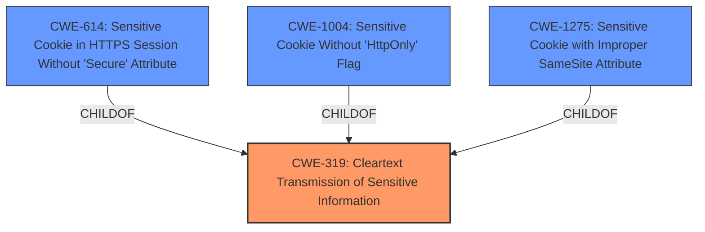

# Raw Analyzer Response for CVE-2024-35211

# Summary
| CWE ID | CWE Name | Confidence | CWE Abstraction Level | CWE Vulnerability Mapping Label | CWE-Vulnerability Mapping Notes |
|---|---|---|---|---|---|
| CWE-319 | Cleartext Transmission of Sensitive Information | 0.9 | Base | Allowed | Primary CWE - Root Cause |
| CWE-614 | Sensitive Cookie in HTTPS Session Without 'Secure' Attribute | 0.8 | Variant | Allowed | Secondary Candidate |
| CWE-1004 | Sensitive Cookie Without 'HttpOnly' Flag | 0.8 | Variant | Allowed | Secondary Candidate |
| CWE-1275 | Sensitive Cookie with Improper SameSite Attribute | 0.8 | Variant | Allowed | Secondary Candidate |

## Evidence and Confidence

*   **Confidence Score:** 0.9
*   **Evidence Strength:** HIGH

## Relationship Analysis
The primary weakness is **CWE-319: Cleartext Transmission of Sensitive Information**, because the vulnerability description states that the web server **sets the session cookie on the browser without applying any security attributes**. This directly relates to the transmission of sensitive information (the session cookie) without encryption or protection. Several other CWEs were considered because the missing security attributes relate to cookie security, specifically the Secure, HttpOnly, and SameSite attributes. **CWE-614, CWE-1004, and CWE-1275** are all child variants of **CWE-319** and describe the specific missing attributes.

## Vulnerability Chain
The vulnerability chain starts with the **Cleartext Transmission of Sensitive Information (CWE-319)**. The web server **sets the session cookie on the browser without applying any security attributes**. This leads to the possibility of an attacker intercepting the session cookie and gaining unauthorized access. Missing the Secure attribute (**CWE-614**) allows interception over HTTP. Missing the HttpOnly attribute (**CWE-1004**) allows the cookie to be accessed via scripts, and the missing SameSite attribute (**CWE-1275**) could allow CSRF attacks.

## Summary of Analysis
The vulnerability lies in the **incorrect** setting of session cookies, specifically the **failure** to apply security attributes. The primary root cause is **CWE-319: Cleartext Transmission of Sensitive Information** because the session cookie, which is sensitive, is transmitted without protection due to the missing "Secure" attribute. This is the initial **weakness** that enables further potential exploitation. The vulnerability description explicitly states that the **weakness** is the **setting of the session cookie on the browser without applying any security attributes**. The CVE Reference Links Content Summary confirms this, stating that the **root cause of the vulnerability** is the affected web server **setting the session cookie after successful login without applying security attributes like "Secure", "HttpOnly", or "SameSite"**.

The other CWEs considered (CWE-614, CWE-1004, CWE-1275) are secondary because they represent specific instances of the primary issue, focusing on individual missing attributes (Secure, HttpOnly, SameSite). While these are important, they are consequences of the broader failure to protect the cookie during transmission. Thus, **CWE-319** captures the fundamental flaw, and the others provide more granular details of the specific attributes that were **missing**.