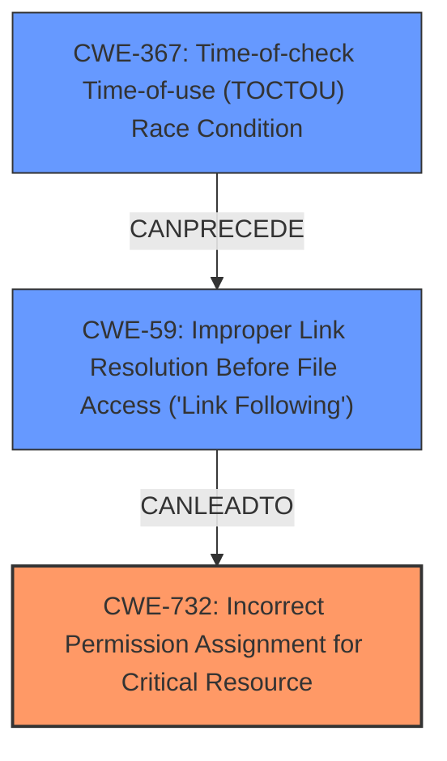

# Raw Analyzer Response for CVE-2024-35235

# Summary

| CWE ID  | CWE Name                                                        | Confidence | CWE Abstraction Level | CWE Vulnerability Mapping Label | CWE-Vulnerability Mapping Notes |
| :-------- | :-------------------------------------------------------------- | :--------- | :-------------------- | :------------------------------ | :------------------------------ |
| CWE-732   | Incorrect Permission Assignment for Critical Resource           | 0.9        | Class                 | Allowed-with-Review             | Primary CWE                     |
| CWE-367   | Time-of-check Time-of-use (TOCTOU) Race Condition               | 0.7        | Base                  | Allowed                         | Secondary Candidate             |
| CWE-59    | Improper Link Resolution Before File Access ('Link Following') | 0.6        | Base                  | Allowed                         | Secondary Candidate             |

## Evidence and Confidence

*   **Confidence Score:** 0.8
*   **Evidence Strength:** HIGH

## Relationship Analysis

The primary weakness is identified as **CWE-732 Incorrect Permission Assignment for Critical Resource**, a Class-level CWE. While the description involves a race condition (**CWE-367 Time-of-check Time-of-use (TOCTOU) Race Condition**) and improper link resolution (**CWE-59 Improper Link Resolution Before File Access ('Link Following')**), these are contributing factors rather than the core issue. **CWE-732** reflects the direct consequence of the vulnerability: the incorrect assignment of permissions to critical resources. The relationships between these CWEs can be visualized as follows:

## Vulnerability Chain

The vulnerability chain can be described as follows:

1.  **Initial Configuration:** `cupsd` server is started with a `Listen` configuration item pointing to a symbolic link.
2.  **Race Condition/Link Following:** A race condition (**CWE-367**) or AppArmor restrictions prevent the `unlink` or `bind` operation on the symbolic link, potentially involving **CWE-59**.
3.  **Incorrect Permission Assignment:** Due to the **improper check** of the return values of `unlink` and `bind`, the `cupsd` process performs an **arbitrary chmod** on the target of the symbolic link, making it world-writable (**CWE-732**).
4.  **Privilege Escalation (Impact):** This leads to the potential for full root command execution by modifying configuration files and leveraging `FoomaticRIPCommandLine`.

The primary weakness is **CWE-732**, which represents the immediate security flaw.

## Summary of Analysis

The initial analysis considered several CWEs, including **CWE-367** and **CWE-59** due to the race condition and symbolic link aspects of the vulnerability. However, the core issue is the **incorrect assignment of permissions**, making **CWE-732** the most relevant. The evidence from the vulnerability description and CVE Reference Links Content Summary strongly supports this classification. The graph relationships helped to visualize the chain of events leading to the incorrect permission assignment, further solidifying the choice of **CWE-732** as the primary CWE. The fact that the code **does not properly check the return value of `unlink` and `bind` before proceeding to `chmod`** strongly points to **CWE-732**.

The selected CWEs are at the optimal level of specificity because **CWE-732** directly addresses the core weakness (incorrect permission assignment), while **CWE-367** and **CWE-59** provide context regarding the conditions that enable the vulnerability.

Relevant CWE Information:

**CWE-732: Incorrect Permission Assignment for Critical Resource**
The product specifies permissions for a security-critical resource in a way that allows that resource to be read or modified by unintended actors. The **arbitrary chmod** directly leads to this condition.

**CWE-367: Time-of-check Time-of-use (TOCTOU) Race Condition**
The product checks the state of a resource before using that resource, but the resource's state can change between the check and the use in a way that invalidates the results of the check. This allows the attacker to cause a race condition.

**CWE-59: Improper Link Resolution Before File Access ('Link Following')**
The product attempts to access a file based on the filename, but it does not properly prevent that filename from identifying a link or shortcut that resolves to an unintended resource. This allows the attacker to cause a bind to a symbolic link to fail.