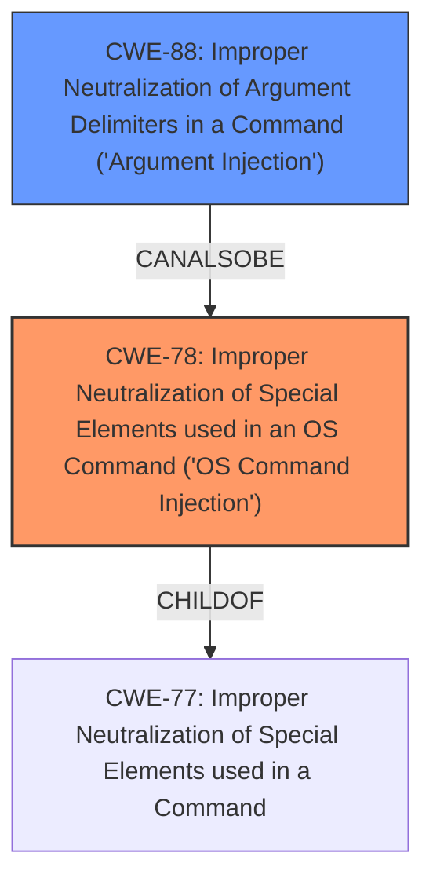

# Enhanced Analysis for CVE-2024-35241

# Summary
| CWE ID | CWE Name | Confidence | CWE Abstraction Level | CWE Vulnerability Mapping Label | CWE-Vulnerability Mapping Notes |
|---|---|---|---|---|---|
| CWE-78 | Improper Neutralization of Special Elements used in an OS Command ('OS Command Injection') | 1.0 | Base | Primary CWE | Allowed |
| CWE-88 | Improper Neutralization of Argument Delimiters in a Command ('Argument Injection') | 0.7 | Base | Secondary Candidate | Allowed |

## Evidence and Confidence

*   **Confidence Score:** 0.9
*   **Evidence Strength:** HIGH

## Relationship Analysis
The primary relationship that impacted my decision was the parent-child relationship between CWE-77 (Improper Neutralization of Special Elements used in a Command) and CWE-78. Because the command being constructed is an OS command, CWE-78 is the more specific and appropriate choice. CWE-88 was considered because the vulnerability involves improper handling of arguments, but CWE-78 better captures the overall vulnerability. The abstraction level of Base for CWE-78 is ideal for identifying the root cause.



## Vulnerability Chain
The vulnerability chain begins with the **improper handling of git branch names** by the Composer application when executing `status`, `reinstall`, or `remove` commands. This leads to **OS Command Injection**, where a specially crafted branch name allows for the execution of arbitrary commands on the system. The root cause is the **lack of proper sanitization or escaping** of the branch name before its use in a `git diff` command. The final impact is **arbitrary code execution**, which can lead to system compromise.

## Summary of Analysis
The vulnerability is clearly an instance of **CWE-78 Improper Neutralization of Special Elements used in an OS Command ('OS Command Injection')**. The evidence from the CVE Reference Links Content Summary states, "The core weakness is the ability to inject arbitrary commands via a malicious git branch name. The application uses the branch name in a `git diff` command without proper sanitization or escaping." This aligns directly with the description of CWE-78. The fix, which involves using `ProcessExecutor::escape()` to properly escape the branch name, also supports this classification.

CWE-88 Improper Neutralization of Argument Delimiters in a Command ('Argument Injection') was considered because the vulnerability involves improper handling of arguments. However, the primary issue is that the crafted branch name is used in an OS command, making CWE-78 a more accurate representation of the vulnerability. The abstraction level of Base for CWE-78 is optimal for identifying the root cause of the vulnerability.


## CWE Relationship Analysis

Current CWEs represent these abstraction levels: .


### Vulnerability Chain Analysis

**Chain starting from CWE-88:**
- 88 (Improper Neutralization of Argument Delimiters in a Command ('Argument Injection')) - ROOT


**Chain starting from CWE-77:**
- 77 (Improper Neutralization of Special Elements used in a Command ('Command Injection')) - ROOT


### CWE Relationship Diagram

```mermaid
graph TD
    classDef primary fill:#f96,stroke:#333,stroke-width:2px
    classDef secondary fill:#69f,stroke:#333
    classDef tertiary fill:#9e9,stroke:#333
```