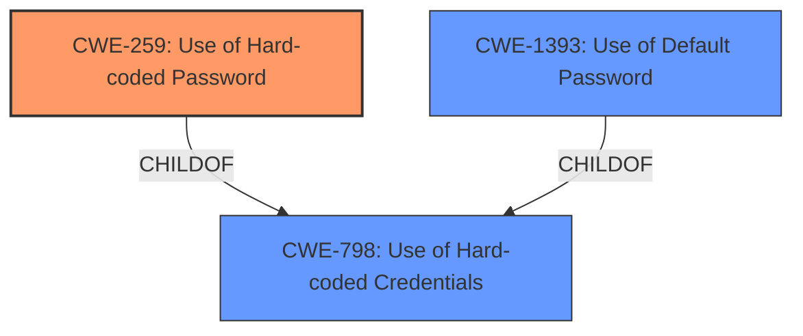

# Analysis Report for CVE-2024-35338

# Vulnerability Analysis Report: CVE-2024-35338

## Description

Tenda i29V1.0 V1.0.0.5 was discovered to contain a **hardcoded password** for root.

## Vulnerability Description Key Phrases

- **Rootcause:** hardcoded password
- **Product:** Tenda i29V1.0
- **Version:** V1.0.0.5

## Analysis (with Relationship Data)

# Summary
| CWE ID | CWE Name | Confidence | CWE Abstraction Level | CWE Vulnerability Mapping Label | CWE-Vulnerability Mapping Notes |
|---|---|---|---|---|---|
| CWE-259 | Use of Hard-coded Password | 1.0 | Variant | Allowed | Primary CWE. The vulnerability description explicitly states a hardcoded password is the root cause. |
| CWE-798 | Use of Hard-coded Credentials | 0.7 | Base | Allowed | Secondary candidate. This is a broader category that includes passwords but is less specific than CWE-259. |
| CWE-1393 | Use of Default Password | 0.6 | Base | Allowed | Secondary candidate. This could be applicable if the hardcoded password is also the default password. Needs further context to confirm. |

## Evidence and Confidence

*   **Confidence Score:** 0.9
*   **Evidence Strength:** HIGH

## Relationship Analysis
The primary CWE is CWE-259, which is a variant of the base CWE-798 (Use of Hard-coded Credentials). CWE-259 is more specific because it focuses on passwords, whereas CWE-798 covers other types of credentials such as cryptographic keys. The relationship between CWE-259 and CWE-798 is a parent-child relationship, with CWE-259 being a child of CWE-798.



## Vulnerability Chain
The vulnerability chain starts with the **hardcoded password** (CWE-259). This allows unauthorized access to the system, potentially leading to a complete system compromise.

## Summary of Analysis
The vulnerability description clearly states the presence of a **hardcoded password**. This directly aligns with CWE-259 (Use of Hard-coded Password), which is at the Variant level of abstraction and is the most specific CWE for this vulnerability. CWE-798 (Use of Hard-coded Credentials) is a broader category that could also apply, but CWE-259 is preferred due to its specificity. CWE-1393 (Use of Default Password) could be considered if the hardcoded password is the default, but there isn't enough context to confirm.

The retriever results support this assessment, with CWE-259 having a high relevance score. The mapping guidance for CWE-259 allows its usage, further reinforcing the selection.

Other CWEs considered but not used:
*   CWE-321 (Use of Hard-coded Cryptographic Key): This is not applicable as the vulnerability explicitly mentions a password, not a cryptographic key.
*   CWE-425 (Direct Request ('Forced Browsing')): This is not relevant as the vulnerability is about authentication, not authorization.
*   CWE-78 (Improper Neutralization of Special Elements used in an OS Command ('OS Command Injection')): This is not relevant as the vulnerability is not related to command injection.
*   CWE-912 (Hidden Functionality): This is not relevant to hardcoded credentials.
*   CWE-121 (Stack-based Buffer Overflow): This is not relevant as the vulnerability is not related to buffer overflows.
*   CWE-471 (Modification of Assumed-Immutable Data (MAID)): This is not relevant as the vulnerability is not about immutable data modification.


## CWE Relationship Analysis

Current CWEs represent these abstraction levels: .


### Vulnerability Chain Analysis

**Chain starting from CWE-321:**
- 321 (Use of Hard-coded Cryptographic Key) - ROOT


**Chain starting from CWE-121:**
- 121 (Stack-based Buffer Overflow) - ROOT


### CWE Relationship Diagram

```mermaid
graph TD
    classDef primary fill:#f96,stroke:#333,stroke-width:2px
    classDef secondary fill:#69f,stroke:#333
    classDef tertiary fill:#9e9,stroke:#333
```


*Report generated on 2025-07-13 08:35:34*
