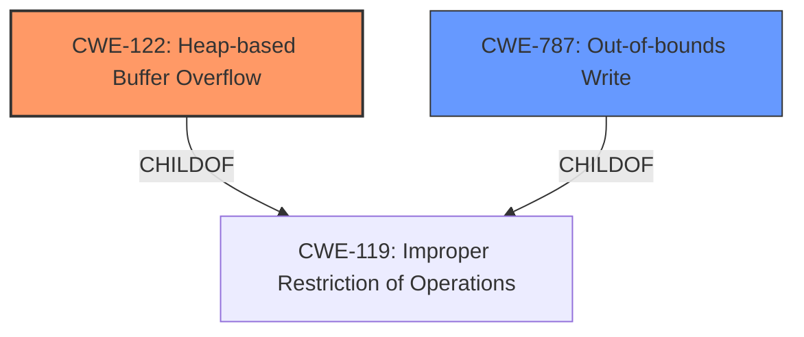

# Analysis Report for CVE-2024-35418

# Vulnerability Analysis Report: CVE-2024-35418

## Description

wac commit 385e1 was discovered to contain a **heap overflow** via the setup_call function at /wac-asan/wa.c. This vulnerability allows attackers to cause a Denial of Service (DoS) via a crafted wasm file.

## Vulnerability Description Key Phrases

- **Weakness:** heap overflow
- **Impact:** Denial of Service (DoS)
- **Vector:** crafted wasm file
- **Attacker:** attackers
- **Product:** wac
- **Version:** commit 385e1
- **Component:** setup_call function at /wac-asan/wa.c

## Analysis (with Relationship Data)

# Summary
| CWE ID | CWE Name | Confidence | CWE Abstraction Level | CWE Vulnerability Mapping Label | CWE-Vulnerability Mapping Notes |
|---|---|---|---|---|---|
| CWE-122 | Heap-based Buffer Overflow | 1.0 | Variant | Primary | Allowed |
| CWE-787 | Out-of-bounds Write | 0.7 | Base | Secondary Candidate | Allowed |

## Evidence and Confidence

*   **Confidence Score:** 0.9
*   **Evidence Strength:** HIGH

## Relationship Analysis
The primary weakness is a **heap-based buffer overflow** (CWE-122). The relationship between CWE-122 and other CWEs, such as CWE-787 (Out-of-bounds Write), is that CWE-122 is a specific type of out-of-bounds write that occurs on the heap. CWE-122 is a variant of CWE-119 (Improper Restriction of Operations within the Bounds of a Memory Buffer), while CWE-787 is a child of CWE-119.



## Vulnerability Chain
The vulnerability chain starts with a **heap overflow** in the `setup_call` function. This leads to an out-of-bounds write, potentially resulting in a Denial of Service (DoS).

Heap Overflow -> Out-of-bounds Write -> Denial of Service

## Summary of Analysis
The vulnerability is a **heap-based buffer overflow** in the `setup_call` function, triggered by a crafted WASM file, leading to a Denial of Service. The primary evidence is the "Vulnerability Description" key phrase "**heap overflow**" and the "CVE Reference Links Content Summary" section, which states: "The vulnerability is a heap buffer overflow in the `setup_call` function within the `wac` project."

CWE-122 (Heap-based Buffer Overflow) is the most appropriate CWE because it directly reflects the **heap overflow** condition described in the vulnerability. CWE-787 (Out-of-bounds Write) is a related but more general CWE; since the overflow occurs on the heap, CWE-122 is more specific and accurate.

The retriever results also listed CWE-122 as a relevant CWE, further supporting this classification.

CWEs considered but not used:

*   CWE-190 (Integer Overflow or Wraparound): While integer overflows can sometimes lead to buffer overflows, there's no direct evidence of an integer overflow in this case.
*   CWE-125 (Out-of-bounds Read): The description explicitly mentions a **heap overflow**, which is an out-of-bounds write. While an out-of-bounds read might occur as a consequence, the primary issue is the write.
*   CWE-674 (Uncontrolled Recursion): No evidence of uncontrolled recursion.
*   CWE-193 (Off-by-one Error): While an off-by-one error *could* contribute to a heap overflow, the description doesn't suggest this is the root cause.
*   CWE-1284 (Improper Validation of Specified Quantity in Input): There's no specific mention of improper validation of input size.
*   CWE-126 (Buffer Over-read): Similar to CWE-125, the primary issue is the overflow (write), not the over-read.
*   CWE-476 (NULL Pointer Dereference): No indication of a NULL pointer dereference.
*   CWE-409: Improper Handling of Highly Compressed Data (Data Amplification): No evidence of compressed data issues.
*   CWE-1339: Insufficient Precision or Accuracy of a Real Number: No evidence of real number precision issues.


## CWE Relationship Analysis

Current CWEs represent these abstraction levels: .


### Vulnerability Chain Analysis

**Chain starting from CWE-1284:**
- 1284 (Improper Validation of Specified Quantity in Input) - ROOT


**Chain starting from CWE-476:**
- 476 (NULL Pointer Dereference) - ROOT


### CWE Relationship Diagram

```mermaid
graph TD
    classDef primary fill:#f96,stroke:#333,stroke-width:2px
    classDef secondary fill:#69f,stroke:#333
    classDef tertiary fill:#9e9,stroke:#333
```


*Report generated on 2025-07-13 08:36:07*
