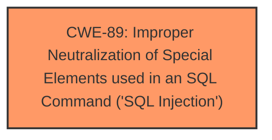

# Analysis Report for CVE-2024-3549

# Vulnerability Analysis Report: CVE-2024-3549

## Description

The Blog2Social Social Media Auto Post & Scheduler plugin for WordPress is vulnerable to SQL Injection via the b2sSortPostType parameter in all versions up to, and including, 7.4.1 due to **insufficient escaping on the user supplied parameter and lack of sufficient preparation on the existing SQL query**. This makes it possible for authenticated attackers, with subscriber-level access and above, to append additional SQL queries into already existing queries that can be used to extract sensitive information from the database.

## Vulnerability Description Key Phrases

- **Rootcause:** insufficient escaping on the user supplied parameter and lack of sufficient preparation on the existing SQL query
- **Weakness:** SQL injection
- **Impact:** ['extract sensitive information from the database', 'information disclosure']
- **Attacker:** authenticated attackers
- **Product:** Blog2Social Social Media Auto Post & Scheduler WordPress plugin
- **Version:** up to 7.4.1
- **Component:** b2sSortPostType parameter

## Analysis (with Relationship Data)

# Summary
| CWE ID | CWE Name | Confidence | CWE Abstraction Level | CWE Vulnerability Mapping Label | CWE-Vulnerability Mapping Notes |
|---|---|---|---|---|---|
| CWE-89 | Improper Neutralization of Special Elements used in an SQL Command ('SQL Injection') | 1.0 | Base | Allowed | Primary CWE. The **rootcause** is **insufficient escaping** of the 'b2sSortPostType' parameter and **lack of sufficient preparation** on the existing SQL query, leading to SQL Injection. |

## Evidence and Confidence

*   **Confidence Score:** 1.0
*   **Evidence Strength:** HIGH

## Relationship Analysis
The primary CWE is CWE-89, which is a Base level CWE. There are no direct parent or child relationships that significantly influence this mapping. The key relationship here is that the **improper neutralization** leads directly to the **SQL injection** vulnerability. The abstraction level is appropriate as Base since it directly reflects the coding error.



## Vulnerability Chain
The chain of events is as follows:
1.  The application receives user input via the 'b2sSortPostType' parameter.
2.  Due to **insufficient escaping** and **lack of sufficient preparation**, the input is not properly neutralized.
3.  This allows an attacker to inject malicious SQL code.
4.  The injected SQL code is executed, leading to the extraction of sensitive information from the database.

The root cause is the **improper neutralization** (or lack thereof), and the impact is the **SQL injection** leading to information disclosure.

## Summary of Analysis
The analysis is based on the vulnerability description and the provided information. The **rootcause** is clearly stated as **insufficient escaping** on the user supplied parameter and **lack of sufficient preparation on the existing SQL query**, which directly leads to **SQL Injection**. The retriever results also strongly suggest CWE-89 as the most appropriate mapping. The relationship analysis shows that the **improper neutralization** directly causes the **SQL injection**. The evidence is strong and directly supports the mapping to CWE-89.

The other CWEs were considered but were less relevant:
*   CWE-116: Improper Encoding or Escaping of Output - While related to neutralization, it's a more general class. CWE-89 is more specific to the **SQL injection** vulnerability.
*   CWE-352: Cross-Site Request Forgery (CSRF) - Not relevant as the vulnerability is SQL injection, not CSRF.
*   CWE-90: Improper Neutralization of Special Elements used in an LDAP Query ('LDAP Injection') - Not relevant as the vulnerability is SQL injection, not LDAP Injection.
*   CWE-79: Improper Neutralization of Input During Web Page Generation ('Cross-site Scripting') - Not relevant as the vulnerability is SQL injection, not XSS.
*   CWE-425: Direct Request ('Forced Browsing') - Not relevant as the vulnerability is SQL injection, not Forced Browsing.
*   CWE-472: External Control of Assumed-Immutable Web Parameter - Not relevant as the vulnerability is SQL injection and the rootcause is not external control of immutable parameters.
*   CWE-434: Unrestricted Upload of File with Dangerous Type - Not relevant as the vulnerability is SQL injection, not file upload related.
*   CWE-639: Authorization Bypass Through User-Controlled Key - Not relevant as the vulnerability is SQL injection, not authorization bypass related.
*   CWE-201: Insertion of Sensitive Information Into Sent Data - Not relevant as the vulnerability is SQL injection, not related to sensitive data in sent data.
*   CWE-1336: Improper Neutralization of Special Elements Used in a Template Engine - Not relevant as the vulnerability is SQL injection, not related to template engine injection.


## CWE Relationship Analysis

Current CWEs represent these abstraction levels: .


### Vulnerability Chain Analysis

**Chain starting from CWE-90:**
- 90 (Improper Neutralization of Special Elements used in an LDAP Query ('LDAP Injection')) - ROOT


**Chain starting from CWE-89:**
- 89 (Improper Neutralization of Special Elements used in an SQL Command ('SQL Injection')) - ROOT


### CWE Relationship Diagram

```mermaid
graph TD
    classDef primary fill:#f96,stroke:#333,stroke-width:2px
    classDef secondary fill:#69f,stroke:#333
    classDef tertiary fill:#9e9,stroke:#333
```


*Report generated on 2025-07-13 08:37:53*
