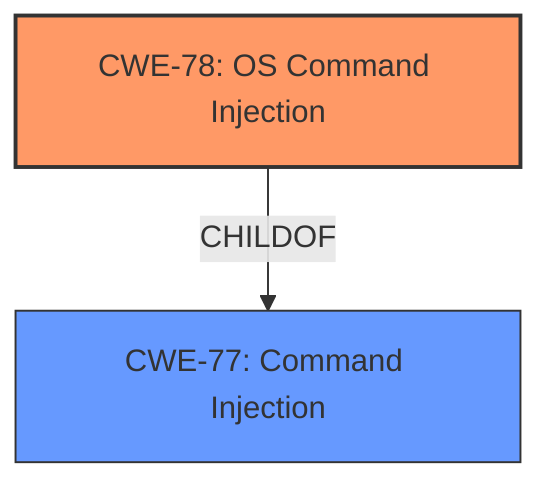

# Raw Analyzer Response for CVE-2024-35519

# Summary
| CWE ID | CWE Name | Confidence | CWE Abstraction Level | CWE Vulnerability Mapping Label | CWE-Vulnerability Mapping Notes |
|---|---|---|---|---|---|
| CWE-78 | Improper Neutralization of Special Elements used in an OS Command ('OS Command Injection') | 1.0 | Base | Allowed | Primary CWE |

## Evidence and Confidence

*   **Confidence Score:** 1.0
*   **Evidence Strength:** HIGH

## Relationship Analysis
The primary relationship considered was the child-of relationship between CWE-78 and CWE-77. While CWE-77 is a broader class encompassing command injection, CWE-78 specifically targets OS command injection, which aligns with the evidence suggesting the injection occurs at the operating system level.

## Vulnerability Chain
The vulnerability chain starts with the **improper neutralization** of the `ap_mode` parameter, leading to the execution of arbitrary OS commands.

Improper Neutralization -> OS Command Injection -> Arbitrary Code Execution

## Summary of Analysis
The vulnerability is a **command injection** in the `operating_mode.cgi` script via the `ap_mode` parameter. The application **fails to properly sanitize user input**, allowing an attacker to inject arbitrary shell commands, resulting in arbitrary code execution on the affected Netgear devices.

The primary CWE is CWE-78, which accurately reflects the nature of the vulnerability. The evidence from the CVE Reference Links Content Summary explicitly states that the root cause is a command injection vulnerability and that the application fails to properly sanitize user input.

Relevant CWE Information:

# Enhanced Context (25 CWEs)

## CWE-77: Improper Neutralization of Special Elements used in a Command ('Command Injection')
**Abstraction Level**: Class
**Similarity Score**: 0.76
**Source**: dense

**Description**:
The product constructs all or part of a command using externally-influenced input from an upstream component, but it does not neutralize or incorrectly neutralizes special elements that could modify the intended command when it is sent to a downstream component.

**Mapping Guidance**:
- Usage: Allowed-with-Review
- Rationale: CWE-77 is often misused when OS command injection (CWE-78) was intended instead [REF-1287].

CWE-77 was considered but not chosen because CWE-78 is a more specific case of command injection, namely OS command injection, which is more accurate given the context of the vulnerability.

## CWE-78: Improper Neutralization of Special Elements used in an OS Command ('OS Command Injection')
**Abstraction Level**: Base
**Similarity Score**: 0.75
**Source**: dense

**Description**:
The product constructs all or part of an OS command using externally-influenced input from an upstream component, but it does not neutralize or incorrectly neutralizes special elements that could modify the intended OS command when it is sent to a downstream component.

**Mapping Guidance**:
- Usage: Allowed
- Rationale: This CWE entry is at the Base level of abstraction, which is a preferred level of abstraction for mapping to the root causes of vulnerabilities.

This CWE accurately describes the vulnerability where the application **fails to neutralize special elements** in the `ap_mode` parameter, which is then used to construct an OS command. This aligns with the vulnerability description and the analysis of the CVE reference links. The "Usage: Allowed" mapping guidance further supports this choice.