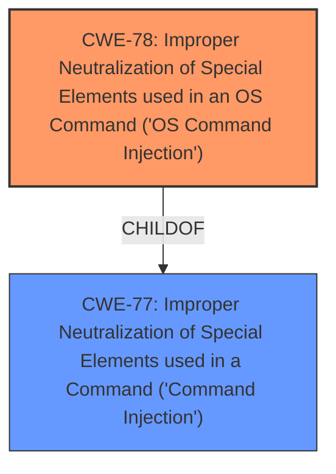

# Enhanced Analysis for CVE-2024-35520

# Summary
| CWE ID | CWE Name | Confidence | CWE Abstraction Level | CWE Vulnerability Mapping Label | CWE-Vulnerability Mapping Notes |
|---|---|---|---|---|---|
| CWE-78 | Improper Neutralization of Special Elements used in an OS Command ('OS Command Injection') | 1.0 | Base | Allowed | Primary CWE. The vulnerability allows the injection of OS commands due to improper neutralization of special elements in the input.|
| CWE-77 | Improper Neutralization of Special Elements used in a Command ('Command Injection') | 0.7 | Class | Allowed-with-Review | Secondary candidate. This is a more general form of command injection. |

## Evidence and Confidence

*   **Confidence Score:** 1.0
*   **Evidence Strength:** HIGH

## Relationship Analysis
The primary relationship impacting the decision is that CWE-78 [CWE-78: Improper Neutralization of Special Elements used in an OS Command ('OS Command Injection')] is a specific type of CWE-77 [CWE-77: Improper Neutralization of Special Elements used in a Command ('Command Injection')]. Since the vulnerability description clearly indicates OS command injection, CWE-78 is chosen for its greater specificity.



## Vulnerability Chain
The vulnerability chain starts with the **improper neutralization** of special elements in the `device_name2` parameter within the `RMT_invite.cgi` component. This leads directly to the ability to inject and execute arbitrary OS commands, potentially granting full control of the router.

## Summary of Analysis
The analysis is based on the provided vulnerability description and CVE reference. The description clearly states a **command injection** vulnerability in the `RMT_invite.cgi` component of the Netgear R7000 router, specifically through the `device_name2` parameter. The CVE reference confirms this as a post-authentication **command injection** flaw, enabling arbitrary command execution.

The selection of CWE-78 [CWE-78: Improper Neutralization of Special Elements used in an OS Command ('OS Command Injection')] as the primary CWE is strongly supported by the evidence. The CVE summary explicitly mentions the ability to execute arbitrary commands on the underlying operating system, aligning perfectly with the definition of OS command injection. CWE-77 [CWE-77: Improper Neutralization of Special Elements used in a Command ('Command Injection')] was considered but deemed less specific.

The chosen CWE is at the optimal level of specificity (Base) as it directly reflects the root cause and nature of the vulnerability.


## CWE Relationship Analysis

Current CWEs represent these abstraction levels: .


### Vulnerability Chain Analysis

**Chain starting from CWE-77:**
- 77 (Improper Neutralization of Special Elements used in a Command ('Command Injection')) - ROOT


**Chain starting from CWE-78:**
- 78 (Improper Neutralization of Special Elements used in an OS Command ('OS Command Injection')) - ROOT


### CWE Relationship Diagram

```mermaid
graph TD
    classDef primary fill:#f96,stroke:#333,stroke-width:2px
    classDef secondary fill:#69f,stroke:#333
    classDef tertiary fill:#9e9,stroke:#333
```