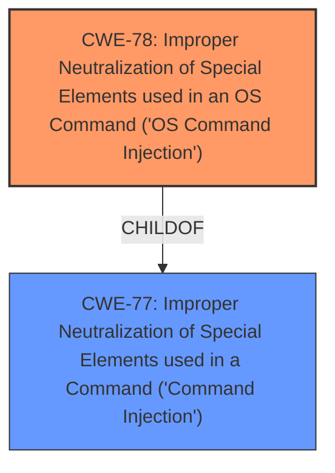

# Enhanced Analysis for CVE-2024-35522

# Summary
| CWE ID | CWE Name | Confidence | CWE Abstraction Level | CWE Vulnerability Mapping Label | CWE-Vulnerability Mapping Notes |
|---|---|---|---|---|---|
| CWE-78 | Improper Neutralization of Special Elements used in an OS Command ('OS Command Injection') | 1.0 | Base | Allowed | Primary CWE. |
| CWE-77 | Improper Neutralization of Special Elements used in a Command ('Command Injection') | 0.7 | Class | Allowed-with-Review | Secondary Candidate |

## Evidence and Confidence

*   **Confidence Score:** 1.0
*   **Evidence Strength:** HIGH

## Relationship Analysis
The primary relationship influencing the CWE selection is the hierarchical relationship between CWE-77 (Class) and CWE-78 (Base). CWE-78 is a more specific child of CWE-77. Since the vulnerability description clearly states "command injection" in the context of an operating system, CWE-78 is the more appropriate choice. The retriever results also suggest CWE-78 as a strong candidate.



## Vulnerability Chain
The vulnerability chain starts with the **improper neutralization** of special elements in the OS command, leading to **command injection**.

## Summary of Analysis
The vulnerability description explicitly mentions "**command injection**" in the context of a Netgear product. The retriever results also list CWE-77 and CWE-78 as top candidates. Given that the command injection occurs at the operating system level, CWE-78, which is a Base level CWE, is a more specific and accurate classification than its parent, CWE-77. The evidence supports this decision, and the mapping guidance for CWE-78 allows its use.

Relevant CWE Information:

# Enhanced Context (25 CWEs)
The following CWEs were identified as potentially relevant to this vulnerability:

## CWE-77: Improper Neutralization of Special Elements used in a Command ('Command Injection')
**Abstraction Level**: Class
**Similarity Score**: 0.73
**Source**: dense

**Description**:
The product constructs all or part of a command using externally-influenced input from an upstream component, but it does not neutralize or incorrectly neutralizes special elements that could modify the intended command when it is sent to a downstream component.

**Mapping Guidance**:
- Usage: Allowed-with-Review
- Rationale: CWE-77 is often misused when OS command injection (CWE-78) was intended instead [REF-1287].


## CWE-78: Improper Neutralization of Special Elements used in an OS Command ('OS Command Injection')
**Abstraction Level**: Base
**Similarity Score**: 0.72
**Source**: dense

**Description**:
The product constructs all or part of an OS command using externally-influenced input from an upstream component, but it does not neutralize or incorrectly neutralizes special elements that could modify the intended OS command when it is sent to a downstream component.

**Mapping Guidance**:
- Usage: Allowed
- Rationale: This CWE entry is at the Base level of abstraction, which is a preferred level of abstraction for mapping to the root causes of vulnerabilities.

### Final Conclusion:
CWE-78 is the primary CWE because the vulnerability specifically involves **command injection** at the operating system level. The description explicitly mentions command injection via the ap_mode parameter in operating_mode.cgi.

CWE-77 was considered, but ultimately, CWE-78 is more specific and better represents the vulnerability's root cause. The confidence level is high due to the explicit mention of "**command injection**" in the vulnerability description.


## CWE Relationship Analysis

Current CWEs represent these abstraction levels: .


### Vulnerability Chain Analysis

**Chain starting from CWE-77:**
- 77 (Improper Neutralization of Special Elements used in a Command ('Command Injection')) - ROOT


**Chain starting from CWE-78:**
- 78 (Improper Neutralization of Special Elements used in an OS Command ('OS Command Injection')) - ROOT


### CWE Relationship Diagram

```mermaid
graph TD
    classDef primary fill:#f96,stroke:#333,stroke-width:2px
    classDef secondary fill:#69f,stroke:#333
    classDef tertiary fill:#9e9,stroke:#333
```