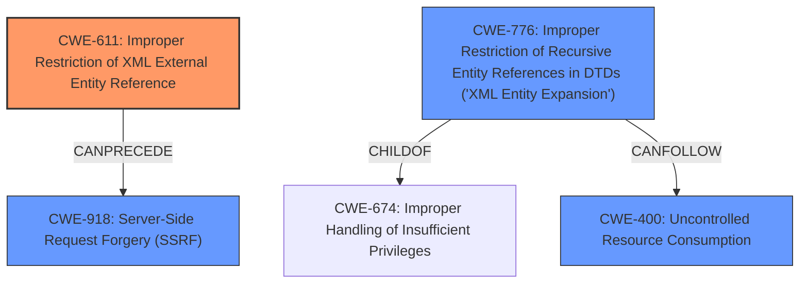

# Analysis for CVE-2024-35532

# Summary
| CWE ID | CWE Name | Confidence | CWE Abstraction Level | CWE Vulnerability Mapping Label | CWE-Vulnerability Mapping Notes |
|---|---|---|---|---|---|
| CWE-611 | Improper Restriction of XML External Entity Reference | 1.0 | Base | Allowed | Primary CWE |
| CWE-776 | Improper Restriction of Recursive Entity References in DTDs ('XML Entity Expansion') | 0.5 | Base | Allowed | Secondary Candidate |
| CWE-918 | Server-Side Request Forgery (SSRF) | 0.5 | Base | Allowed | Secondary Candidate |
| CWE-400 | Uncontrolled Resource Consumption | 0.3 | Class | Discouraged | Secondary Candidate |

## Evidence and Confidence

*   **Confidence Score:** 0.8
*   **Evidence Strength:** HIGH

## Relationship Analysis
The primary weakness, CWE-611 [Improper Restriction of XML External Entity Reference], is a base-level CWE. I also considered CWE-776 [Improper Restriction of Recursive Entity References in DTDs ('XML Entity Expansion')], CWE-918 [Server-Side Request Forgery (SSRF)], and CWE-400 [Uncontrolled Resource Consumption] as secondary candidates because the description mentions SSRF and DoS, and CWE-776 relates to XML entity expansion which can lead to DoS. CWE-400 is a parent of CWE-770, which is "Allocation of Resources Without Limits or Throttling".

## Vulnerability Chain
The vulnerability chain starts with **XML External Entity injection** (CWE-611). This allows attackers to perform arbitrary file reading, make SSRF requests (CWE-918), or cause a Denial of Service (DoS) (CWE-400).

## Summary of Analysis
The vulnerability description clearly states that an **XML External Entity (XXE) injection** vulnerability exists. This aligns directly with CWE-611 [Improper Restriction of XML External Entity Reference]. The description also mentions arbitrary file reading, SSRF, and DoS, which are potential impacts of XXE.

The primary decision is based on the explicit mention of "**XML External Entity injection**" in the "**Vulnerability Description Key Phrases**".

CWE-611 is the most specific and appropriate CWE based on the available evidence. The relationship graph supports the potential for SSRF and DoS as downstream effects of XXE.

The other CWEs were considered and rejected, as they are impacts of the XXE vulnerability, not the root cause.

Relevant CWE Information:

# Enhanced Context (25 CWEs)

## CWE-611: Improper Restriction of XML External Entity Reference
**Abstraction Level**: Base
**Similarity Score**: 0.80
**Source**: dense

**Description**:
The product processes an XML document that can contain XML entities with URIs that resolve to documents outside of the intended sphere of control, causing the product to embed incorrect documents into its output.

**Mapping Guidance**:
- Usage: Allowed
- Rationale: This CWE entry is at the Base level of abstraction, which is a preferred level of abstraction for mapping to the root causes of vulnerabilities.