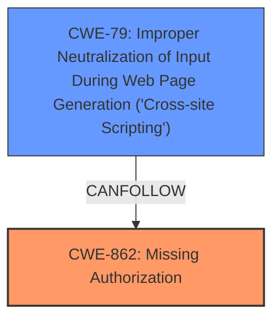

# Analysis for CVE-2024-3555

# Summary
| CWE ID | CWE Name | Confidence | CWE Abstraction Level | CWE Vulnerability Mapping Label | CWE-Vulnerability Mapping Notes |
|---|---|---|---|---|---|
| CWE-862 | Missing Authorization | 1.0 | Class | Allowed-with-Review | The **missing capability check** on the `import_link_pages()` function directly corresponds to a **missing authorization** vulnerability. |
| CWE-79 | Improper Neutralization of Input During Web Page Generation ('Cross-site Scripting') | 0.9 | Base | Allowed | The ability to **inject arbitrary pages and malicious web scripts** due to the **missing authorization** leads to XSS. |

## Evidence and Confidence

*   **Confidence Score:** 0.95
*   **Evidence Strength:** HIGH

## Relationship Analysis
The primary weakness is **CWE-862 (Missing Authorization)**, a Class-level CWE. Due to the **missing capability check** on the `import_link_pages()` function, unauthenticated users can access the function. This can lead to **CWE-79 (Improper Neutralization of Input During Web Page Generation ('Cross-site Scripting'))** because the attackers can inject malicious scripts by uploading a crafted CSV file.

## Vulnerability Chain
The vulnerability chain starts with the **missing authorization (CWE-862)** in the `import_link_pages()` function. This **missing authorization** allows unauthenticated attackers to upload malicious CSV files, leading to **improper neutralization of input during web page generation (CWE-79)** and resulting in cross-site scripting.

## Summary of Analysis
The analysis is primarily based on the provided evidence, which clearly states that the **root cause** is a **missing capability check** on the `import_link_pages()` function.

The Wordfence article explicitly mentions: "The Social Link Pages link-in-bio landing pages for your social media profiles plugin for WordPress is vulnerable to unauthorized access due to a **missing capability check** on the import_link_pages() function in all versions up to, and including, 1.6.9. This makes it possible for unauthenticated attackers to inject arbitrary pages and malicious web scripts."

The graph relationships influenced the selection, as the **missing authorization** directly allows for the injection of malicious scripts, creating a chain of vulnerabilities.

CWE-862 is chosen as the primary CWE because the **missing capability check** is the root cause that leads to the vulnerability. CWE-79 is included as a secondary CWE because it represents the impact of the injected malicious scripts.

# Enhanced Context (25 CWEs)
The following CWEs were identified as potentially relevant to this vulnerability:

## CWE-352: Cross-Site Request Forgery (CSRF)
**Abstraction Level**: Compound
**Similarity Score**: 0.79
**Source**: dense

**Description**:
The web application does not, or can not, sufficiently verify whether a well-formed, valid, consistent request was intentionally provided by the user who submitted the request.

**Mapping Guidance**:
- Usage: Allowed
- Rationale: This is a well-known Composite of multiple weaknesses that must all occur simultaneously, although it is attack-oriented in nature.

*Not Selected*: CSRF requires the user to be authenticated. This vulnerability explictly states that it is unauthenticated access.

## CWE-425: Direct Request ('Forced Browsing')
**Abstraction Level**: Base
**Similarity Score**: 0.76
**Source**: dense

**Description**:
The web application does not adequately enforce appropriate authorization on all restricted URLs, scripts, or files.

**Mapping Guidance**:
- Usage: Allowed
- Rationale: This CWE entry is at the Base level of abstraction, which is a preferred level of abstraction for mapping to the root causes of vulnerabilities.

*Not Selected*: While related to authorization, **CWE-862 (Missing Authorization)** is a more direct and specific fit for the vulnerability description, which focuses on the **missing capability check**.

## CWE-472: External Control of Assumed-Immutable Web Parameter
**Abstraction Level**: Base
**Similarity Score**: 0.74
**Source**: dense

**Description**:
The web application does not sufficiently verify inputs that are assumed to be immutable but are actually externally controllable, such as hidden form fields.

**Mapping Guidance**:
- Usage: Allowed
- Rationale: This CWE entry is at the Base level of abstraction, which is a preferred level of abstraction for mapping to the root causes of vulnerabilities.

*Not Selected*: This CWE is not applicable as the vulnerability is not related to external control of assumed-immutable web parameters.

## CWE-434: Unrestricted Upload of File with Dangerous Type
**Abstraction Level**: Base
**Similarity Score**: 0.74
**Source**: dense

**Description**:
The product allows the upload or transfer of dangerous file types that are automatically processed within its environment.

**Mapping Guidance**:
- Usage: Allowed
- Rationale: This CWE entry is at the Base level of abstraction, which is a preferred level of abstraction for mapping to the root causes of vulnerabilities.

*Not Selected*: While the vulnerability involves uploading a CSV file, the root cause is the **missing authorization** that allows this upload in the first place.

## CWE-116: Improper Encoding or Escaping of Output
**Abstraction Level**: Class
**Similarity Score**: 0.74
**Source**: dense

**Description**:
The product prepares a structured message for communication with another component, but encoding or escaping of the data is either missing or done incorrectly. As a result, the intended structure of the message is not preserved.

**Mapping Guidance**:
- Usage: Allowed-with-Review
- Rationale: This CWE entry is a Class and might have Base-level children that would be more appropriate

*Not Selected*: While related to output, the primary issue is the **missing authorization**, not the encoding/escaping of output.

## CWE-639: Authorization Bypass Through User-Controlled Key
**Abstraction Level**: Base
**Similarity Score**: 0.74
**Source**: dense

**Description**:
The system's authorization functionality does not prevent one user from gaining access to another user's data or record by modifying the key value identifying the data.

**Mapping Guidance**:
- Usage: Allowed
- Rationale: This CWE entry is at the Base level of abstraction, which is a preferred level of abstraction for mapping to the root causes of vulnerabilities.

*Not Selected*: This CWE is not applicable as the vulnerability is not related to authorization bypass through user-controlled key.

## CWE-201: Insertion of Sensitive Information Into Sent Data
**Abstraction Level**: Base
**Similarity Score**: 0.73
**Source**: dense

**Description**:
The code transmits data to another actor, but a portion of the data includes sensitive information that should not be accessible to that actor.

**Mapping Guidance**:
- Usage: Allowed
- Rationale: This CWE entry is at the Base level of abstraction, which is a preferred level of abstraction for mapping to the root causes of vulnerabilities.

*Not Selected*: This CWE is not applicable as the vulnerability is not related to insertion of sensitive information into sent data.

## CWE-79: Improper Neutralization of Input During Web Page Generation ('Cross-site Scripting')
**Abstraction Level**: Base
**Similarity Score**: 0.73
**Source**: dense

**Description**:
The product does not neutralize or incorrectly neutralizes user-controllable input before it is placed in output that is used as a web page that is served to other users.

**Mapping Guidance**:
- Usage: Allowed
- Rationale: This CWE entry is at the Base level of abstraction, which is a preferred level of abstraction for mapping to the root causes of vulnerabilities.

*Selected as Secondary*: The **missing authorization** allows for the injection of malicious scripts, leading to **improper neutralization of input during web page generation (CWE-79)** and resulting in cross-site scripting.

## CWE-862: Missing Authorization
**Abstraction Level**: Class
**Similarity Score**: 0.72
**Source**: dense

**Description**:
The product does not perform an authorization check when an actor attempts to access a resource or perform an action.

**Mapping Guidance**:
- Usage: Allowed-with-Review
- Rationale: This CWE entry is a Class and might have Base-level children that would be more appropriate

*Selected as Primary*: The description matches the vulnerability, as there is a **missing capability check** on the `import_link_pages()` function, allowing unauthenticated access.

## CWE-74: Improper Neutralization of Special Elements in Output Used by a Downstream Component ('Injection')
**Abstraction Level**: Class
**Similarity Score**: 0.72
**Source**: dense

**Description