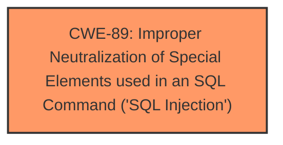

# Analysis for CVE-2024-3561

# Summary
| CWE ID | CWE Name | Confidence | CWE Abstraction Level | CWE Vulnerability Mapping Label | CWE-Vulnerability Mapping Notes |
|---|---|---|---|---|---|
| CWE-89 | Improper Neutralization of Special Elements used in an SQL Command ('SQL Injection') | 1.0 | Base | Allowed | Primary CWE. The vulnerability is due to **insufficient escaping** and **lack of preparation** in the SQL query, which allows attackers to inject malicious SQL code. |

## Evidence and Confidence

*   **Confidence Score:** 1.0
*   **Evidence Strength:** HIGH

## Relationship Analysis
The primary relationship that influenced the decision was the direct match of the vulnerability description to CWE-89, which describes the **improper neutralization** of special elements used in an SQL command. The retriever results also strongly suggested CWE-89 as the top candidate. There were no parent-child relationships or chain patterns that influenced the decision in this case, as the description clearly pointed to a classic SQL injection scenario.

## Vulnerability Chain
The vulnerability chain is straightforward:
1.  **Root Cause:** **Insufficient escaping** and **lack of preparation** in the SQL query.
2.  **Weakness:** CWE-89 Improper Neutralization of Special Elements used in an SQL Command ('SQL Injection').
3.  **Impact:** Extraction of sensitive information from the database.

## Summary of Analysis
The analysis is based on the clear evidence provided in the vulnerability description and the CVE Reference Links Content Summary. The **root cause** is directly stated as "**insufficient escaping on the user supplied parameter and lack of sufficient preparation on the existing SQL query**," which is the hallmark of SQL injection vulnerabilities.

The vulnerability description explicitly states the presence of **SQL injection** and the ability for authenticated attackers to "**append additional SQL queries into already existing queries that can be used to extract sensitive information from the database**."

The retriever results strongly support the selection of CWE-89, with a score of 1.0.

The selected CWE is at the optimal level of specificity (Base) because it directly addresses the technical weakness: the **improper neutralization** of special elements in an SQL command.
# Enhanced Context (25 CWEs)
The following CWEs were identified as potentially relevant to this vulnerability:

## CWE-352: Cross-Site Request Forgery (CSRF)
**Abstraction Level**: Compound
**Similarity Score**: 0.73
**Source**: dense
**Not Used:** CSRF is not applicable, as the vulnerability is due to SQL injection, not a forged request.

## CWE-116: Improper Encoding or Escaping of Output
**Abstraction Level**: Class
**Similarity Score**: 0.71
**Source**: dense
**Not Used:** While escaping is related, CWE-89 is more specific to SQL injection, where the lack of escaping leads to the injection itself.

## CWE-425: Direct Request ('Forced Browsing')
**Abstraction Level**: Base
**Similarity Score**: 0.70
**Source**: dense
**Not Used:** Forced browsing is an authorization issue. This vulnerability is an SQL Injection.

## CWE-472: External Control of Assumed-Immutable Web Parameter
**Abstraction Level**: Base
**Similarity Score**: 0.70
**Source**: dense
**Not Used:** Not applicable as the issue is with SQL injection, not with immutability of parameters.

## CWE-79: Improper Neutralization of Input During Web Page Generation ('Cross-site Scripting')
**Abstraction Level**: Base
**Similarity Score**: 0.70
**Source**: dense
**Not Used:** Cross-site scripting involves injecting client-side scripts, while this vulnerability is SQL injection.

## CWE-434: Unrestricted Upload of File with Dangerous Type
**Abstraction Level**: Base
**Similarity Score**: 0.70
**Source**: dense
**Not Used:** Not relevant as this vulnerability is related to SQL injection, not file uploads.

## CWE-502: Deserialization of Untrusted Data
**Abstraction Level**: Base
**Similarity Score**: 0.70
**Source**: dense
**Not Used:** Deserialization is not related to this SQL injection vulnerability.

## CWE-639: Authorization Bypass Through User-Controlled Key
**Abstraction Level**: Base
**Similarity Score**: 0.69
**Source**: dense
**Not Used:** Authorization bypass is a separate concern from SQL injection.

## CWE-89: Improper Neutralization of Special Elements used in an SQL Command ('SQL Injection')
**Abstraction Level**: Base
**Similarity Score**: 0.69
**Source**: dense
**Used:** This is the most accurate CWE as the **root cause** is **insufficient escaping** of SQL special characters leading to potential malicious query execution.

## CWE-201: Insertion of Sensitive Information Into Sent Data
**Abstraction Level**: Base
**Similarity Score**: 0.69
**Source**: dense
**Not Used:** Although sensitive information may be extracted, the **root cause** is not about inserting data into sent data.

## CWE-89: Improper Neutralization of Special Elements used in an SQL Command ('SQL Injection')
**Abstraction Level**: Base
**Similarity Score**: 1371.67
**Source**: sparse
**Used:** This is the most accurate CWE as the **root cause** is **insufficient escaping** of SQL special characters leading to potential malicious query execution.

## CWE-116: Improper Encoding or Escaping of Output
**Abstraction Level**: Class
**Similarity Score**: 1356.50
**Source**: sparse
**Not Used:** While escaping is related, CWE-89 is more specific to SQL injection, where the **lack of escaping** leads to the injection itself.

## CWE-90: Improper Neutralization of Special Elements used in an LDAP Query ('LDAP Injection')
**Abstraction Level**: Base
**Similarity Score**: 1229.50
**Source**: sparse
**Not Used:** LDAP Injection is not related to SQL Injection.

## CWE-138: Improper Neutralization of Special Elements
**Abstraction Level**: Class
**Similarity Score**: 1220.74
**Source**: sparse
**Not Used:** Too generic. SQL Injection is much more specific.

## CWE-863: Incorrect Authorization
**Abstraction Level**: Class
**Similarity Score**: 1213.90
**Source**: sparse
**Not Used:** Authorization is not the **root cause** of the vulnerability, but instead the improper handling of SQL queries.

## CWE-613: Insufficient Session Expiration
**Abstraction Level**: base
**Similarity Score**: 4.21
**Source**: graph
**Not Used:** Not related to SQL Injection.

## CWE-79: Improper Neutralization of Input During Web Page Generation ('Cross-site Scripting')
**Abstraction Level**: Base
**Similarity Score**: 2.86
**Source**: graph
**Not Used:** Cross-site scripting involves injecting client-side scripts, while this vulnerability is SQL injection.

## CWE-471: Modification of Assumed-Immutable Data (MAID)
**Abstraction Level**: base
**Similarity Score**: 2.72
**Source**: graph
**Not Used:** Not related to SQL Injection.

## CWE-90: Improper Neutralization of Special Elements used in an LDAP Query ('LDAP Injection')
**Abstraction Level**: base
**Similarity Score**: 2.40
**Source**: graph
**Not Used:** LDAP Injection is not related to SQL Injection.

## CWE-425: Direct Request ('Forced Browsing')
**Abstraction Level**: Base
**Similarity Score**: 2.34
**Source**: graph
**Not Used:** Not related to SQL Injection.

## CWE-184: Incomplete List of Disallowed Inputs
**Abstraction Level**: base
**Similarity Score**: 2.21
**Source**: graph
**Not Used:** Not related to SQL Injection.

## CWE-494: Download of Code Without Integrity Check
**Abstraction Level**: base
**Similarity Score**: 2.21
**Source**: graph
**Not Used:** Not related to SQL Injection.

## CWE-352: Cross-Site Request Forgery (CSRF)
**Abstraction Level**: Compound
**Similarity Score**: 2.18
**Source**: graph
**Not Used:** Not related to SQL Injection.

## CWE-564: SQL Injection: Hibernate
**Abstraction Level**: variant
**Similarity Score**: 2.16
**Source**: graph
**Not Used:** While related to SQL injection, it's specific to Hibernate, which isn't mentioned in the vulnerability description.

## CWE-89: Improper Neutralization of Special Elements used in an SQL Command ('SQL Injection')
**Abstraction Level**: Base
**Similarity Score**: 2.16
**Source**: graph
**Used:** This is the most accurate CWE as the **root cause** is **insufficient escaping** of SQL special characters leading to potential malicious query execution.