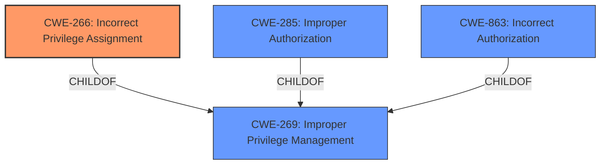

# Raw Analyzer Response for CVE-2024-35700

# Summary
| CWE ID | CWE Name | Confidence | CWE Abstraction Level | CWE Vulnerability Mapping Label | CWE-Vulnerability Mapping Notes |
|---|---|---|---|---|---|
| CWE-266 | Incorrect Privilege Assignment | 0.8 | Base | Primary CWE | Allowed |
| CWE-269 | Improper Privilege Management | 0.6 | Class | Secondary Candidate | Discouraged |
| CWE-285 | Improper Authorization | 0.5 | Class | Secondary Candidate | Discouraged |
| CWE-863 | Incorrect Authorization | 0.5 | Class | Secondary Candidate | Allowed-with-Review |

## Evidence and Confidence

*   **Confidence Score:** 0.8
*   **Evidence Strength:** MEDIUM

## Relationship Analysis
The primary relationship impacting the decision is the parent-child relationship between CWE-269 (Improper Privilege Management) and CWE-266 (Incorrect Privilege Assignment). CWE-266 is a more specific Base level weakness that describes a particular type of **improper privilege management**. Given that the vulnerability involves a user being assigned incorrect privileges, CWE-266 is a more accurate representation of the root cause.

## Vulnerability Chain
The vulnerability chain starts with **Improper Privilege Management**, specifically an **Incorrect Privilege Assignment** (CWE-266). This leads to **Privilege Escalation**, allowing an attacker to gain full website control.

## Summary of Analysis
The initial analysis identified **Improper Privilege Management** as the root cause. However, after further analysis and consideration of the CWE relationships, it became clear that **Incorrect Privilege Assignment** (CWE-266) is a more specific and accurate classification. The vulnerability description states "Improper Privilege Management vulnerability in DeluxeThemes Userpro allows Privilege Escalation." The key phrase is "**Improper Privilege Management**", but the provided information indicates that it leads to "**Privilege Escalation**."

The CWE guidance highlights that using CWE-269 directly is discouraged and that the root cause should be identified. **Incorrect Privilege Assignment** (CWE-266) directly addresses the act of assigning incorrect privileges to a user, which is the root cause in this case.

The selected CWEs are at the optimal level of specificity because they pinpoint the exact mechanism of the vulnerability, i.e., the incorrect assignment of privileges, rather than simply stating that privilege management is improper.

Relevant CWE Information:

# Enhanced Context (25 CWEs)
The following CWEs were identified as potentially relevant to this vulnerability:

## CWE-266: Incorrect Privilege Assignment
**Abstraction Level**: Base
**Similarity Score**: 0.80
**Source**: dense

**Description**:
A product **incorrectly assigns a privilege** to a particular actor, creating an unintended sphere of control for that actor.

**Mapping Guidance**:
- Usage: Allowed
- Rationale: This CWE entry is at the Base level of abstraction, which is a preferred level of abstraction for mapping to the root causes of vulnerabilities.

## CWE-269: Improper Privilege Management
**Abstraction Level**: Class
**Similarity Score**: 1576.65
**Source**: sparse

**Description**:
The product does not properly assign, modify, track, or check privileges for an actor, creating an unintended sphere of control for that actor.

**Mapping Guidance**:
- Usage: Discouraged
- Rationale: CWE-269 is commonly misused. It can be conflated with "privilege escalation," which is a technical impact that is listed in many low-information vulnerability reports [REF-1287]. It is not useful for trend analysis.

## CWE-285: Improper Authorization
**Abstraction Level**: Class
**Similarity Score**: 1540.59
**Source**: sparse

**Description**:
The product does not perform or incorrectly performs an authorization check when an actor attempts to access a resource or perform an action.

**Mapping Guidance**:
- Usage: Discouraged
- Rationale: CWE-285 is high-level and lower-level CWEs can frequently be used instead. It is a level-1 Class (i.e., a child of a Pillar).

## CWE-863: Incorrect Authorization
**Abstraction Level**: Class
**Similarity Score**: 1581.24
**Source**: sparse

**Description**:
The product performs an authorization check when an actor attempts to access a resource or perform an action, but it does not correctly perform the check.

**Mapping Guidance**:
- Usage: Allowed-with-Review
- Rationale: This CWE entry is a Class and might have Base-level children that would be more appropriate

## CWE-284: Improper Access Control
**Abstraction Level**: Pillar
**Similarity Score**: 0.74
**Source**: dense

**Description**:
The product does not properly control access to resources, which can be exploited by an attacker.

**Mapping Guidance**:
- Usage: Discouraged
- Rationale: This is a very high level category. It is better to choose a more specific child.

## Other CWEs Considered:
- CWE-269 **Improper Privilege Management**: While initially considered due to the vulnerability description, it is a more general Class-level CWE. The guidance discourages its use when a more specific root cause can be identified.
- CWE-285 **Improper Authorization**: This CWE relates to authorization checks, but the primary issue seems to be the assignment of incorrect privileges rather than a flaw in the authorization check itself.
- CWE-863 **Incorrect Authorization**: Similar to CWE-285, this relates to flawed authorization checks, which is not the core issue here.
- CWE-284 **Improper Access Control**: This is a very high level category, so it is not ideal as the specific issue is privilege assignment.