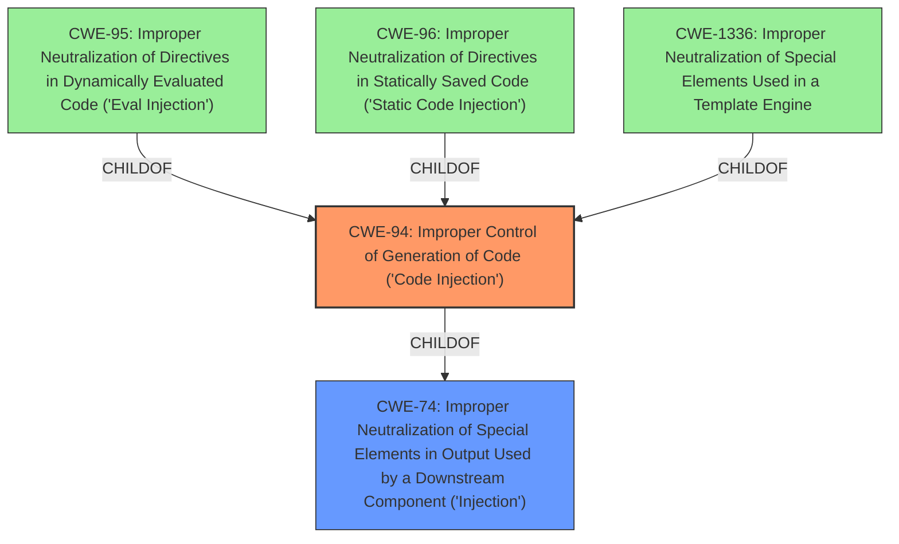

# Analysis for CVE-2024-35728

# Summary
| CWE ID | CWE Name | Confidence | CWE Abstraction Level | CWE Vulnerability Mapping Label | CWE-Vulnerability Mapping Notes |
|---|---|---|---|---|---|
| CWE-94 | Improper Control of Generation of Code ('Code Injection') | 0.8 | Base |  Primary CWE | Allowed-with-Review |
| CWE-74 | Improper Neutralization of Special Elements in Output Used by a Downstream Component ('Injection') | 0.6 | Class | Secondary Candidate | Discouraged |
| CWE-1336 | Improper Neutralization of Special Elements Used in a Template Engine | 0.5 | Base | Secondary Candidate | Allowed |

## Evidence and Confidence

*   **Confidence Score:** 0.7
*   **Evidence Strength:** MEDIUM

## Relationship Analysis
The primary relationship that influenced my decision was the parent-child relationship between CWE-94, CWE-95, CWE-96 and CWE-1336, suggesting that the specific type of code injection could be further specified. I selected CWE-94 due to the evidence pointing towards code injection as the primary issue. CWE-74 is a parent of CWE-94, but CWE-94 provides more specific guidance.

## Vulnerability Chain
The vulnerability chain starts with **Improper Neutralization of Special Elements in Output Used by a Downstream Component (Injection)** which leads to **Code Inclusion**. The root cause is the insufficient sanitization of user inputs.

## Summary of Analysis
The initial analysis focused on the **Improper Neutralization of Special Elements in Output Used by a Downstream Component (Injection)** as suggested in the vulnerability description, but the retriever results and graph relationships showed more specific options. The key evidence is in the **Vulnerability Description Key Phrases** which states the **rootcause** is "**Improper Neutralization of Special Elements in Output Used by a Downstream Component (Injection)**" and the **impact** is "**Code Inclusion**". The Retriever Results listed CWE-74 as the top candidate, but also showed CWE-94, CWE-95, CWE-96 and CWE-1336, all children of CWE-74. CWE-94 is the best fit as the impact is "Code Inclusion".

Relevant CWE Information:

# Enhanced Context (25 CWEs)
The following CWEs were identified as potentially relevant to this vulnerability:

## CWE-94: Improper Control of Generation of Code ('Code Injection')
**Abstraction Level**: base
**Similarity Score**: 2.42
**Source**: graph

**Description**:
CWE-94: Improper Control of Generation of Code ('Code Injection')

**Mapping Guidance**:
- Usage: Allowed-with-Review
- Rationale: This entry is frequently misused for vulnerabilities with a technical impact of "code execution," which does not by itself indicate a root cause weakness, since dozens of weaknesses can enable code execution.

**Relationships**:
- CANFOLLOW -> CWE-98
- PARENTOF -> CWE-96
- PARENTOF -> CWE-95
- PARENTOF -> CWE-1336
- CHILDOF -> CWE-913

CWE-94 is the most accurate because the impact is code inclusion/injection.

*   **CWE-94: Improper Control of Generation of Code ('Code Injection')**
    *   **Technical Explanation:** The application fails to properly sanitize or validate user-supplied input, which is then used to generate code. This allows an attacker to inject arbitrary code into the application, leading to potential code execution. The **rootcause** is the **improper neutralization**, and the impact is code injection.
    *   **Security Implications:** An attacker can execute arbitrary code on the server, potentially leading to complete system compromise.
    *   **Relationship Analysis:** CWE-94 is a child of CWE-74, providing a more specific classification for code injection vulnerabilities.
    *   **Mapping Guidance Influence:** The "Allowed-with-Review" usage indicates it's suitable, provided the specifics align with code injection.
    *   **Primary Weakness:** Yes, this is the primary weakness as it directly relates to the vulnerability's impact and root cause.

*   **CWE-74: Improper Neutralization of Special Elements in Output Used by a Downstream Component ('Injection')**
    *   **Technical Explanation:** The application fails to neutralize special elements in output, which are then used by a downstream component. This can lead to various types of injection vulnerabilities, including code injection.
    *   **Security Implications:** This can lead to arbitrary code execution, data leakage, or other security breaches, depending on the downstream component.
    *   **Relationship Analysis:** CWE-74 is a more general class of injection vulnerabilities.
    *   **Mapping Guidance Influence:** The "Discouraged" usage suggests that a more specific CWE should be used if available.
    *   **Primary Weakness:** No, CWE-94 is a more specific and appropriate classification.

*   **CWE-1336: Improper Neutralization of Special Elements Used in a Template Engine**
    *   **Technical Explanation:** The application uses a template engine to process user-supplied input, but fails to properly neutralize special elements, allowing an attacker to inject arbitrary template code.
    *   **Security Implications:** An attacker can execute arbitrary code within the context of the template engine, potentially leading to information disclosure or code execution.
    *   **Relationship Analysis:** CWE-1336 is a child of CWE-94, providing a more specific classification for template injection vulnerabilities.
    *   **Mapping Guidance Influence:** The "Allowed" usage indicates it's a suitable option if the application uses a template engine.
    *   **Primary Weakness:** Maybe. The vulnerability description lacks the details to indicate that a template engine is in use. Therefore, it is only a secondary candidate.