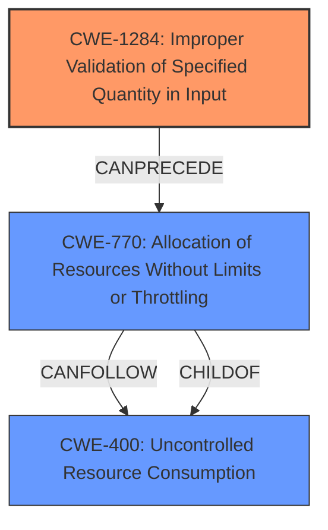

# Enhanced Analysis for CVE-2024-36128

# Summary
| CWE ID | CWE Name | Confidence | CWE Abstraction Level | CWE Vulnerability Mapping Label | CWE-Vulnerability Mapping Notes |
|---|---|---|---|---|---|
| CWE-1284 | Improper Validation of Specified Quantity in Input | 0.9 | Base | Allowed | Primary CWE - The root cause is the lack of proper validation of the length parameter, leading to a denial-of-service vulnerability. |
| CWE-770 | Allocation of Resources Without Limits or Throttling | 0.7 | Base | Allowed | Secondary CWE - The lack of input validation leads to a **memory issue** that can be related to resource exhaustion. |
| CWE-400 | Uncontrolled Resource Consumption | 0.6 | Class | Allowed | Secondary CWE - Resource consumption is the result of the memory allocation issue. |

## Evidence and Confidence

*   **Confidence Score:** 0.8
*   **Evidence Strength:** HIGH

## Relationship Analysis
The primary CWE is CWE-1284 (**Improper Validation of Specified Quantity in Input**), which directly addresses the **lack of validation** on the length parameter. CWE-770 (**Allocation of Resources Without Limits or Throttling**) is a consequence of the missing input validation, leading to resource exhaustion. CWE-400 (**Uncontrolled Resource Consumption**) is the resulting impact of the resource exhaustion.
The abstraction levels influenced the selection, preferring the Base level CWE-1284 as it represents the **root cause** more accurately than its Class parent.



## Vulnerability Chain
The chain of events is as follows:
1.  **Root Cause:** CWE-1284 (**Improper Validation of Specified Quantity in Input**) - The application fails to validate that the 'length' parameter is a valid numeric value.
2.  CWE-770 (**Allocation of Resources Without Limits or Throttling**) - The invalid input results in excessive memory allocation or other resource consumption due to the **memory issue**.
3.  **Impact:** CWE-400 (**Uncontrolled Resource Consumption**) - This leads to a denial-of-service condition as the system's resources are exhausted.

## Summary of Analysis
The initial analysis identified CWE-1284 as the primary **root cause** due to the **lack of input validation**. The provided evidence from the CVE Reference Links Content Summary clearly states: "**Lack of input validation:** The random string generation utility did not properly validate the input provided for the length parameter. It failed to handle non-numeric input, leading to a broken state." This aligns directly with the description of CWE-1284. The subsequent **memory issue** and denial-of-service condition are consequences of this initial flaw, leading to the selection of CWE-770 and CWE-400 as secondary CWEs.

The graph relationships helped in understanding the flow of the vulnerability, starting from the **lack of validation** (CWE-1284) leading to resource allocation issues (CWE-770) and finally resulting in resource consumption (CWE-400). The selection of CWEs is based on the optimal level of specificity, with CWE-1284 being a Base level CWE that accurately represents the **root cause**.

**CWEs Considered But Not Used:**

*   **CWE-330 (Use of Insufficiently Random Values)**, **CWE-334 (Small Space of Random Values)**, **CWE-335 (Incorrect Usage of Seeds in Pseudo-Random Number Generator (PRNG))**, **CWE-337 (Predictable Seed in Pseudo-Random Number Generator (PRNG))**, and **CWE-1204 (Generation of Weak Initialization Vector (IV))**: These CWEs relate to issues with random number generation, but the core issue here isn't the randomness of the generated string but the improper handling of the length parameter during the generation process. Thus, they are not directly applicable.
*   **CWE-789 (Memory Allocation with Excessive Size Value)**: While the vulnerability leads to a **memory issue**, the primary problem is not the excessive size value itself but the **lack of validation** that causes the issue. Therefore, CWE-1284 is a more appropriate choice.
*   **CWE-804 (Guessable CAPTCHA)**: This is specific to CAPTCHA implementations and not relevant to the described vulnerability.
*   **CWE-502 (Deserialization of Untrusted Data)**: This CWE is not relevant as the vulnerability doesn't involve deserialization of untrusted data.
*   **CWE-201 (Insertion of Sensitive Information Into Sent Data)**: This CWE is not relevant as the vulnerability doesn't involve sending any Sensitive Information
*   **CWE-226 (Sensitive Information in Resource Not Removed Before Reuse)**: This CWE is not relevant as the vulnerability doesn't involve any sensitive information
*   **CWE-1391 (Use of Weak Credentials)**: This CWE is not relevant as the vulnerability doesn't involve weak credentials.
*   **CWE-303 (Incorrect Implementation of Authentication Algorithm)**: This CWE is not relevant as the vulnerability doesn't involve issues with authentication algorithms.
*   **CWE-346 (Origin Validation Error)**: This CWE is not relevant as the vulnerability doesn't involve origin validation.
*   **CWE-204 (Observable Response Discrepancy)**: This CWE is not relevant as the vulnerability doesn't involve any response discrepancy.
*   **CWE-617 (Reachable Assertion)**: This CWE is not relevant as the vulnerability doesn't involve any assertions.
*    **CWE-212 (Improper Removal of Sensitive Information Before Storage or Transfer)**: This CWE is not relevant as the vulnerability doesn't involve sending any Sensitive Information
*   **CWE-1286 (Improper Validation of Syntactic Correctness of Input)**: This CWE is not used because **CWE-1284** is a better fit.
*   **CWE-755 (Improper Handling of Exceptional Conditions)**: This is too generic and doesn't specifically describe the input validation issue.
*   **CWE-863 (Incorrect Authorization)**: This is not relevant as the vulnerability doesn't involve authorization issues.


## CWE Relationship Analysis

Current CWEs represent these abstraction levels: .


### Vulnerability Chain Analysis

**Chain starting from CWE-400:**
- 400 (Uncontrolled Resource Consumption) - ROOT


**Chain starting from CWE-226:**
- 226 (Sensitive Information in Resource Not Removed Before Reuse) - ROOT


### CWE Relationship Diagram

```mermaid
graph TD
    classDef primary fill:#f96,stroke:#333,stroke-width:2px
    classDef secondary fill:#69f,stroke:#333
    classDef tertiary fill:#9e9,stroke:#333
```