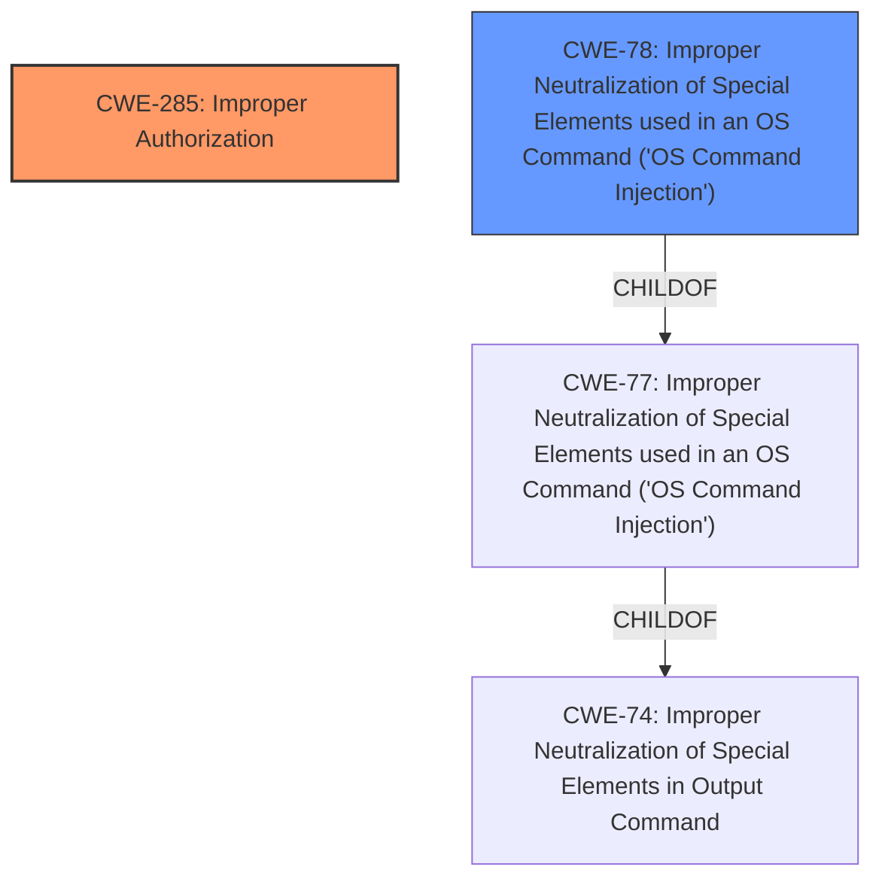

# Enhanced Analysis for CVE-2024-36130

# Summary
| CWE ID    | CWE Name                                                                               | Confidence | CWE Abstraction Level | CWE Vulnerability Mapping Label | CWE-Vulnerability Mapping Notes |
| :-------- | :------------------------------------------------------------------------------------- | :--------- | :---------------------- | :------------------------------ | :-------------------------------- |
| CWE-285   | Improper Authorization                                                                 | 0.85       | Class                   | Primary CWE                     | Discouraged                       |
| CWE-78    | Improper Neutralization of Special Elements used in an OS Command ('OS Command Injection') | 0.70       | Base                    | Secondary Candidate             | Allowed                           |

## Evidence and Confidence

*   **Confidence Score:** 0.75
*   **Evidence Strength:** MEDIUM

## Relationship Analysis
The primary relationship influencing the CWE selection is the hierarchical structure where CWE-285 (Improper Authorization) is a class-level CWE. The vulnerability description points to an **insufficient authorization** issue. Although CWE-285 is discouraged, there isn't sufficient information to pinpoint a more specific base-level CWE. CWE-78 (Improper Neutralization of Special Elements used in an OS Command) is included because the impact of the vulnerability is that an attacker can execute arbitrary commands on the underlying operating system, suggesting command injection.



## Vulnerability Chain
The vulnerability chain starts with **insufficient authorization** (CWE-285). Because of this weakness, an attacker can then execute arbitrary commands on the underlying operating system (CWE-78).
  - Root Cause: **Insufficient Authorization** (CWE-285)
  - Impact: OS Command Injection (CWE-78)

## Summary of Analysis
The initial assessment focused on the **insufficient authorization** aspect of the vulnerability, leading to the selection of CWE-285 as the primary weakness. The ability to "execute arbitrary commands on the underlying operating system" was then considered, suggesting a potential command injection vulnerability. This led to the inclusion of CWE-78 as a secondary weakness.

The selection of CWE-285 is based on the explicit mention of "**insufficient authorization**" in the vulnerability description key phrases. The documentation indicates that CWE-285 is discouraged as a class-level CWE, and more specific CWEs are preferred. However, the provided information lacks the granularity to identify a more specific root cause. The description of "execute arbitrary commands" suggests the presence of CWE-78.

Relevant CWE Information:
- Vulnerability Description Key Phrases:
  - **rootcause:** **insufficient authorization**
  - **impact:** execute arbitrary commands on the underlying operating system

I am overriding the discouraged usage of CWE-285 because of the direct statement of **insufficient authorization**, and the lack of information to select a more specific CWE.


## CWE Relationship Analysis

Current CWEs represent these abstraction levels: .


### Vulnerability Chain Analysis

**Chain starting from CWE-74:**
- 74 (Improper Neutralization of Special Elements in Output Used by a Downstream Component ('Injection')) - ROOT


**Chain starting from CWE-77:**
- 77 (Improper Neutralization of Special Elements used in a Command ('Command Injection')) - ROOT


### CWE Relationship Diagram

```mermaid
graph TD
    classDef primary fill:#f96,stroke:#333,stroke-width:2px
    classDef secondary fill:#69f,stroke:#333
    classDef tertiary fill:#9e9,stroke:#333
```