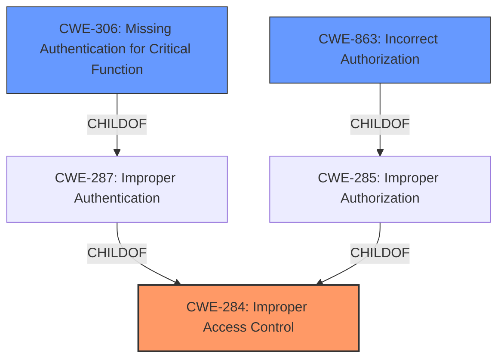

# Raw Analyzer Response for CVE-2024-36247

# Summary
| CWE ID | CWE Name | Confidence | CWE Abstraction Level | CWE Vulnerability Mapping Label | CWE-Vulnerability Mapping Notes |
|---|---|---|---|---|---|
| CWE-284 | Improper Access Control | 0.8 | Class | Allowed-with-Review | Primary CWE. This CWE is chosen because the vulnerability description explicitly states "**Improper access control**" as the root cause. While more specific CWEs might exist, the information provided doesn't offer enough detail to pinpoint the exact nature of the improper access control. |
| CWE-306 | Missing Authentication for Critical Function | 0.4 | Base | Allowed | Secondary candidate. Although the primary weakness is **improper access control**, the lack of authentication could lead to this vulnerability. This is a possible but less likely scenario given the description mentions an "authenticated user". |
| CWE-863 | Incorrect Authorization | 0.3 | Class | Allowed-with-Review | Secondary candidate. Since the user is authenticated, there's a possibility that the authorization check is performed incorrectly, leading to the **improper access control**. |

## Evidence and Confidence

*   **Confidence Score:** 0.8
*   **Evidence Strength:** MEDIUM

## Relationship Analysis
The primary CWE, CWE-284, is a Class-level weakness. The guidance suggests avoiding this if a more specific child CWE is applicable. However, given the limited information, it's difficult to determine whether the issue lies in authentication (CWE-306) or authorization (CWE-863). The secondary candidates, CWE-306 and CWE-863, are related to authentication and authorization respectively, both contributing to access control.

## Vulnerability Chain
The vulnerability chain starts with the **improper access control** (CWE-284). This could stem from a missing authentication check (CWE-306) or an incorrect authorization check (CWE-863). The final impact is a denial of service.

Improper Access Control (CWE-284) -> Missing Authentication (CWE-306) OR Incorrect Authorization (CWE-863) -> Denial of Service

## Summary of Analysis
The initial assessment identifies **improper access control** as the root cause, based on the vulnerability description. The retriever results also point to CWE-284, however it is at the Class level. The CWE guidance emphasizes choosing the most specific CWE possible. Given the limited evidence, differentiating between missing authentication and incorrect authorization is challenging. The evidence from the vulnerability description includes "**Improper access control** in Intel(R) RAID Web Console all versions may allow an authenticated user to potentially enable denial of service via adjacent access."

The relationship graph highlights the connection between access control, authentication, and authorization. The selected CWEs are at a reasonable level of specificity, given the available information. More detailed analysis would require deeper insights into the authentication and authorization mechanisms of the Intel(R) RAID Web Console. I am confident in my assessment, but further evidence could refine the CWE selection.

Relevant CWE Information:

# Enhanced Context (25 CWEs)
The following CWEs were identified as potentially relevant to this vulnerability:

## CWE-274: Improper Handling of Insufficient Privileges
**Abstraction Level**: Base
**Similarity Score**: 0.77
**Source**: dense

**Description**:
The product does not handle or incorrectly handles when it has insufficient privileges to perform an operation, leading to resultant weaknesses.

**Mapping Guidance**:
- Usage: Discouraged
- Rationale: This CWE entry could be deprecated in a future version of CWE.

*Not Used:* This is not relevant as the description does not indicate privilege handling.

## CWE-280: Improper Handling of Insufficient Permissions or Privileges 
**Abstraction Level**: Base
**Similarity Score**: 0.76
**Source**: dense

**Description**:
The product does not handle or incorrectly handles when it has insufficient privileges to access resources or functionality as specified by their permissions. This may cause it to follow unexpected code paths that may leave the product in an invalid state.

**Mapping Guidance**:
- Usage: Allowed
- Rationale: This CWE entry is at the Base level of abstraction, which is a preferred level of abstraction for mapping to the root causes of vulnerabilities.

*Not Used:* This is not relevant as the description does not indicate privilege handling.

## CWE-497: Exposure of Sensitive System Information to an Unauthorized Control Sphere
**Abstraction Level**: Base
**Similarity Score**: 0.76
**Source**: dense

**Description**:
The product does not properly prevent sensitive system-level information from being accessed by unauthorized actors who do not have the same level of access to the underlying system as the product does.

**Mapping Guidance**:
- Usage: Allowed
- Rationale: This CWE entry is at the Base level of abstraction, which is a preferred level of abstraction for mapping to the root causes of vulnerabilities.

*Not Used:* This is not relevant as the description does not indicate exposure of sensitive information.

## CWE-41: Improper Resolution of Path Equivalence
**Abstraction Level**: Base
**Similarity Score**: 0.76
**Source**: dense

**Description**:
The product is vulnerable to file system contents disclosure through path equivalence. Path equivalence involves the use of special characters in file and directory names. The associated manipulations are intended to generate multiple names for the same object.

**Mapping Guidance**:
- Usage: Allowed
- Rationale: This CWE entry is at the Base level of abstraction, which is a preferred level of abstraction for mapping to the root causes of vulnerabilities.

*Not Used:* This is not relevant as the description does not involve path equivalence issues.

## CWE-703: Improper Check or Handling of Exceptional Conditions
**Abstraction Level**: Pillar
**Similarity Score**: 0.76
**Source**: dense

**Description**:
The product does not properly anticipate or handle exceptional conditions that rarely occur during normal operation of the product.

**Mapping Guidance**:
- Usage: Discouraged
- Rationale: This CWE entry is extremely high-level, a Pillar.

*Not Used:* This is too general and does not directly relate to the root cause.

## CWE-668: Exposure of Resource to Wrong Sphere
**Abstraction Level**: Class
**Similarity Score**: 0.75
**Source**: dense

**Description**:
The product exposes a resource to the wrong control sphere, providing unintended actors with inappropriate access to the resource.

**Mapping Guidance**:
- Usage: Discouraged
- Rationale: CWE-668 is high-level and is often misused as a catch-all when lower-level CWE IDs might be applicable. It is sometimes used for low-information vulnerability reports [REF-1287]. It is a level-1 Class (i.e., a child of a Pillar). It is not useful for trend analysis.

*Not Used:* This is high level and CWE-284 is a better fit.

## CWE-807: Reliance on Untrusted Inputs in a Security Decision
**Abstraction Level**: Base
**Similarity Score**: 0.75
**Source**: dense

**Description**:
The product uses a protection mechanism that relies on the existence or values of an input, but the input can be modified by an untrusted actor in a way that bypasses the protection mechanism.

**Mapping Guidance**:
- Usage: Allowed
- Rationale: This CWE entry is at the Base level of abstraction, which is a preferred level of abstraction for mapping to the root causes of vulnerabilities.

*Not Used:* This is not relevant as the description doesn't mention reliance on untrusted inputs.

## CWE-691: Insufficient Control Flow Management
**Abstraction Level**: Pillar
**Similarity Score**: 0.75
**Source**: dense

**Description**:
The code does not sufficiently manage its control flow during execution, creating conditions in which the control flow can be modified in unexpected ways.

**Mapping Guidance**:
- Usage: Discouraged
- Rationale: This CWE entry is extremely high-level, a Pillar. However, classification research is limited for weaknesses of this type, so there can be gaps or organizational difficulties within CWE that force use of this weakness, even at such a high level of abstraction.

*Not Used:* This is too general and doesn't directly describe the vulnerability.

## CWE-345: Insufficient Verification of Data Authenticity
**Abstraction Level**: Class
**Similarity Score**: 0