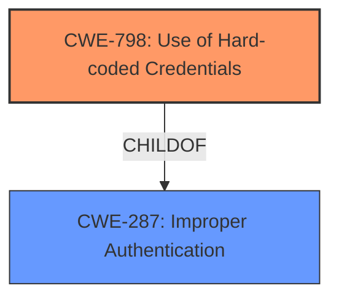

# Raw Analyzer Response for CVE-2024-36264

# Summary

| CWE ID  | CWE Name                                                                  | Confidence | CWE Abstraction Level | CWE Vulnerability Mapping Label | CWE-Vulnerability Mapping Notes |
| :-------- | :------------------------------------------------------------------------ | :--------- | :-------------------- | :------------------------------ | :------------------------------ |
| CWE-798   | Use of Hard-coded Credentials                                             | 1          | Base                  | Primary                         | Allowed                       |
| CWE-287   | Improper Authentication                                                    | 0.7        | Class                 | Secondary                       | Discouraged                    |

## Evidence and Confidence

*   **Confidence Score:** 0.9
*   **Evidence Strength:** HIGH

## Relationship Analysis

The primary CWE identified is CWE-798, which is a child of CWE-287. CWE-798 directly addresses the use of hard-coded credentials, while CWE-287 represents a broader class of improper authentication issues. The relationship shows that the specific flaw (hard-coded credentials) leads to a more general authentication problem. Since CWE-798 is a more specific Base level CWE, it is preferred.

## Vulnerability Chain

The vulnerability chain starts with the **use of hard-coded credentials** (CWE-798) as the root cause. This **leads to improper authentication** (CWE-287), as the system relies on a secret that is not unique or securely managed. The potential impact is unauthorized access to systems relying on this component for authentication.

## Summary of Analysis

The initial assessment identified the **root cause** as an **"Improper Authentication vulnerability"** related to the use of a hard-coded default secret in Apache Submarine Commons Utils. This aligns directly with CWE-798 (Use of Hard-coded Credentials), which is a base-level CWE and provides a precise description of the weakness. The CVE description states that if the user doesn't explicitly set `submarine.auth.default.secret`, a default value will be used. This confirms the use of hard-coded credentials.

CWE-287 (Improper Authentication) was considered as a broader classification but was deemed less specific than CWE-798. While the vulnerability does result in improper authentication, the root cause is the hard-coded credential itself. Therefore, CWE-798 is the more appropriate primary CWE. The retriever results also identified CWE-287, but it is a discouraged CWE as a Class level CWE.

The evidence from the CVE description and the retriever results strongly supports the selection of CWE-798 as the primary CWE, providing a clear and specific characterization of the vulnerability.

Relevant CWE Information:

**CWE-798: Use of Hard-coded Credentials**

*   **Abstraction Level**: Base
*   **Description**: The product contains hard-coded credentials, such as a password or cryptographic key, which it uses for its own inbound authentication, outbound authentication, or encryption.
*   **Mapping Guidance**: Usage: Allowed

**CWE-287: Improper Authentication**

*   **Abstraction Level**: Class
*   **Description**: When an actor claims to have a given identity, the product does not prove or insufficiently proves that the claim is correct.
*   **Mapping Guidance**: Usage: Discouraged - This CWE entry might be misused when lower-level CWE entries are likely to be applicable.