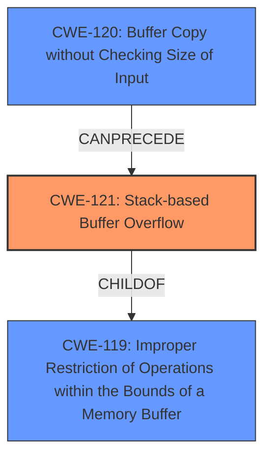

# Analysis Report for CVE-2024-36290

# Vulnerability Analysis Report: CVE-2024-36290

## Description

A buffer overflow vulnerability exists in the login.cgi Goto_chidx() functionality of Wavlink AC3000 M33A8.V5030.210505. A specially crafted HTTP request can lead to **stack-based buffer overflow**. An attacker can make an unauthenticated HTTP request to trigger this vulnerability.

## Vulnerability Description Key Phrases

- **Weakness:** stack-based buffer overflow
- **Vector:** specially crafted HTTP request
- **Product:** Wavlink AC3000 M33A8
- **Version:** V5030.210505
- **Component:** login.cgi Goto_chidx() functionality

## Analysis (with Relationship Data)

# Summary
| CWE ID  | CWE Name                                                                             | Confidence | CWE Abstraction Level | CWE Vulnerability Mapping Label | CWE-Vulnerability Mapping Notes |
| :-------- | :----------------------------------------------------------------------------------- | :---------- | :---------------------- | :------------------------------ | :------------------------------ |
| CWE-121 | Stack-based Buffer Overflow                                                        | 1.0         | Variant                 | Primary                         | Allowed                         |
| CWE-120 | Buffer Copy without Checking Size of Input ('Classic Buffer Overflow')              | 0.7         | Base                    | Secondary                       | Allowed-with-Review             |
| CWE-119 | Improper Restriction of Operations within the Bounds of a Memory Buffer              | 0.5         | Class                   | Secondary                       | Discouraged                     |

## Evidence and Confidence

*   **Confidence Score:** 0.8
*   **Evidence Strength:** HIGH

## Relationship Analysis
The primary CWE is CWE-121, which is a variant of CWE-119. CWE-120 can precede CWE-787, which is a type of out-of-bounds write that can occur due to a buffer overflow. Choosing CWE-121 provides a more specific classification than its parent CWE-119.



## Vulnerability Chain
The vulnerability chain starts with an **improper buffer copy** (CWE-120) without checking the size of the input. This leads to a **stack-based buffer overflow** (CWE-121), where data is written beyond the allocated buffer on the stack. This, in turn, leads to **improper restriction of operations within the bounds of a memory buffer** (CWE-119).

## Summary of Analysis
The initial assessment focused on the **stack-based buffer overflow** as the primary issue. The evidence clearly states that a specially crafted HTTP request can lead to a **stack-based buffer overflow** in the login.cgi Goto_chidx() functionality. The CVE Reference Links Content Summary confirms this by stating that the vulnerability occurs because the `wlanUrl` parameter is read without length checking and copied to the stack using `sprintf`.

The graph relationships influenced the final selection by highlighting the hierarchical connection between CWE-121 and CWE-119. While CWE-119 is a broader category, CWE-121 provides a more specific and accurate representation of the vulnerability. The choice of CWE-121 is at the optimal level of specificity because it accurately describes the location of the buffer overflow (stack) and the type of vulnerability (buffer overflow).

CWE-120 was considered since the vulnerability description indicates that data is copied to the stack without checking the size. This can lead to a buffer overflow. However, CWE-121 is more specific, since it identifies the location as the stack.

CWE-119 was also considered as a more general case of memory corruption, but the stack-based nature of the overflow makes CWE-121 a better fit.

*   **CWE-121: Stack-based Buffer Overflow**
    *   **Technical Explanation:** The vulnerability occurs when a program writes data beyond the allocated buffer on the stack. In this case, the `wlanUrl` parameter is copied to the stack using `sprintf` without proper length validation, leading to a buffer overflow.
    *   **Security Implications:** This allows an attacker to overwrite adjacent memory regions on the stack, potentially hijacking control flow and executing arbitrary code.
    *   **Relationship Analysis:** CWE-121 is a variant of CWE-119 (Improper Restriction of Operations within the Bounds of a Memory Buffer).
    *   **Mapping Guidance Influence:** The vulnerability description explicitly mentions a **stack-based buffer overflow**, making CWE-121 the most appropriate choice.
    *   **Confidence:** 1.0

*   **CWE-120: Buffer Copy without Checking Size of Input ('Classic Buffer Overflow')**
    *   **Technical Explanation:** The `wlanUrl` parameter is copied to the stack using `sprintf` without proper length validation.
    *   **Security Implications:** This allows an attacker to overwrite adjacent memory regions on the stack, potentially hijacking control flow and executing arbitrary code.
    *   **Relationship Analysis:** CWE-120 is a base CWE and a parent of CWE-785. It can lead to CWE-456, CWE-416, CWE-231, and CWE-170.
    *   **Mapping Guidance Influence:** Usage is Allowed-with-Review.
    *   **Confidence:** 0.7

*   **CWE-119: Improper Restriction of Operations within the Bounds of a Memory Buffer**
    *   **Technical Explanation:** The vulnerability description describes a buffer overflow, which is a type of memory safety violation.
    *   **Security Implications:** This can lead to various security issues, including arbitrary code execution, denial of service, and information disclosure.
    *   **Relationship Analysis:** CWE-119 is a class-level CWE.
    *   **Mapping Guidance Influence:** Usage is Discouraged.
    *   **Confidence:** 0.5

CWEs considered but not used:

*   CWE-190, CWE-195, CWE-197, CWE-128, CWE-1284, CWE-131, CWE-805, CWE-130, CWE-1339: These CWEs relate to integer handling, buffer size calculation, and length parameter inconsistencies, but they are not as directly relevant as CWE-121 and CWE-120, which specifically address the stack-based buffer overflow and the lack of input size checking.


## CWE Relationship Analysis

Current CWEs represent these abstraction levels: .


### Vulnerability Chain Analysis

**Chain starting from CWE-121:**
- 121 (Stack-based Buffer Overflow) - ROOT


**Chain starting from CWE-416:**
- 416 (Use After Free) - ROOT


### CWE Relationship Diagram

```mermaid
graph TD
    classDef primary fill:#f96,stroke:#333,stroke-width:2px
    classDef secondary fill:#69f,stroke:#333
    classDef tertiary fill:#9e9,stroke:#333
```


*Report generated on 2025-07-13 08:55:25*
