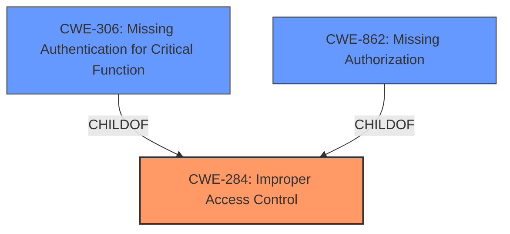

# Analysis Report for CVE-2024-36293

# Vulnerability Analysis Report: CVE-2024-36293

## Description

**Improper access control** in the EDECCSSA user leaf function for some Intel(R) Processors with Intel(R) SGX may allow an authenticated user to potentially enable denial of service via local access.

## Vulnerability Description Key Phrases

- **Rootcause:** Improper access control
- **Impact:** denial of service
- **Vector:** local access
- **Attacker:** authenticated user
- **Product:** Intel(R) Processors with Intel(R) SGX
- **Component:** EDECCSSA user leaf function

## Analysis (with Relationship Data)

# Summary
| CWE ID | CWE Name | Confidence | CWE Abstraction Level | CWE Vulnerability Mapping Label | CWE-Vulnerability Mapping Notes |
|---|---|---|---|---|---|
| CWE-284 | Improper Access Control | 0.8 | Pillar | Allowed | Primary CWE |
| CWE-306 | Missing Authentication for Critical Function | 0.5 | Base | Allowed | Secondary Candidate |
| CWE-862 | Missing Authorization | 0.5 | Base | Allowed | Secondary Candidate |

## Evidence and Confidence

*   **Confidence Score:** 0.8
*   **Evidence Strength:** HIGH

## Relationship Analysis
The primary relationship considered here is the hierarchical one, where CWE-284 is a high-level category, and CWE-306 and CWE-862 are more specific children relating to authentication and authorization respectively. The decision to select CWE-284 is influenced by the fact that the vulnerability description only mentions **improper access control**, without specifying whether the issue is related to authentication or authorization. If more information were available pinpointing the **root cause** to missing authentication or authorization, a more specific CWE would be chosen.



## Vulnerability Chain
The vulnerability chain starts with **improper access control**, which leads to a potential denial of service.

Improper Access Control -> Denial of Service

The **Primary CWE** is CWE-284 and identifies the issue that led to the vulnerability.

## Summary of Analysis
Initially, the vulnerability description indicates **improper access control**, which seems best represented by the high-level CWE-284. The provided information isn't specific enough to determine whether the **improper access control** stems from missing authentication (CWE-306) or missing authorization (CWE-862). The analysis relies heavily on the vulnerability description, which explicitly states **"Improper access control in the EDECCSSA user leaf function for some Intel(R) Processors with Intel(R) SGX may allow an authenticated user to potentially enable denial of service via local access."**

The use of CWE-284 is at a higher level (Pillar), but justifiable, pending more specific details. If the access control issue were known to be related to missing authentication, CWE-306 would be favored. If it related to authorization, CWE-862 would be better.

Based on the guidance, **"CWE-284: *Improper Access Control* – top-level category used when access control failure exists but root cause is unclear."**

The evidence supports this decision, but additional details about the **root cause** would allow for a more precise classification.

Other CWEs Considered:

*   CWE-306 and CWE-862: Were considered as more specific alternatives if the vulnerability description had more details on whether authentication or authorization was the issue.
*   CWE-285, CWE-863, CWE-639, CWE-287: These CWEs are related to authorization and authentication bypasses. However, the provided description doesn't have enough information to confirm that the vulnerability is due to an authorization or authentication bypass.
*   CWE-703, CWE-497, CWE-691, CWE-668, CWE-1220, CWE-41, CWE-274, CWE-754, CWE-280, CWE-807: These are related to handling of exceptions, exposure of sensitive information, and insufficient control flow management. However, these are not directly related to the **improper access control** issue described in the vulnerability.
*   CWE-1257, CWE-1260, CWE-1191, CWE-942, CWE-1256, CWE-248, CWE-22, CWE-617: These are less relevant based on the description.


## CWE Relationship Analysis

Current CWEs represent these abstraction levels: .


### Vulnerability Chain Analysis

**Chain starting from CWE-274:**
- 274 (Improper Handling of Insufficient Privileges) - ROOT


**Chain starting from CWE-862:**
- 862 (Missing Authorization) - ROOT


### CWE Relationship Diagram

```mermaid
graph TD
    classDef primary fill:#f96,stroke:#333,stroke-width:2px
    classDef secondary fill:#69f,stroke:#333
    classDef tertiary fill:#9e9,stroke:#333
```


*Report generated on 2025-07-13 08:56:08*
