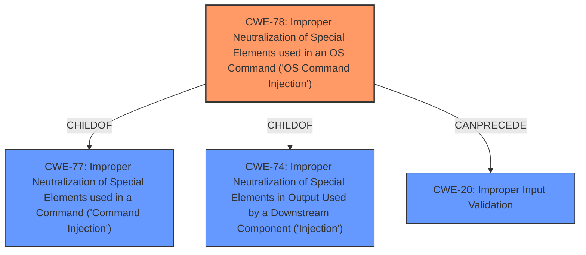

# Analysis for CVE-2024-36360

# Summary
| CWE ID | CWE Name | Confidence | CWE Abstraction Level | CWE Vulnerability Mapping Label | CWE-Vulnerability Mapping Notes |
|---|---|---|---|---|---|
| CWE-78 | Improper Neutralization of Special Elements used in an OS Command ('OS Command Injection') | 1.0 | Base | Allowed | Primary CWE |
| CWE-20 | Improper Input Validation | 0.5 | Class | Discouraged | Secondary Candidate |

## Evidence and Confidence

*   **Confidence Score:** 0.9
*   **Evidence Strength:** HIGH

## Relationship Analysis
The primary relationship that influenced the selection of CWE-78 is its direct relevance to the vulnerability description. The description explicitly mentions "OS command injection," and CWE-78 is specifically designed to address this type of weakness. CWE-78 is a Base level CWE, which is preferred for root cause analysis, and it's a child of CWE-77 (Improper Neutralization of Special Elements used in a Command) and CWE-74 (Improper Neutralization of Special Elements in Output Used by a Downstream Component), indicating a more specific form of command injection. CWE-20 was considered because improper input validation often leads to injection vulnerabilities, but CWE-78 is more specific.

## Vulnerability Chain
The vulnerability chain starts with **Improper Input Validation (CWE-20)** which leads to **OS Command Injection (CWE-78)**, and finally results in **Arbitrary OS Command Execution**, which is the impact. CWE-78 is the root cause of the vulnerability, while CWE-20 could be a contributing factor.

## Summary of Analysis
The initial analysis strongly points towards CWE-78 due to the explicit mention of **OS command injection** in the vulnerability description and the CVE Reference Links Content Summary. The **weakness** is a failure to properly neutralize special elements, allowing for the injection of arbitrary OS commands.

The retriever results also list CWE-78 as the top candidate with a score of 1.0. The retriever results confirm that CWE-78 is the most appropriate CWE.

The evidence from the "CVE Reference Links Content Summary" confirms this: "The vulnerability is due to an OS command injection flaw...This occurs when the application processes HTTP requests, allowing an attacker to inject and execute arbitrary OS commands."

CWE-78 is selected because it is the most specific and accurate representation of the vulnerability's root cause. While CWE-20 (Improper Input Validation) could be a contributing factor, CWE-78 directly addresses the **OS command injection** vulnerability.

Relevant CWE Information:

# Enhanced Context (25 CWEs)
The following CWEs were identified as potentially relevant to this vulnerability:

## CWE-74: Improper Neutralization of Special Elements in Output Used by a Downstream Component ('Injection')
**Abstraction Level**: Class
**Similarity Score**: 0.78
**Source**: dense

**Description**:
The product constructs all or part of a command, data structure, or record using externally-influenced input from an upstream component, but it does not neutralize or incorrectly neutralizes special elements that could modify how it is parsed or interpreted when it is sent to a downstream component.

**Mapping Guidance**:
- Usage: Discouraged
- Rationale: CWE-74 is high-level and often misused when lower-level weaknesses are more appropriate.

## CWE-78: Improper Neutralization of Special Elements used in an OS Command ('OS Command Injection')
**Abstraction Level**: base
**Similarity Score**: 4.31
**Source**: graph

**Description**:
CWE-78: Improper Neutralization of Special Elements used in an OS Command ('OS Command Injection')

**Mapping Guidance**:
- Usage: Allowed
- Rationale: This CWE entry is at the Base level of abstraction, which is a preferred level of abstraction for mapping to the root causes of vulnerabilities.

## CWE-20: Improper Input Validation
**Abstraction Level**: class
**Similarity Score**: 2.55
**Source**: graph

**Description**:
CWE-20: Improper Input Validation

**Mapping Guidance**:
- Usage: Discouraged
- Rationale: CWE-20 is commonly misused in low-information vulnerability reports when lower-level CWEs could be used instead, or when more details about the vulnerability are available [REF-1287]. It is not useful for trend analysis. It is also a level-1 Class (i.e., a child of a Pillar).

**CWE-77**: Improper Neutralization of Special Elements used in a Command ('Command Injection') was considered but not used because CWE-78 is a more specific type of command injection.
**CWE-74**: Improper Neutralization of Special Elements in Output Used by a Downstream Component ('Injection') was considered but not used because it is more general and not specific to OS commands.
**CWE-20**: Improper Input Validation was considered as a secondary weakness because it often precedes injection vulnerabilities. The application does not properly sanitize or validate input received through HTTP requests, which allows an attacker to inject malicious OS commands. However, this is a general weakness and CWE-78 is more specific.