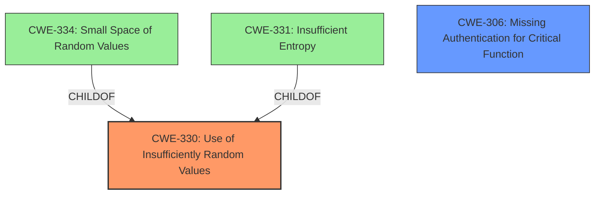

# Analysis for CVE-2024-36389

# Summary

| CWE ID | CWE Name | Confidence | CWE Abstraction Level | CWE Vulnerability Mapping Label | CWE-Vulnerability Mapping Notes |
|---|---|---|---|---|---|
| CWE-330 | Use of Insufficiently Random Values | 0.9 | Class | Primary CWE | Discouraged |
| CWE-306 | Missing Authentication for Critical Function | 0.6 | Base | Secondary Candidate | Allowed |

## Evidence and Confidence

*   **Confidence Score:** 0.75
*   **Evidence Strength:** MEDIUM

## Relationship Analysis
The primary CWE selected is CWE-330, which is a Class-level CWE. While it's generally preferred to choose a Base or Variant level CWE, the provided information is not specific enough to determine which child of CWE-330 would be the best fit. The vulnerability description explicitly mentions "**use of insufficiently random values**," making CWE-330 a direct match. The secondary CWE selected is CWE-306, because **use of insufficiently random values** may allow Authentication Bypass.

## Vulnerability Chain
The vulnerability chain starts with the **use of insufficiently random values** (CWE-330), which then leads to the impact of authentication bypass.

## Summary of Analysis
The analysis is based on the vulnerability description and the retriever results. The description clearly states "**use of insufficiently random values**," which aligns perfectly with CWE-330. The retriever results also list CWE-330 as the top candidate. However, CWE-330 is a Class-level CWE, and the guidance suggests preferring Base or Variant levels. Since there is not enough information in the vulnerability description to determine the specific type of insufficient randomness, I am keeping it as CWE-330.

The "Authentication vs Authorization vs Access Control Guidance" helped to identify CWE-306 "Missing Authentication for Critical Function" as a secondary weakness which the **use of insufficiently random values** may allow to occur leading to Authentication Bypass.

Relevant CWE Information:

# Enhanced Context (25 CWEs)
The following CWEs were identified as potentially relevant to this vulnerability:

## CWE-330: Use of Insufficiently Random Values
**Abstraction Level**: Class
**Similarity Score**: 0.77
**Source**: dense

**Description**:
The product uses insufficiently random numbers or values in a security context that depends on unpredictable numbers.

**Mapping Guidance**:
- Usage: Discouraged
- Rationale: This CWE entry is a level-1 Class (i.e., a child of a Pillar). It might have lower-level children that would be more appropriate
## CWE-330: Use of Insufficiently Random Values
**Abstraction Level**: Class
**Similarity Score**: 1048.95
**Source**: sparse

**Description**:
The product uses insufficiently random numbers or values in a security context that depends on unpredictable numbers.

**Mapping Guidance**:
- Usage: Discouraged
- Rationale: This CWE entry is a level-1 Class (i.e., a child of a Pillar). It might have lower-level children that would be more appropriate

## CWE-306: Missing Authentication for Critical Function
**Abstraction Level**: base
**Similarity Score**: 2.12
**Source**: graph

**Description**:
CWE-306: Missing Authentication for Critical Function

**Mapping Guidance**:
- Usage: Allowed
- Rationale: This CWE entry is at the Base level of abstraction, which is a preferred level of abstraction for mapping to the root causes of vulnerabilities.