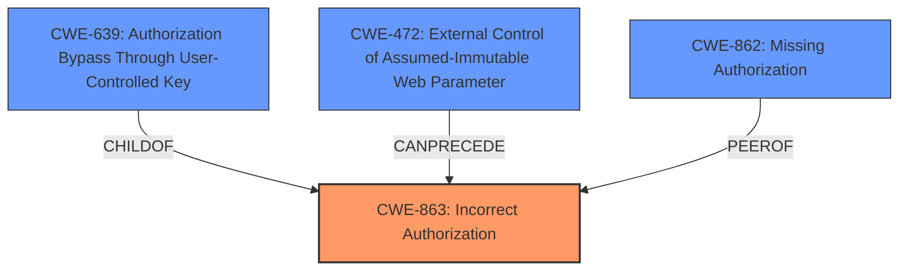

# Analysis for CVE-2024-36399

# Summary
| CWE ID | CWE Name | Confidence | CWE Abstraction Level | CWE Vulnerability Mapping Label | CWE-Vulnerability Mapping Notes |
|---|---|---|---|---|---|
| CWE-863 | Incorrect Authorization | 0.9 | Class | Allowed-with-Review | Primary CWE. The authorization check is present but flawed. |
| CWE-639 | Authorization Bypass Through User-Controlled Key | 0.7 | Base | Allowed | Secondary CWE. An attacker is able to modify the key value identifying the data. |
| CWE-472 | External Control of Assumed-Immutable Web Parameter | 0.6 | Base | Allowed | Secondary CWE. The application does not sufficiently verify inputs that are assumed to be immutable but are actually externally controllable, such as the `project_id` in the POST body. |
| CWE-862 | Missing Authorization | 0.5 | Class | Allowed-with-Review | The authorization check based on the POST BODY parameter project_id is missing. |

## Evidence and Confidence

*   **Confidence Score:** 0.8
*   **Evidence Strength:** HIGH

## Relationship Analysis
The primary weakness is **Incorrect Authorization (CWE-863)**, because the application attempts to perform authorization but does it incorrectly. The vulnerability also exhibits characteristics of **Authorization Bypass Through User-Controlled Key (CWE-639)** because the attacker modifies the `project_id` parameter in the POST request body to bypass authorization. **External Control of Assumed-Immutable Web Parameter (CWE-472)** is also applicable because the `project_id` is assumed to be immutable but can be controlled by the user. The **Missing Authorization (CWE-862)** is also applicable because the application does not perform an authorization check based on the POST BODY parameter `project_id`.

## Vulnerability Chain
The vulnerability chain starts with the **incorrect or missing authorization** (CWE-863, CWE-862) in the `addUser()` function, which leads to the **authorization bypass through user-controlled key** (CWE-639) and the **external control of assumed-immutable web parameter** (CWE-472). The final impact is the ability to **take over any other project**.

## Summary of Analysis
The analysis is primarily based on the provided evidence, which includes the vulnerability description and the CVE reference links content summary. The vulnerability lies in the `addUser()` function of the `ProjectPermissionController.php` file, where the application **only checks the user's permission based on the `project_id` in the URL parameters** but **fails to re-verify the user's permission based on the `project_id` provided in the POST request body**. This allows an attacker to manipulate the project ID in the request body to gain access to projects they are not authorized to manage.

The graph relationships influenced the final selection by highlighting the connections between the different CWEs. **CWE-863** is the primary weakness because the authorization check is present but flawed. **CWE-639** and **CWE-472** are secondary weaknesses because they contribute to the authorization bypass. **CWE-862** also applies because the authorization check based on the POST BODY parameter project_id is missing.

The selected CWEs are at the optimal level of specificity. **CWE-863** is a Class-level CWE, but it is the most appropriate choice because it accurately reflects the nature of the vulnerability. **CWE-639** and **CWE-472** are Base-level CWEs, which provide more specific details about the authorization bypass.

The **CWE-285 Improper Authorization** was considered, but it was deemed less appropriate than **CWE-863 Incorrect Authorization**. While both CWEs deal with authorization issues, **CWE-863** is more specific in that it highlights the fact that the authorization check is present but flawed. **CWE-285** is more general and could apply to cases where there is no authorization check at all.

**CWE-306: Missing Authentication for Critical Function** was considered, but authentication is not mentioned in the provided text.

Relevant CWE Information:
* CWE-863: Incorrect Authorization
* CWE-285: Improper Authorization
* CWE-862: Missing Authorization
* CWE-201: Insertion of Sensitive Information Into Sent Data
* CWE-79: Improper Neutralization of Input During Web Page Generation ('Cross-site Scripting')
* CWE-639: Authorization Bypass Through User-Controlled Key
* CWE-306: Missing Authentication for Critical Function
* CWE-425: Direct Request ('Forced Browsing')
* CWE-286: Incorrect User Management
* CWE-494: Download of Code Without Integrity Check