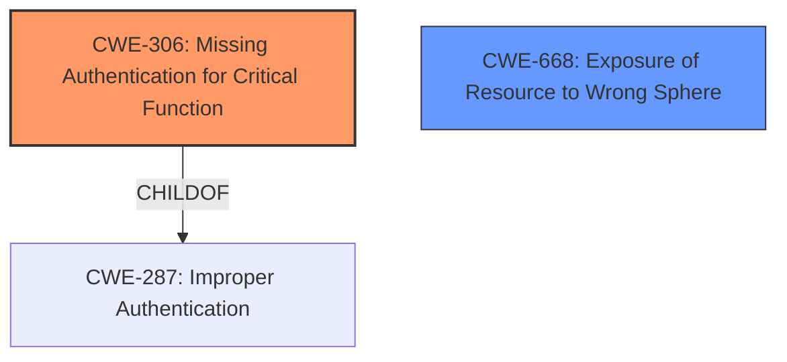

# Analysis Report for CVE-2024-36402

# Vulnerability Analysis Report: CVE-2024-36402

## Description

Matrix Media Repo (MMR) is a highly configurable multi-homeserver media repository for Matrix. MMR before version 1.3.5 allows, by design, unauthenticated remote participants to trigger a download and caching of remote media from a remote homeserver to the local media repository. Such content then also becomes available for download from the local homeserver in an unauthenticated way. The implication is that unauthenticated remote adversaries can use this functionality to plant problematic content into the media repository. MMR 1.3.5 introduces a partial mitigation in the form of new endpoints which require authentication for media downloads. The unauthenticated endpoints will be frozen in a future release, closing the attack vector. Though extremely limited, server operators can use more strict rate limits based on IP address as a partial workaround.

## Vulnerability Description Key Phrases

- **Weakness:** allow download and caching of remote media from remote homeserver to local media repository
- **Product:** Matrix Media Repo
- **Impact:** download and caching of remote media, download problematic content
- **Attacker:** unauthenticated remote participants
- **Version:** before 1.3.5

## Analysis (with Relationship Data)

# Summary
| CWE ID  | CWE Name                                                                                                                                | Confidence | CWE Abstraction Level | CWE Vulnerability Mapping Label | CWE-Vulnerability Mapping Notes |
| :------- | :--------------------------------------------------------------------------------------------------------------------------------------- | :--------- | :---------------------- | :------------------------------ | :------------------------------ |
| CWE-306 | CWE-306: Missing Authentication for Critical Function                                                                                   | 0.95       | Base                    | Primary CWE                   | Allowed                         |
| CWE-668 | CWE-668: Exposure of Resource to Wrong Sphere                                                                                          | 0.60       | Class                  | Secondary Candidate             | Discouraged                      |

## Evidence and Confidence

*   **Confidence Score:** 0.9
*   **Evidence Strength:** HIGH

## Relationship Analysis
The primary relationship identified is CWE-306 as a child of CWE-287 (Improper Authentication). This indicates that the vulnerability stems from a lack of authentication. CWE-668 (Exposure of Resource to Wrong Sphere) is a class-level CWE that can describe the high-level impact, but lacks the specificity of CWE-306.



## Vulnerability Chain
The vulnerability chain starts with the **lack of authentication (CWE-306)**, which allows unauthenticated remote participants to trigger a download and caching of remote media. This leads to problematic content being planted into the media repository, impacting integrity and availability.

## Summary of Analysis
The primary vulnerability is the **missing authentication** for a critical function, specifically the ability to trigger a download and caching of remote media. The evidence from the "CVE Reference Links Content Summary" states: "MMR before version 1.3.5 allows, by design, unauthenticated remote participants to trigger a download and caching of remote media from a remote homeserver to the local media repository. Such content then also becomes available for download from the local homeserver in an unauthenticated way." This directly aligns with the description of CWE-306: Missing Authentication for Critical Function. The fact that the fix involves introducing authentication further supports this classification.

The retriever results also point to related CWEs such as CWE-863 (Incorrect Authorization) and CWE-639 (Authorization Bypass Through User-Controlled Key), but these are less relevant as the issue is not with incorrect authorization, but rather the complete absence of authentication. CWE-668 (Exposure of Resource to Wrong Sphere) could be considered as a secondary weakness, representing the impact of the missing authentication, but is not the root cause.

The selected CWEs are at the optimal level of specificity. CWE-306 is a Base-level CWE that accurately describes the missing authentication.
CWE-668 is a higher-level Class CWE describing the impact of exposing the resource to the wrong sphere.

Relevant CWE Information:

# Enhanced Context (25 CWEs)
The following CWEs were identified as potentially relevant to this vulnerability:

## CWE-41: Improper Resolution of Path Equivalence
**Abstraction Level**: Base
**Similarity Score**: 0.77
**Source**: dense

**Description**:
The product is vulnerable to file system contents disclosure through path equivalence. Path equivalence involves the use of special characters in file and directory names. The associated manipulations are intended to generate multiple names for the same object.

**Mapping Guidance**:
- Usage: Allowed
- Rationale: This CWE entry is at the Base level of abstraction, which is a preferred level of abstraction for mapping to the root causes of vulnerabilities.

## CWE-212: Improper Removal of Sensitive Information Before Storage or Transfer
**Abstraction Level**: Base
**Similarity Score**: 0.76
**Source**: dense

**Description**:
The product stores, transfers, or shares a resource that contains sensitive information, but it does not properly remove that information before the product makes the resource available to unauthorized actors.

**Mapping Guidance**:
- Usage: Allowed
- Rationale: This CWE entry is at the Base level of abstraction, which is a preferred level of abstraction for mapping to the root causes of vulnerabilities.

## CWE-639: Authorization Bypass Through User-Controlled Key
**Abstraction Level**: Base
**Similarity Score**: 0.76
**Source**: dense

**Description**:
The system's authorization functionality does not prevent one user from gaining access to another user's data or record by modifying the key value identifying the data.

**Mapping Guidance**:
- Usage: Allowed
- Rationale: This CWE entry is at the Base level of abstraction, which is a preferred level of abstraction for mapping to the root causes of vulnerabilities.

## CWE-668: Exposure of Resource to Wrong Sphere
**Abstraction Level**: Class
**Similarity Score**: 0.76
**Source**: dense

**Description**:
The product exposes a resource to the wrong control sphere, providing unintended actors with inappropriate access to the resource.

**Mapping Guidance**:
- Usage: Discouraged
- Rationale: CWE-668 is high-level and is often misused as a catch-all when lower-level CWE IDs might be applicable. It is sometimes used for low-information vulnerability reports [REF-1287]. It is a level-1 Class (i.e., a child of a Pillar). It is not useful for trend analysis.

## CWE-923: Improper Restriction of Communication Channel to Intended Endpoints
**Abstraction Level**: Class
**Similarity Score**: 0.76
**Source**: dense

**Description**:
The product establishes a communication channel to (or from) an endpoint for privileged or protected operations, but it does not properly ensure that it is communicating with the correct endpoint.

**Mapping Guidance**:
- Usage: Allowed-with-Review
- Rationale: This CWE entry is a Class and might have Base-level children that would be more appropriate

## CWE-754: Improper Check for Unusual or Exceptional Conditions
**Abstraction Level**: Class
**Similarity Score**: 0.76
**Source**: dense

**Description**:
The product does not check or incorrectly checks for unusual or exceptional conditions that are not expected to occur frequently during day to day operation of the product.

**Mapping Guidance**:
- Usage: Allowed-with-Review
- Rationale: This CWE entry is a Class and might have Base-level children that would be more appropriate

## CWE-1391: Use of Weak Credentials
**Abstraction Level**: Class
**Similarity Score**: 0.75
**Source**: dense

**Description**:
The product uses weak credentials (such as a default key or hard-coded password) that can be calculated, derived, reused, or guessed by an attacker.

**Mapping Guidance**:
- Usage: Allowed-with-Review
- Rationale: This CWE entry is a Class and might have Base-level children that would be more appropriate

## CWE-610: Externally Controlled Reference to a Resource in Another Sphere
**Abstraction Level**: Class
**Similarity Score**: 0.75
**Source**: dense

**Description**:
The product uses an externally controlled name or reference that resolves to a resource that is outside of the intended control sphere.

**Mapping Guidance**:
- Usage: Discouraged
- Rationale: This CWE entry is a level-1 Class (i.e., a child of a Pillar). It might have lower-level children that would be more appropriate

## CWE-345: Insufficient Verification of Data Authenticity
**Abstraction Level**: Class
**Similarity Score**: 0.75
**Source**: dense

**Description**:
The product does not sufficiently verify the origin or authenticity of data, in a way that causes it to accept invalid data.

**Mapping Guidance**:
- Usage: Discouraged
- Rationale: This CWE entry is a level-1 Class (i.e., a child of a Pillar). It might have lower-level children that would be more appropriate

## CWE-23: Relative Path Traversal
**Abstraction Level**: Base
**Similarity Score**: 0.75
**Source**: dense

**Description**:
The product uses external input to construct a pathname that should be within a restricted directory, but it does not properly neutralize sequences such as ".." that can resolve to a location that is outside of that directory.

**Mapping Guidance**:
- Usage: Allowed
- Rationale: This CWE entry is at the Base level of abstraction, which is a preferred level of abstraction for mapping to the root causes of vulnerabilities.

## CWE-22: Improper Limitation of a Pathname to a Restricted Directory ('Path Traversal')
**Abstraction Level**: Base
**Similarity Score**: 2286.86
**Source**: sparse

**Description**:
The product uses external input to construct a pathname that is intended to identify a file or directory that is located underneath a restricted parent directory, but


## CWE Relationship Analysis

Current CWEs represent these abstraction levels: .


### Vulnerability Chain Analysis

**Chain starting from CWE-863:**
- 863 (Incorrect Authorization) - ROOT


**Chain starting from CWE-610:**
- 610 (Externally Controlled Reference to a Resource in Another Sphere) - ROOT


### CWE Relationship Diagram

```mermaid
graph TD
    classDef primary fill:#f96,stroke:#333,stroke-width:2px
    classDef secondary fill:#69f,stroke:#333
    classDef tertiary fill:#9e9,stroke:#333
```


*Report generated on 2025-07-13 08:59:22*
