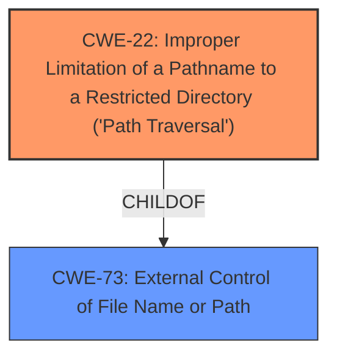

# Raw Analyzer Response for CVE-2024-36420

# Summary
| CWE ID | CWE Name | Confidence | CWE Abstraction Level | CWE Vulnerability Mapping Label | CWE-Vulnerability Mapping Notes |
|---|---|---|---|---|---|
| CWE-22 | Improper Limitation of a Pathname to a Restricted Directory ('Path Traversal') | 0.9 | Base | Primary CWE | Allowed |
| CWE-73 | External Control of File Name or Path | 0.7 | Base | Secondary Candidate | Allowed |

## Evidence and Confidence

*   **Confidence Score:** 0.8
*   **Evidence Strength:** HIGH

## Relationship Analysis
The primary CWE is CWE-22, which describes path traversal due to improper limitation of a pathname to a restricted directory. CWE-73, external control of file name or path, is considered as a related weakness where the filename or path is influenced by user input. CWE-22 is a specific case of CWE-73, where the goal is to stay within a restricted directory but fails. Both are Base level CWEs.

## Vulnerability Chain
The vulnerability chain starts with the **lack of sanitization** of the `fileName` parameter (CWE-22), which leads to the ability to read arbitrary files from the server.

## Summary of Analysis
The initial assessment focused on the **lack of sanitization** of the `fileName` parameter, which directly leads to path traversal. The evidence from the vulnerability description and CVE details strongly supports CWE-22 as the primary weakness. The CVE Reference Links Content Summary states: "The vulnerability stems from a **lack of sanitization** of the `fileName` body parameter in the `/api/v1/openai-assistants-file` endpoint." Also, it states: "The application directly uses the provided `fileName` from the request body to construct a file path, without proper validation or sanitization. This allows an attacker to manipulate the path, potentially accessing files outside the intended directory."

The selection of CWE-22 is at the optimal level of specificity, as it accurately captures the vulnerability's root cause and behavior, focusing on the improper limitation of pathnames to a restricted directory. Other CWEs such as CWE-73, CWE-78, and CWE-79 were considered but deemed less specific or relevant.

Relevant CWE Information:

# Enhanced Context (25 CWEs)
The following CWEs were identified as potentially relevant to this vulnerability:

## CWE-73: External Control of File Name or Path
**Abstraction Level**: Base
**Similarity Score**: 0.72
**Source**: dense

**Description**:
The product allows user input to control or influence paths or file names that are used in filesystem operations.

**Mapping Guidance**:
- Usage: Allowed
- Rationale: This CWE entry is at the Base level of abstraction, which is a preferred level of abstraction for mapping to the root causes of vulnerabilities.

## CWE-22: Improper Limitation of a Pathname to a Restricted Directory ('Path Traversal')
**Abstraction Level**: Base
**Similarity Score**: 975.97
**Source**: sparse

**Description**:
The product uses external input to construct a pathname that is intended to identify a file or directory that is located underneath a restricted parent directory, but the product does not properly neutralize special elements within the pathname that can cause the pathname to resolve to a location that is outside of the restricted directory.

**Mapping Guidance**:
- Usage: Allowed
- Rationale: This CWE entry is at the Base level of abstraction, which is a preferred level of abstraction for mapping to the root causes of vulnerabilities.