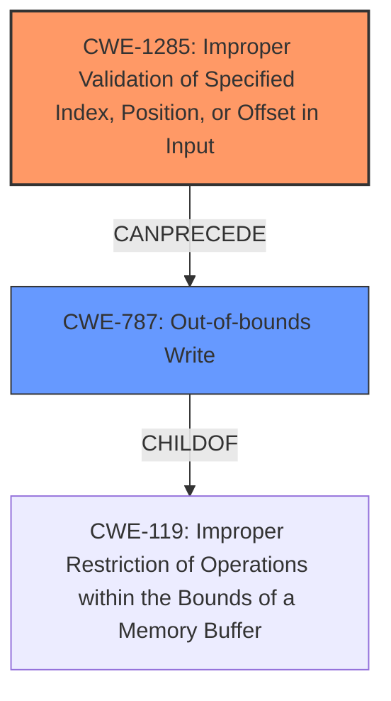

# Raw Analyzer Response for CVE-2024-36434

# Summary
| CWE ID | CWE Name | Confidence | CWE Abstraction Level | CWE Vulnerability Mapping Label | CWE-Vulnerability Mapping Notes |
|---|---|---|---|---|---|
| CWE-1285 | Improper Validation of Specified Index, Position, or Offset in Input | 0.8 | Base | Primary | Allowed |
| CWE-787 | Out-of-bounds Write | 0.6 | Base | Secondary | Allowed |

## Evidence and Confidence

*   **Confidence Score:** 0.7
*   **Evidence Strength:** MEDIUM

## Relationship Analysis
The primary CWE is CWE-1285, representing the **improper validation of input** that leads to a vulnerable SMM callout. CWE-787 is a potential consequence if the **improper validation** leads to writing outside buffer boundaries.

## Vulnerability Chain
The vulnerability chain starts with the **improper validation of input** (CWE-1285) during the SMM callout. This can potentially lead to an out-of-bounds write (CWE-787) if the invalid index, position, or offset is used to write data outside the intended buffer. This allows for arbitrary code execution.

## Summary of Analysis
The primary weakness is CWE-1285 because the root cause is the **improper validation of input** to the SMM callout. This aligns with the evidence in "CVE Reference Links Content Summary" stating, "The vulnerability stems from a flaw in Supermicro BIOS firmware related to **improper input validation**. This allows an attacker to exploit an SMM callout."

The secondary weakness, CWE-787, is a potential consequence of the **improper input validation**, where invalid offsets could lead to writing data past buffer boundaries, though the description doesn't definitively confirm this.

I considered several other CWEs, particularly CWE-119 (Improper Restriction of Operations within the Bounds of a Memory Buffer), but it is too general. The retriever discourages it, stating, "CWE-119 is commonly misused in low-information vulnerability reports when lower-level CWEs could be used instead, or when more details about the vulnerability are available." CWE-1285 and CWE-787 are more specific.

Relevant CWE Information:

# Enhanced Context (25 CWEs)
The following CWEs were identified as potentially relevant to this vulnerability:

## CWE-1285: Improper Validation of Specified Index, Position, or Offset in Input
**Abstraction Level**: Base
**Similarity Score**: 0.74
**Source**: dense

**Description**:
The product receives input that is expected to specify an index, position, or offset into an indexable resource such as a buffer or file, but it does not validate or incorrectly validates that the specified index/position/offset has the required properties.

**Mapping Guidance**:
- Usage: Allowed
- Rationale: This CWE entry is at the Base level of abstraction, which is a preferred level of abstraction for mapping to the root causes of vulnerabilities.

**Technical Explanation:**
CWE-1285 (Improper Validation of Specified Index, Position, or Offset in Input): This CWE describes a scenario where software doesn't properly validate input that specifies an index, position, or offset. In the context of the SMM callout vulnerability, if the Supermicro BIOS firmware fails to validate the index, position, or offset provided as input to the SMM callout, it could lead to out-of-bounds memory access or other unexpected behavior.

**Security Implications:**
The security implication of CWE-1285 is that an attacker can potentially control the memory location being accessed by providing a malicious index, position, or offset. This can lead to information disclosure, arbitrary code execution, or denial of service.

**Relationship Explanation:**
CWE-1285 can be a root cause that leads to further vulnerabilities such as CWE-787 (Out-of-bounds Write). If the **improperly validated** index or offset is used to write data, it can result in an out-of-bounds write.

**Mapping Guidance Influence:**
The MITRE mapping guidance indicates that CWE-1285 is at the Base level of abstraction, making it suitable for mapping the root cause of the vulnerability. The "Usage: Allowed" further supports its applicability.

## CWE-787: Out-of-bounds Write
**Abstraction Level**: base
**Similarity Score**: 4.33
**Source**: graph

**Description**:
CWE-787: Out-of-bounds Write

**Mapping Guidance**:
- Usage: Allowed
- Rationale: This CWE entry is at the Base level of abstraction, which is a preferred level of abstraction for mapping to the root causes of vulnerabilities.

**Relationships**:
- CANFOLLOW -> CWE-825
- CANFOLLOW -> CWE-824
- CANFOLLOW -> CWE-823
- CANFOLLOW -> CWE-822
- PARENTOF -> CWE-124

**Technical Explanation:**
CWE-787 (Out-of-bounds Write): This CWE describes a condition where the software writes data past the end or before the beginning of the intended buffer. In the context of the SMM callout vulnerability, if the **improperly validated** input leads to writing data outside the buffer boundaries used by the SMM handler, an out-of-bounds write occurs.

**Security Implications:**
The security implication of CWE-787 is that an attacker can overwrite adjacent memory locations, potentially corrupting data structures, injecting malicious code, or causing a denial-of-service condition.

**Relationship Explanation:**
CWE-787 is related to CWE-1285 (Improper Validation of Specified Index, Position, or Offset in Input) because the **improper validation** can directly lead to an out-of-bounds write if the validated offset is out of range. Also, it is child of CWE-119.

**Mapping Guidance Influence:**
The MITRE mapping guidance indicates that CWE-787 is at the Base level of abstraction and can be used when the product writes data past the end, or before the beginning, of the intended buffer.