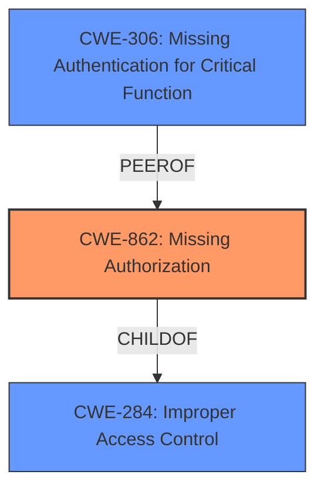

# Raw Analyzer Response for CVE-2024-36438

# Summary
| CWE ID | CWE Name | Confidence | CWE Abstraction Level | CWE Vulnerability Mapping Label | CWE-Vulnerability Mapping Notes |
|---|---|---|---|---|---|
| CWE-862 | Missing Authorization | 1.0 | Base | Primary | Allowed |
| CWE-306 | Missing Authentication for Critical Function | 0.8 | Base | Secondary Candidate | Allowed |
| CWE-284 | Improper Access Control | 0.7 | Class | Secondary Candidate | Discouraged |

## Evidence and Confidence

*   **Confidence Score:** 0.9
*   **Evidence Strength:** HIGH

## Relationship Analysis
The primary relationship influencing the selection was the parent-child relationship between CWE-284 (Improper Access Control) and CWE-862 (Missing Authorization). Since the vulnerability description and CVE summary point to a specific absence of authorization checks, CWE-862 was chosen over the more general CWE-284. Additionally, CWE-306 (Missing Authentication) was considered but deemed less appropriate since the core issue appears to be a lack of authorization after access is granted, rather than a complete absence of authentication.

## Vulnerability Chain
The vulnerability chain starts with the **missing authorization** check (CWE-862). This leads to unauthorized access to the cabinet lock, ultimately compromising the secured contents. The reliance on easily replicated MIFARE Classic 1K cards exacerbates the issue, but the primary flaw is the absence of proper authorization mechanisms.

## Summary of Analysis
The analysis is based on the provided vulnerability description, CVE reference summary, and the retriever results. The **root cause** is identified as **Incorrect Access Control**, which translates to a **missing authorization** check in the context of the smart cabinet lock. The CVE reference summary confirms this by stating that the underlying issue is a **lack of sufficient security measures to prevent unauthorized access via duplicated or emulated cards**.

The selection of CWE-862 is further justified by the MITRE guidance, which states that "CWE-862: *Missing Authorization* – the application doesn't check whether the user is authorized at all." This aligns directly with the vulnerability, where the lock fails to verify the authenticity of the NFC card or prevent replay attacks.

The abstraction level of CWE-862 (Base) is appropriate because it provides a specific representation of the **missing authorization** weakness. While CWE-284 (Improper Access Control) is a broader category, CWE-862 captures the precise nature of the vulnerability.

Relevant CWE Information:

# Enhanced Context (25 CWEs)
The following CWEs were identified as potentially relevant to this vulnerability:

## CWE-1391: Use of Weak Credentials
**Abstraction Level**: Class
**Similarity Score**: 0.76
**Source**: dense

**Description**:
The product uses weak credentials (such as a default key or hard-coded password) that can be calculated, derived, reused, or guessed by an attacker.

**Mapping Guidance**:
- Usage: Allowed-with-Review
- Rationale: This CWE entry is a Class and might have Base-level children that would be more appropriate

*Not Used:* While the use of easily replicated MIFARE Classic 1K cards could be considered "weak credentials," the primary issue is the **missing authorization** check, not the strength of the credentials themselves.

## CWE-303: Incorrect Implementation of Authentication Algorithm
**Abstraction Level**: Base
**Similarity Score**: 0.76
**Source**: dense

**Description**:
The requirements for the product dictate the use of an established authentication algorithm, but the implementation of the algorithm is incorrect.

**Mapping Guidance**:
- Usage: Allowed
- Rationale: This CWE entry is at the Base level of abstraction, which is a preferred level of abstraction for mapping to the root causes of vulnerabilities.

*Not Used:* The vulnerability is not about an incorrect implementation of an algorithm, but rather the **absence of an authorization check**.

## CWE-345: Insufficient Verification of Data Authenticity
**Abstraction Level**: Class
**Similarity Score**: 0.76
**Source**: dense

**Description**:
The product does not sufficiently verify the origin or authenticity of data, in a way that causes it to accept invalid data.

**Mapping Guidance**:
- Usage: Discouraged
- Rationale: This CWE entry is a level-1 Class (i.e., a child of a Pillar). It might have lower-level children that would be more appropriate

*Not Used:* Although related, the core issue is the **missing authorization** check, not simply the insufficient verification of data authenticity.

## CWE-807: Reliance on Untrusted Inputs in a Security Decision
**Abstraction Level**: Base
**Similarity Score**: 0.75
**Source**: dense

**Description**:
The product uses a protection mechanism that relies on the existence or values of an input, but the input can be modified by an untrusted actor in a way that bypasses the protection mechanism.

**Mapping Guidance**:
- Usage: Allowed
- Rationale: This CWE entry is at the Base level of abstraction, which is a preferred level of abstraction for mapping to the root causes of vulnerabilities.

*Not Used:* While this CWE is relevant, CWE-862 (Missing Authorization) more accurately describes the **root cause**, which is the complete absence of an authorization check.

## CWE-1390: Weak Authentication
**Abstraction Level**: Class
**Similarity Score**: 0.75
**Source**: dense

**Description**:
The product uses an authentication mechanism to restrict access to specific users or identities, but the mechanism does not sufficiently prove that the claimed identity is correct.

**Mapping Guidance**:
- Usage: Allowed-with-Review
- Rationale: This CWE entry is a Class and might have Base-level children that would be more appropriate

*Not Used:* Although related, the primary issue is the **missing authorization** check, not the weakness of the authentication mechanism.

## CWE-703: Improper Check or Handling of Exceptional Conditions
**Abstraction Level**: Pillar
**Similarity Score**: 0.75
**Source**: dense

**Description**:
The product does not properly anticipate or handle exceptional conditions that rarely occur during normal operation of the product.

**Mapping Guidance**:
- Usage: Discouraged
- Rationale: This CWE entry is extremely high-level, a Pillar.

*Not Used:* This CWE is too generic and does not accurately represent the specific vulnerability.

## CWE-288: Authentication Bypass Using an Alternate Path or Channel
**Abstraction Level**: Base
**Similarity Score**: 0.75
**Source**: dense

**Description**:
The product requires authentication, but the product has an alternate path or channel that does not require authentication.

**Mapping Guidance**:
- Usage: Allowed
- Rationale: This CWE entry is at the Base level of abstraction, which is a preferred level of abstraction for mapping to the root causes of vulnerabilities.

*Not Used:* Not applicable, as the vulnerability is about **missing authorization**, not bypassing authentication.

## CWE-203: Observable Discrepancy
**Abstraction Level**: Base
**Similarity Score**: 0.75
**Source**: dense

**Description**:
The product behaves differently or sends different responses under different circumstances in a way that is observable to an unauthorized actor, which exposes security-relevant information about the state of the product, such as whether a particular operation was successful or not.

**Mapping Guidance**:
- Usage: Allowed
- Rationale: This CWE entry is at the Base level of abstraction, which is a preferred level of abstraction for mapping to the root causes of vulnerabilities.

*Not Used:* This CWE is not relevant to the vulnerability.

## CWE-639: Authorization Bypass Through User-Controlled Key
**Abstraction Level**: Base
**Similarity Score**: 0.75
**Source**: dense

**Description**:
The system's authorization functionality does not prevent one user from gaining access to another user's data or record by modifying the key value identifying the data.

**Mapping Guidance**:
- Usage: Allowed
- Rationale: This CWE entry is at the Base level of abstraction, which is a preferred level of abstraction for mapping to the root causes of vulnerabilities.

*Not Used:* Although related to authorization, this CWE is too specific and does not fully capture the **missing authorization** check.

## CWE-330: Use of Insufficiently Random Values
**Abstraction Level**: Class
**Similarity Score**: 0.74
**Source**: dense

**Description**:
The product uses insufficiently random numbers or values in a security context that depends on unpredictable numbers.

**Mapping Guidance**: