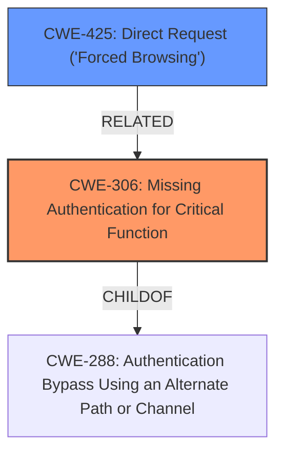

# Analysis for CVE-2024-36444

# Summary
| CWE ID | CWE Name | Confidence | CWE Abstraction Level | CWE Vulnerability Mapping Label | CWE-Vulnerability Mapping Notes |
|---|---|---|---|---|---|
| CWE-306 | Missing Authentication for Critical Function | 1.0 | Base | Primary | Allowed |
| CWE-425 | Direct Request ('Forced Browsing') | 0.7 | Base | Secondary | Allowed |

## Evidence and Confidence

*   **Confidence Score:** 0.9
*   **Evidence Strength:** HIGH

## Relationship Analysis
The primary CWE is CWE-306, which describes the core issue of missing authentication for critical functions like accessing log files. CWE-425 is a related weakness, representing the direct consequence of being able to access resources without proper authorization. CWE-306 is a parent of CWE-288 (Authentication Bypass Using an Alternate Path or Channel). The base abstraction level is appropriate as it accurately reflects the fundamental lack of authentication.

## Vulnerability Chain
The vulnerability chain starts with the **missing authentication** (**CWE-306**) for accessing log files. This leads to the ability to make direct requests to sensitive URLs, resulting in **direct request ('forced browsing')** (**CWE-425**). The final impact is unauthorized access to device logs, potentially exposing sensitive information.

## Summary of Analysis
The analysis focuses on the root cause of the vulnerability: the **lack of authentication** for accessing device logs. The evidence clearly points to **CWE-306 (Missing Authentication for Critical Function)** as the primary weakness.

The vulnerability description states: "cgi-bin/fdmcgiwebv2.cgi on Swissphone DiCal-RED 4009 devices allows an **unauthenticated attacker** to gain access to device logs." The CVE Reference Links Content Summary explicitly mentions: "The DiCal-RED radio module has an **improper authentication** vulnerability in its web interface. Specifically, the function to view log files **does not require an authenticated session**." This direct evidence supports the selection of CWE-306.

**CWE-425 (Direct Request ('Forced Browsing'))** is considered a secondary weakness because it describes the direct consequence of the **missing authentication**: the ability to access resources without authorization. While it's a valid observation, it's more of an impact or manifestation of the primary flaw.

Other CWEs were considered but deemed less relevant:

*   CWE-22 (Improper Limitation of a Pathname to a Restricted Directory ('Path Traversal')): While unauthorized access to logs can be related to path traversal, there is no evidence of path manipulation in the provided description.
*   CWE-78 (Improper Neutralization of Special Elements used in an OS Command ('OS Command Injection')): There is no mention of command injection in the description.
*   CWE-321 (Use of Hard-coded Cryptographic Key) and CWE-259 (Use of Hard-coded Password): These are not relevant as the vulnerability is about missing authentication, not the use of weak credentials.

The final selection of CWE-306 as the primary weakness is based on its direct alignment with the root cause described in the vulnerability details and supporting evidence. The base abstraction level is appropriate as it accurately reflects the fundamental **lack of authentication**.

Relevant CWE Information:

# Enhanced Context (25 CWEs)
The following CWEs were identified as potentially relevant to this vulnerability:

## CWE-425: Direct Request ('Forced Browsing')
**Abstraction Level**: Base
**Similarity Score**: 0.75
**Source**: dense

**Description**:
The web application does not adequately enforce appropriate authorization on all restricted URLs, scripts, or files.

**Mapping Guidance**:
- Usage: Allowed
- Rationale: This CWE entry is at the Base level of abstraction, which is a preferred level of abstraction for mapping to the root causes of vulnerabilities.

## CWE-912: Hidden Functionality
**Abstraction Level**: Class
**Similarity Score**: 0.74
**Source**: dense

**Description**:
The product contains functionality that is not documented, not part of the specification, and not accessible through an interface or command sequence that is obvious to the product's users or administrators.

**Mapping Guidance**:
- Usage: Allowed-with-Review
- Rationale: This CWE entry is a Class and might have Base-level children that would be more appropriate

## CWE-345: Insufficient Verification of Data Authenticity
**Abstraction Level**: Class
**Similarity Score**: 0.74
**Source**: dense

**Description**:
The product does not sufficiently verify the origin or authenticity of data, in a way that causes it to accept invalid data.

**Mapping Guidance**:
- Usage: Discouraged
- Rationale: This CWE entry is a level-1 Class (i.e., a child of a Pillar). It might have lower-level children that would be more appropriate

## CWE-807: Reliance on Untrusted Inputs in a Security Decision
**Abstraction Level**: Base
**Similarity Score**: 0.73
**Source**: dense

**Description**:
The product uses a protection mechanism that relies on the existence or values of an input, but the input can be modified by an untrusted actor in a way that bypasses the protection mechanism.

**Mapping Guidance**:
- Usage: Allowed
- Rationale: This CWE entry is at the Base level of abstraction, which is a preferred level of abstraction for mapping to the root causes of vulnerabilities.

## CWE-1391: Use of Weak Credentials
**Abstraction Level**: Class
**Similarity Score**: 0.73
**Source**: dense

**Description**:
The product uses weak credentials (such as a default key or hard-coded password) that can be calculated, derived, reused, or guessed by an attacker.

**Mapping Guidance**:
- Usage: Allowed-with-Review
- Rationale: This CWE entry is a Class and might have Base-level children that would be more appropriate

## CWE-288: Authentication Bypass Using an Alternate Path or Channel
**Abstraction Level**: Base
**Similarity Score**: 0.73
**Source**: dense

**Description**:
The product requires authentication, but the product has an alternate path or channel that does not require authentication.

**Mapping Guidance**:
- Usage: Allowed
- Rationale: This CWE entry is at the Base level of abstraction, which is a preferred level of abstraction for mapping to the root causes of vulnerabilities.

## CWE-203: Observable Discrepancy
**Abstraction Level**: Base
**Similarity Score**: 0.73
**Source**: dense

**Description**:
The product behaves differently or sends different responses under different circumstances in a way that is observable to an unauthorized actor, which exposes security-relevant information about the state of the product, such as whether a particular operation was successful or not.

**Mapping Guidance**:
- Usage: Allowed
- Rationale: This CWE entry is at the Base level of abstraction, which is a preferred level of abstraction for mapping to the root causes of vulnerabilities.

## CWE-497: Exposure of Sensitive System Information to an Unauthorized Control Sphere
**Abstraction Level**: Base
**Similarity Score**: 0.73
**Source**: dense

**Description**:
The product does not properly prevent sensitive system-level information from being accessed by unauthorized actors who do not have the same level of access to the underlying system as the product does.

**Mapping Guidance**:
- Usage: Allowed
- Rationale: This CWE entry is at the Base level of abstraction, which is a preferred level of abstraction for mapping to the root causes of vulnerabilities.

## CWE-798: Use of Hard-coded Credentials
**Abstraction Level**: Base
**Similarity Score**: 0.73
**Source**: dense

**Description**:
The product contains hard-coded credentials, such as a password or cryptographic key.

**Mapping Guidance**:
- Usage: Allowed
- Rationale: This CWE entry is at the Base level of abstraction, which is a preferred level of abstraction for mapping to the root causes of vulnerabilities.

## CWE-116: Improper Encoding or Escaping of Output
**Abstraction Level**: Class
**Similarity Score**: 0.73
**Source**: dense

**Description**:
The product prepares a structured message for communication with another component, but encoding or escaping of the data is either missing or done incorrectly. As a result, the intended structure of the message is not preserved.

**Mapping Guidance**:
- Usage: Allowed-with-Review
- Rationale: This CWE entry is a Class and might have Base-level children that would be more appropriate

## CWE-22: Improper Limitation of a Pathname