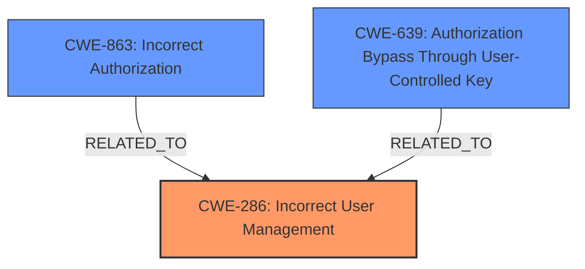

# Analysis for CVE-2024-36492

# Summary
| CWE ID | CWE Name | Confidence | CWE Abstraction Level | CWE Vulnerability Mapping Label | CWE-Vulnerability Mapping Notes |
|---|---|---|---|---|---|
| CWE-286 | Incorrect User Management | 0.75 | Class | Allowed-with-Review | Primary CWE. |
| CWE-863 | Incorrect Authorization | 0.60 | Class | Allowed-with-Review | Secondary Candidate. |
| CWE-639 | Authorization Bypass Through User-Controlled Key | 0.50 | Base | Allowed | Secondary Candidate. |

## Evidence and Confidence

*   **Confidence Score:** 0.70
*   **Evidence Strength:** MEDIUM

## Relationship Analysis
The primary CWE is CWE-286, Incorrect User Management, which is a Class-level CWE. While more specific Base or Variant CWEs would be ideal, the available information doesn't pinpoint a more precise weakness. CWE-863, Incorrect Authorization, and CWE-639, Authorization Bypass Through User-Controlled Key, are related to the authorization aspects of the vulnerability but are considered secondary as the core issue lies in how user management is handled during the syncing process.

## Vulnerability Chain
The vulnerability chain starts with **incorrect user management** during the syncing of users in shared channels. This leads to a failure to disallow modification of local users, which ultimately allows a malicious remote to **overwrite an existing local user**.

Root Cause: **Incorrect User Management** (CWE-286)
Impact: Overwriting existing local user.

## Summary of Analysis
The analysis is based on the provided vulnerability description, which indicates that the Mattermost application **fails to disallow the modification of local users when syncing users in shared channels, which allows a malicious remote to overwrite an existing local user.**

CWE-286, Incorrect User Management, is selected as the primary CWE because the vulnerability centers around the **incorrect** handling of user data during the syncing process. The application **fails to properly manage users** by allowing modifications of local users from remote sources.

CWE-863, Incorrect Authorization and CWE-639, Authorization Bypass Through User-Controlled Key, are considered, as the ability of a malicious remote to overwrite an existing local user suggests a potential authorization issue. However, the description focuses more on the user management aspect.

The selected CWEs are at the appropriate level of specificity based on the available information. While more specific CWEs might exist, the current description doesn't provide sufficient detail to pinpoint a more precise weakness.

Other CWEs Considered:

*   CWE-200 (Exposure of Sensitive Information to an Unauthorized Actor): While the impact is that a user is overwritten, the **root cause** isn't directly about exposing information but about failing to manage user modifications correctly.
*   CWE-732 (Incorrect Permission Assignment for Critical Resource): The vulnerability isn't directly related to permission assignments but rather to the broader aspect of user management during syncing.
*   CWE-269 (Improper Privilege Management): Similar to CWE-732, the issue is not about privilege management but about the broader management of users.
* CWE-201 (Insertion of Sensitive Information Into Sent Data): This is not about insertion of information.
* CWE-1272 (Sensitive Information Uncleared Before Debug/Power State Transition): This is not about information uncleared.

# Enhanced Context (25 CWEs)
The following CWEs were identified as potentially relevant to this vulnerability:

## CWE-267: Privilege Defined With Unsafe Actions
**Abstraction Level**: Base
**Similarity Score**: 0.74

## CWE-212: Improper Removal of Sensitive Information Before Storage or Transfer
**Abstraction Level**: Base
**Similarity Score**: 0.73

## CWE-201: Insertion of Sensitive Information Into Sent Data
**Abstraction Level**: Base
**Similarity Score**: 0.73

## CWE-346: Origin Validation Error
**Abstraction Level**: Class
**Similarity Score**: 0.73

## CWE-941: Incorrectly Specified Destination in a Communication Channel
**Abstraction Level**: Base
**Similarity Score**: 0.73

## CWE-204: Observable Response Discrepancy
**Abstraction Level**: Base
**Similarity Score**: 0.73

## CWE-303: Incorrect Implementation of Authentication Algorithm
**Abstraction Level**: Base
**Similarity Score**: 0.73

## CWE-639: Authorization Bypass Through User-Controlled Key
**Abstraction Level**: Base
**Similarity Score**: 0.72

## CWE-209: Generation of Error Message Containing Sensitive Information
**Abstraction Level**: Base
**Similarity Score**: 0.72

## CWE-203: Observable Discrepancy
**Abstraction Level**: Base
**Similarity Score**: 0.72

## CWE-863: Incorrect Authorization
**Abstraction Level**: Class
**Similarity Score**: 503.55

## CWE-639: Authorization Bypass Through User-Controlled Key
**Abstraction Level**: Base
**Similarity Score**: 500.37

## CWE-200: Exposure of Sensitive Information to an Unauthorized Actor
**Abstraction Level**: Class
**Similarity Score**: 495.19

## CWE-285: Improper Authorization
**Abstraction Level**: Class
**Similarity Score**: 483.12

## CWE-732: Incorrect Permission Assignment for Critical Resource
**Abstraction Level**: Class
**Similarity Score**: 478.57

## CWE-1272: Sensitive Information Uncleared Before Debug/Power State Transition
**Abstraction Level**: base
**Similarity Score**: 4.33

## CWE-212: Improper Removal of Sensitive Information Before Storage or Transfer
**Abstraction Level**: Base
**Similarity Score**: 2.89

## CWE-201: Insertion of Sensitive Information Into Sent Data
**Abstraction Level**: Base
**Similarity Score**: 2.89

## CWE-226: Sensitive Information in Resource Not Removed Before Reuse
**Abstraction Level**: base
**Similarity Score**: 2.87

## CWE-200: Exposure of Sensitive Information to an Unauthorized Actor
**Abstraction Level**: class
**Similarity Score**: 2.55

## CWE-425: Direct Request ('Forced Browsing')
**Abstraction Level**: base
**Similarity Score**: 2.29

## CWE-266: Incorrect Privilege Assignment
**Abstraction Level**: base
**Similarity Score**: 2.18

## CWE-94: Improper Control of Generation of Code ('Code Injection')
**Abstraction Level**: base
**Similarity Score**: 2.12

## CWE-202: Exposure of Sensitive Information Through Data Queries
**Abstraction Level**: base
**Similarity Score**: 2.05

## CWE-499: Serializable Class Containing Sensitive Data
**Abstraction Level**: variant
**Similarity Score**: 2.04